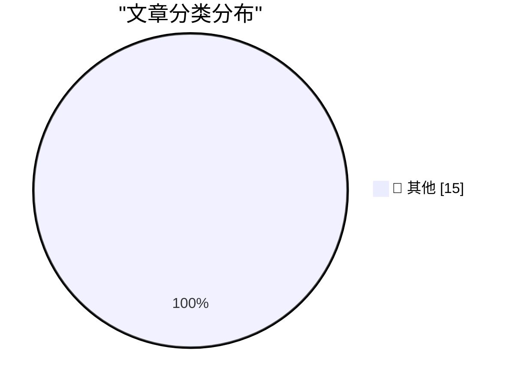

# 📰 AI 博客每日精选 — 2026-05-18

> 来自 Karpathy 推荐的 92 个顶级技术博客，AI 精选 Top 15

## 🏆 今日必读

🥇 **GDS weighs in on the NHS's decision to retreat from Open Source**

[GDS weighs in on the NHS's decision to retreat from Open Source](https://simonwillison.net/2026/May/17/gds-weighs-in/#atom-everything) — simonwillison.net · 20 小时前 · 📝 其他

> GDS weighs in on the NHS's decision to retreat from Open Source

🥈 **Warelay -> OpenClaw**

[Warelay -> OpenClaw](https://simonwillison.net/2026/May/16/openclaw-names/#atom-everything) — simonwillison.net · 1 天前 · 📝 其他

> Warelay -> OpenClaw

🥉 **Quoting Julia Evans**

[Quoting Julia Evans](https://simonwillison.net/2026/May/16/julia-evans/#atom-everything) — simonwillison.net · 1 天前 · 📝 其他

> Quoting Julia Evans

---

## 📊 数据概览

| 扫描源 | 抓取文章 | 时间范围 | 精选 |
|:---:|:---:|:---:|:---:|
| 80/92 | 2390 篇 → 22 篇 | 48h | **15 篇** |

### 分类分布

```mermaid
pie showData
    title "文章分类分布"
    "📝 其他" : 15
```

---

## 📝 其他

### 1. GDS weighs in on the NHS's decision to retreat from Open Source

[GDS weighs in on the NHS's decision to retreat from Open Source](https://simonwillison.net/2026/May/17/gds-weighs-in/#atom-everything) — **simonwillison.net** · 20 小时前 · ⭐ 15/30

> GDS weighs in on the NHS's decision to retreat from Open Source

---

### 2. Warelay -> OpenClaw

[Warelay -> OpenClaw](https://simonwillison.net/2026/May/16/openclaw-names/#atom-everything) — **simonwillison.net** · 1 天前 · ⭐ 15/30

> Warelay -> OpenClaw

---

### 3. Quoting Julia Evans

[Quoting Julia Evans](https://simonwillison.net/2026/May/16/julia-evans/#atom-everything) — **simonwillison.net** · 1 天前 · ⭐ 15/30

> Quoting Julia Evans

---

### 4. Drata

[Drata](https://drata.com/daring) — **daringfireball.net** · 19 小时前 · ⭐ 15/30

> Drata

---

### 5. Reddit Is Blocking Some Users From Accessing Its Website From Mobile Devices

[Reddit Is Blocking Some Users From Accessing Its Website From Mobile Devices](https://arstechnica.com/information-technology/2026/05/why-reddit-blocked-my-daily-visit-to-its-mobile-website/) — **daringfireball.net** · 1 天前 · ⭐ 15/30

> Reddit Is Blocking Some Users From Accessing Its Website From Mobile Devices

---

### 6. Santa Clara County Sues Meta Over Alleged Scam Ads

[Santa Clara County Sues Meta Over Alleged Scam Ads](https://sanjosespotlight.com/santa-clara-county-sues-meta-over-alleged-scam-ads/) — **daringfireball.net** · 1 天前 · ⭐ 15/30

> Santa Clara County Sues Meta Over Alleged Scam Ads

---

### 7. ★ AI Is Technology, Not a Product

[★ AI Is Technology, Not a Product](https://daringfireball.net/2026/05/ai_is_technology_not_a_product) — **daringfireball.net** · 1 天前 · ⭐ 15/30

> ★ AI Is Technology, Not a Product

---

### 8. ArXiv to Ban Researchers for a Year if They Submit AI Slop

[ArXiv to Ban Researchers for a Year if They Submit AI Slop](https://www.404media.co/new-arxiv-rules-ai-generated-papers-ban/) — **daringfireball.net** · 1 天前 · ⭐ 15/30

> ArXiv to Ban Researchers for a Year if They Submit AI Slop

---

### 9. How I Use My Index 01 + Production Update

[How I Use My Index 01 + Production Update](https://repebble.com/blog/how-i-use-my-index-01-production-update) — **ericmigi.com** · 12 小时前 · ⭐ 15/30

> How I Use My Index 01 + Production Update

---

### 10. Don't call yourself a Software Engineer, you are an AI Enabled Engineer.

[Don't call yourself a Software Engineer, you are an AI Enabled Engineer.](https://idiallo.com/blog/you-are-an-ai-enabled-engineer-now?src=feed) — **idiallo.com** · 59 分钟前 · ⭐ 15/30

> Don't call yourself a Software Engineer, you are an AI Enabled Engineer.

---

### 11. In the Empire's Defense

[In the Empire's Defense](https://idiallo.com/blog/the-empire-won?src=feed) — **idiallo.com** · 1 天前 · ⭐ 15/30

> In the Empire's Defense

---

### 12. GDS weighs in on the NHS's decision to retreat from Open Source

[GDS weighs in on the NHS's decision to retreat from Open Source](https://shkspr.mobi/blog/2026/05/gds-weighs-in-on-the-nhss-decision-to-retreat-from-open-source/) — **shkspr.mobi** · 1 天前 · ⭐ 15/30

> GDS weighs in on the NHS's decision to retreat from Open Source

---

### 13. How to be inspired without copying

[How to be inspired without copying](https://www.joanwestenberg.com/how-to-be-inspired-without-copying/) — **joanwestenberg.com** · 14 小时前 · ⭐ 15/30

> How to be inspired without copying

---

### 14. The mistake of conflating intelligence and power

[The mistake of conflating intelligence and power](https://www.dwarkesh.com/p/the-mistake-of-conflating-intelligence) — **dwarkesh.com** · 1 天前 · ⭐ 15/30

> The mistake of conflating intelligence and power

---

### 15. Notes on pretraining parallelisms and failed training runs.

[Notes on pretraining parallelisms and failed training runs.](https://www.dwarkesh.com/p/notes-on-pretraining-parallelisms) — **dwarkesh.com** · 1 天前 · ⭐ 15/30

> Notes on pretraining parallelisms and failed training runs.

---

*生成于 2026-05-18 12:59 | 扫描 80 源 → 获取 2390 篇 → 精选 15 篇*
*基于 [Hacker News Popularity Contest 2025](https://refactoringenglish.com/tools/hn-popularity/) RSS 源列表，由 [Andrej Karpathy](https://x.com/karpathy) 推荐*
*由「懂点儿AI」制作，欢迎关注同名微信公众号获取更多 AI 实用技巧 💡*
