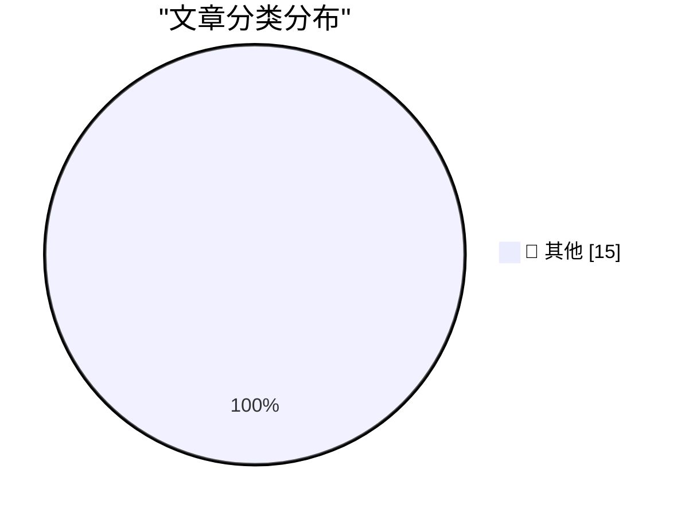

# 📰 AI 博客每日精选 — 2026-05-05

> 来自 Karpathy 推荐的 92 个顶级技术博客，AI 精选 Top 15

## 🏆 今日必读

🥇 **Quoting John Gruber**

[Quoting John Gruber](https://simonwillison.net/2026/May/5/john-gruber/#atom-everything) — simonwillison.net · 10 小时前 · 📝 其他

> Quoting John Gruber

🥈 **Granite 4.1 3B SVG Pelican Gallery**

[Granite 4.1 3B SVG Pelican Gallery](https://simonwillison.net/2026/May/4/granite-41-3b-svg-pelican-gallery/#atom-everything) — simonwillison.net · 11 小时前 · 📝 其他

> Granite 4.1 3B SVG Pelican Gallery

🥉 **Quoting Andy Masley**

[Quoting Andy Masley](https://simonwillison.net/2026/May/4/andy-masley/#atom-everything) — simonwillison.net · 12 小时前 · 📝 其他

> Quoting Andy Masley

---

## 📊 数据概览

| 扫描源 | 抓取文章 | 时间范围 | 精选 |
|:---:|:---:|:---:|:---:|
| 81/92 | 2389 篇 → 41 篇 | 48h | **15 篇** |

### 分类分布

```mermaid
pie showData
    title "文章分类分布"
    "📝 其他" : 15
```

---

## 📝 其他

### 1. Quoting John Gruber

[Quoting John Gruber](https://simonwillison.net/2026/May/5/john-gruber/#atom-everything) — **simonwillison.net** · 10 小时前 · ⭐ 15/30

> Quoting John Gruber

---

### 2. Granite 4.1 3B SVG Pelican Gallery

[Granite 4.1 3B SVG Pelican Gallery](https://simonwillison.net/2026/May/4/granite-41-3b-svg-pelican-gallery/#atom-everything) — **simonwillison.net** · 11 小时前 · ⭐ 15/30

> Granite 4.1 3B SVG Pelican Gallery

---

### 3. Quoting Andy Masley

[Quoting Andy Masley](https://simonwillison.net/2026/May/4/andy-masley/#atom-everything) — **simonwillison.net** · 12 小时前 · ⭐ 15/30

> Quoting Andy Masley

---

### 4. April 2026 newsletter

[April 2026 newsletter](https://simonwillison.net/2026/May/4/april-newsletter/#atom-everything) — **simonwillison.net** · 12 小时前 · ⭐ 15/30

> April 2026 newsletter

---

### 5. TRE Python binding — ReDoS robustness demo

[TRE Python binding — ReDoS robustness demo](https://simonwillison.net/2026/May/4/tre-python-binding/#atom-everything) — **simonwillison.net** · 17 小时前 · ⭐ 15/30

> TRE Python binding — ReDoS robustness demo

---

### 6. Redis Array Playground

[Redis Array Playground](https://simonwillison.net/2026/May/4/redis-array/#atom-everything) — **simonwillison.net** · 19 小时前 · ⭐ 15/30

> Redis Array Playground

---

### 7. Quoting Anthropic

[Quoting Anthropic](https://simonwillison.net/2026/May/3/anthropic/#atom-everything) — **simonwillison.net** · 1 天前 · ⭐ 15/30

> Quoting Anthropic

---

### 8. [Sponsor] WorkOS: Ready to Sell to Enterprise? Your Product Is Ready, Your Auth Infrastructure Isn’t.

[[Sponsor] WorkOS: Ready to Sell to Enterprise? Your Product Is Ready, Your Auth Infrastructure Isn’t.](https://workos.com/?utm_source=daringfireball&amp;utm_medium=newsletter&amp;utm_campaign=q22026) — **daringfireball.net** · 8 小时前 · ⭐ 15/30

> [Sponsor] WorkOS: Ready to Sell to Enterprise? Your Product Is Ready, Your Auth Infrastructure Isn’t.

---

### 9. Chess Peace

[Chess Peace](https://chesspeace.app/) — **daringfireball.net** · 8 小时前 · ⭐ 15/30

> Chess Peace

---

### 10. Adobe’s ‘Modern’ User Interface Is Just Webpages

[Adobe’s ‘Modern’ User Interface Is Just Webpages](https://pxlnv.com/linklog/adobe-modern-user-interface/) — **daringfireball.net** · 8 小时前 · ⭐ 15/30

> Adobe’s ‘Modern’ User Interface Is Just Webpages

---

### 11. Paul Thurrott Might Write a Book on Markdown

[Paul Thurrott Might Write a Book on Markdown](https://www.thurrott.com/paul/334577/the-markdown-book-on-writing?utm_source=dlvr.it&amp;utm_medium=mastodon) — **daringfireball.net** · 12 小时前 · ⭐ 15/30

> Paul Thurrott Might Write a Book on Markdown

---

### 12. ★ Y Combinator’s Stake in OpenAI

[★ Y Combinator’s Stake in OpenAI](https://daringfireball.net/2026/05/y_combinators_stake_in_openai) — **daringfireball.net** · 12 小时前 · ⭐ 15/30

> ★ Y Combinator’s Stake in OpenAI

---

### 13. Google Owns a Big Chunk of Anthropic

[Google Owns a Big Chunk of Anthropic](https://www.nytimes.com/2025/03/11/technology/google-investment-anthropic.html?unlocked_article_code=1.f1A.eSTf.D5ECvk6f4DZ7) — **daringfireball.net** · 13 小时前 · ⭐ 15/30

> Google Owns a Big Chunk of Anthropic

---

### 14. App Store Search Ads and the Slippery Slope

[App Store Search Ads and the Slippery Slope](https://blog.thinktapwork.com/post/812803664980967425/ios-app-store-search-is-rotten) — **daringfireball.net** · 13 小时前 · ⭐ 15/30

> App Store Search Ads and the Slippery Slope

---

### 15. ‘Noir, Japan’s Hard-Boiled Bittersweet Answer to Oreos’

[‘Noir, Japan’s Hard-Boiled Bittersweet Answer to Oreos’](https://tokyopaladin.substack.com/p/the-japanese-oreo-noir-kills-the) — **daringfireball.net** · 15 小时前 · ⭐ 15/30

> ‘Noir, Japan’s Hard-Boiled Bittersweet Answer to Oreos’

---

*生成于 2026-05-05 11:08 | 扫描 81 源 → 获取 2389 篇 → 精选 15 篇*
*基于 [Hacker News Popularity Contest 2025](https://refactoringenglish.com/tools/hn-popularity/) RSS 源列表，由 [Andrej Karpathy](https://x.com/karpathy) 推荐*
*由「懂点儿AI」制作，欢迎关注同名微信公众号获取更多 AI 实用技巧 💡*
