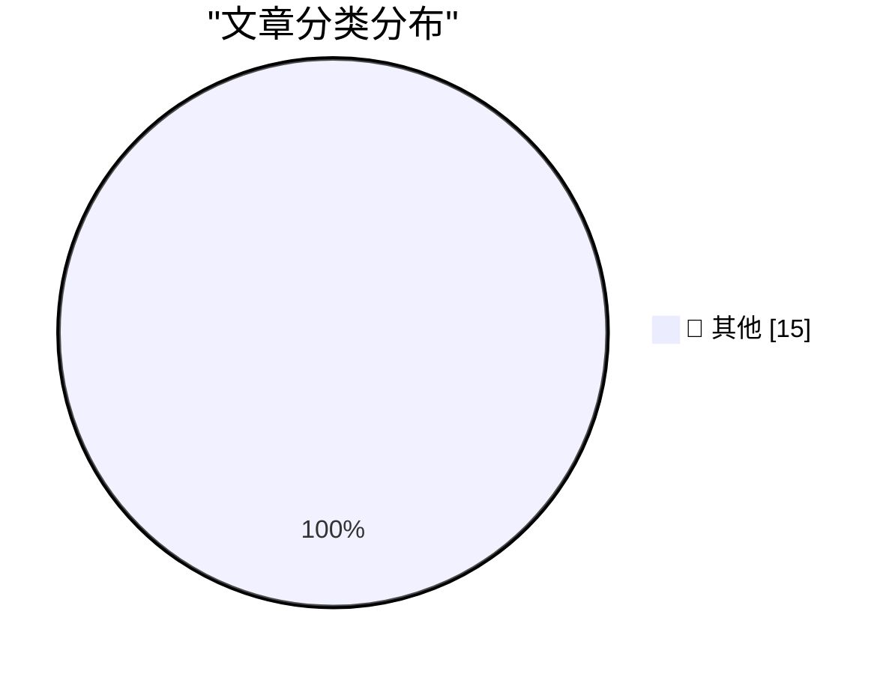

# 📰 AI 博客每日精选 — 2026-09-06

> 来自 Karpathy 推荐的 92 个顶级技术博客，AI 精选 Top 15

## 🏆 今日必读

🥇 **Quoting Zach Kehs**

[Quoting Zach Kehs](https://simonwillison.net/2026/Sep/6/zach-kehs/) — simonwillison.net · 4 小时前 · 📝 其他

> Quoting Zach Kehs

🥈 **Introducing GPT-6 Astra for developers**

[Introducing GPT-6 Astra for developers](https://simonwillison.net/2026/Sep/5/introducing-gpt-6-astra-for-developers/) — simonwillison.net · 13 小时前 · 📝 其他

> Introducing GPT-6 Astra for developers

🥉 **Using Blender with coding agents on macOS**

[Using Blender with coding agents on macOS](https://simonwillison.net/2026/Sep/5/blender-coding-agents-macos/) — simonwillison.net · 21 小时前 · 📝 其他

> Using Blender with coding agents on macOS

---

## 📊 数据概览

| 扫描源 | 抓取文章 | 时间范围 | 精选 |
|:---:|:---:|:---:|:---:|
| 84/92 | 2551 篇 → 27 篇 | 48h | **15 篇** |

### 分类分布

```mermaid
pie showData
    title "文章分类分布"
    "📝 其他" : 15
```

---

## 📝 其他

### 1. Quoting Zach Kehs

[Quoting Zach Kehs](https://simonwillison.net/2026/Sep/6/zach-kehs/) — **simonwillison.net** · 4 小时前 · ⭐ 15/30

> Quoting Zach Kehs

---

### 2. Introducing GPT-6 Astra for developers

[Introducing GPT-6 Astra for developers](https://simonwillison.net/2026/Sep/5/introducing-gpt-6-astra-for-developers/) — **simonwillison.net** · 13 小时前 · ⭐ 15/30

> Introducing GPT-6 Astra for developers

---

### 3. Using Blender with coding agents on macOS

[Using Blender with coding agents on macOS](https://simonwillison.net/2026/Sep/5/blender-coding-agents-macos/) — **simonwillison.net** · 21 小时前 · ⭐ 15/30

> Using Blender with coding agents on macOS

---

### 4. The Pelican comparison grid for Astra is pretty interesting

[The Pelican comparison grid for Astra is pretty interesting](https://simonwillison.net/2026/Sep/4/astra-pelicans/) — **simonwillison.net** · 1 天前 · ⭐ 15/30

> The Pelican comparison grid for Astra is pretty interesting

---

### 5. OpenAI's rogue agents were caught communicating via public wikis

[OpenAI's rogue agents were caught communicating via public wikis](https://simonwillison.net/2026/Sep/4/rogue-agent-wikis/) — **simonwillison.net** · 1 天前 · ⭐ 15/30

> OpenAI's rogue agents were caught communicating via public wikis

---

### 6. Rebuilding a 1995 GPS Time Server so I don't get Telstra'd

[Rebuilding a 1995 GPS Time Server so I don't get Telstra'd](https://www.jeffgeerling.com/blog/2026/truetime-xl-gps-time-server-restomod/) — **jeffgeerling.com** · 1 天前 · ⭐ 15/30

> Rebuilding a 1995 GPS Time Server so I don't get Telstra'd

---

### 7. Gloria Steinem’s Final Essay

[Gloria Steinem’s Final Essay](https://www.newyorker.com/culture/life-and-letters/gloria-steinems-final-essay?cndid=66114350) — **daringfireball.net** · 17 小时前 · ⭐ 15/30

> Gloria Steinem’s Final Essay

---

### 8. ‘Bob and Van’

[‘Bob and Van’](https://marco.org/2026/09/04/bob-and-van) — **daringfireball.net** · 21 小时前 · ⭐ 15/30

> ‘Bob and Van’

---

### 9. Adobe Names Anil Chakravarthy as CEO, Replacing Shantanu Narayen

[Adobe Names Anil Chakravarthy as CEO, Replacing Shantanu Narayen](https://www.cnbc.com/2026/09/03/adobe-anil-chakravarthy-ceo.html) — **daringfireball.net** · 1 天前 · ⭐ 15/30

> Adobe Names Anil Chakravarthy as CEO, Replacing Shantanu Narayen

---

### 10. NBA Brings the Hammer on the Clippers — $30 Million Fine, 5 First-Round Draft Picks, and Steve Ballmer Is Banned for a Year

[NBA Brings the Hammer on the Clippers — $30 Million Fine, 5 First-Round Draft Picks, and Steve Ballmer Is Banned for a Year](https://www.nytimes.com/athletic/7513882/2026/09/02/clippers-kawhi-leonard-punishment-fine-suspensions-nba-investigation/?unlocked_article_code=1.-lA.wcSN.awOHwzojR5nR) — **daringfireball.net** · 1 天前 · ⭐ 15/30

> NBA Brings the Hammer on the Clippers — $30 Million Fine, 5 First-Round Draft Picks, and Steve Ballmer Is Banned for a Year

---

### 11. Apple Fixed ‎TestFlight’s Screwy Sort Order

[Apple Fixed ‎TestFlight’s Screwy Sort Order](https://apps.apple.com/us/app/testflight/id899247664) — **daringfireball.net** · 1 天前 · ⭐ 15/30

> Apple Fixed ‎TestFlight’s Screwy Sort Order

---

### 12. Vinted

[Vinted](https://www.vinted.com/) — **daringfireball.net** · 1 天前 · ⭐ 15/30

> Vinted

---

### 13. ★ Writing With Unnatural Constraints

[★ Writing With Unnatural Constraints](https://daringfireball.net/2026/09/writing_with_unnatural_constraints) — **daringfireball.net** · 1 天前 · ⭐ 15/30

> ★ Writing With Unnatural Constraints

---

### 14. FBI Probes Service Selling 153M+ Drivers Licenses

[FBI Probes Service Selling 153M+ Drivers Licenses](https://krebsonsecurity.com/2026/09/fbi-probes-service-selling-153m-drivers-licenses/) — **daringfireball.net** · 1 天前 · ⭐ 15/30

> FBI Probes Service Selling 153M+ Drivers Licenses

---

### 15. Pluralistic: Google skates (05 Sep 2026)

[Pluralistic: Google skates (05 Sep 2026)](https://pluralistic.net/2026/09/05/divorce-court/) — **pluralistic.net** · 1 天前 · ⭐ 15/30

> Pluralistic: Google skates (05 Sep 2026)

---

*生成于 2026-09-06 13:14 | 扫描 84 源 → 获取 2551 篇 → 精选 15 篇*
*基于 [Hacker News Popularity Contest 2025](https://refactoringenglish.com/tools/hn-popularity/) RSS 源列表，由 [Andrej Karpathy](https://x.com/karpathy) 推荐*
*由「懂点儿AI」制作，欢迎关注同名微信公众号获取更多 AI 实用技巧 💡*
