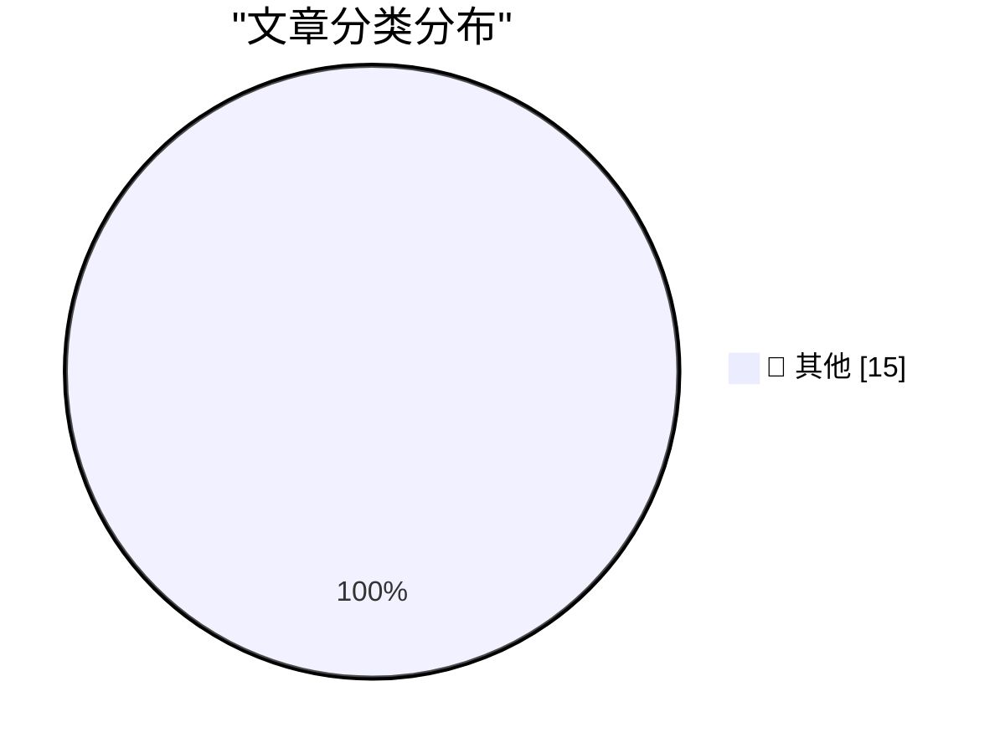

# 📰 AI 博客每日精选 — 2026-06-08

> 来自 Karpathy 推荐的 92 个顶级技术博客，AI 精选 Top 15

## 🏆 今日必读

🥇 **datasette-agent-edit 0.1a0**

[datasette-agent-edit 0.1a0](https://simonwillison.net/2026/Jun/7/datasette-agent-edit/#atom-everything) — simonwillison.net · 14 小时前 · 📝 其他

> datasette-agent-edit 0.1a0

🥈 **Doing nothing at work**

[Doing nothing at work](https://seangoedecke.com/doing-nothing-at-work/) — seangoedecke.com · 13 小时前 · 📝 其他

> Doing nothing at work

🥉 **Working with product managers**

[Working with product managers](https://seangoedecke.com/working-with-product-managers/) — seangoedecke.com · 13 小时前 · 📝 其他

> Working with product managers

---

## 📊 数据概览

| 扫描源 | 抓取文章 | 时间范围 | 精选 |
|:---:|:---:|:---:|:---:|
| 83/92 | 2481 篇 → 28 篇 | 48h | **15 篇** |

### 分类分布

```mermaid
pie showData
    title "文章分类分布"
    "📝 其他" : 15
```

---

## 📝 其他

### 1. datasette-agent-edit 0.1a0

[datasette-agent-edit 0.1a0](https://simonwillison.net/2026/Jun/7/datasette-agent-edit/#atom-everything) — **simonwillison.net** · 14 小时前 · ⭐ 15/30

> datasette-agent-edit 0.1a0

---

### 2. Doing nothing at work

[Doing nothing at work](https://seangoedecke.com/doing-nothing-at-work/) — **seangoedecke.com** · 13 小时前 · ⭐ 15/30

> Doing nothing at work

---

### 3. Working with product managers

[Working with product managers](https://seangoedecke.com/working-with-product-managers/) — **seangoedecke.com** · 13 小时前 · ⭐ 15/30

> Working with product managers

---

### 4. Mux — Video for Developers

[Mux — Video for Developers](https://www.mux.com/?utm_campaign=fireball&amp;utm_source=DF) — **daringfireball.net** · 12 小时前 · ⭐ 15/30

> Mux — Video for Developers

---

### 5. ★ SwiftUI Only Makes It Easy to Develop Bad Apps

[★ SwiftUI Only Makes It Easy to Develop Bad Apps](https://daringfireball.net/2026/06/swiftui_only_makes_it_easy_to_develop_bad_apps) — **daringfireball.net** · 12 小时前 · ⭐ 15/30

> ★ SwiftUI Only Makes It Easy to Develop Bad Apps

---

### 6. Alberto Romero on Apple’s AI Spending

[Alberto Romero on Apple’s AI Spending](https://www.thealgorithmicbridge.com/p/what-apple-knows-about-ai-that-silicon) — **daringfireball.net** · 12 小时前 · ⭐ 15/30

> Alberto Romero on Apple’s AI Spending

---

### 7. Halide Mark III

[Halide Mark III](https://www.lux.camera/halide-mark-iii/) — **daringfireball.net** · 1 天前 · ⭐ 15/30

> Halide Mark III

---

### 8. 60 Minutes Correspondents Lesley Stahl, Bill Whitaker, and the Other Guy Will Stay at Show

[60 Minutes Correspondents Lesley Stahl, Bill Whitaker, and the Other Guy Will Stay at Show](https://www.nytimes.com/2026/06/05/business/media/60-minutes-cbs-stahl-whitaker-wertheim.html?unlocked_article_code=1.oFA.xooG.Pz8cQv8odz7Z) — **daringfireball.net** · 1 天前 · ⭐ 15/30

> 60 Minutes Correspondents Lesley Stahl, Bill Whitaker, and the Other Guy Will Stay at Show

---

### 9. Trump Lawyer Argues Trump Can Tear Down Statue of Liberty

[Trump Lawyer Argues Trump Can Tear Down Statue of Liberty](https://talkingpointsmemo.com/edblog/trump-can-tear-down-statue-of-liberty-says-trump-lawyer) — **daringfireball.net** · 1 天前 · ⭐ 15/30

> Trump Lawyer Argues Trump Can Tear Down Statue of Liberty

---

### 10. A new era for software testing

[A new era for software testing](http://antirez.com/news/168) — **antirez.com** · 1 天前 · ⭐ 15/30

> A new era for software testing

---

### 11. Arp 297:

[Arp 297:](https://maurycyz.com/astro/arp297/) — **maurycyz.com** · 1 天前 · ⭐ 15/30

> Arp 297:

---

### 12. Pluralistic: Criticizing the everything machine (06 Jun 2026)

[Pluralistic: Criticizing the everything machine (06 Jun 2026)](https://pluralistic.net/2026/06/06/applied-counterescatology/) — **pluralistic.net** · 1 天前 · ⭐ 15/30

> Pluralistic: Criticizing the everything machine (06 Jun 2026)

---

### 13. How many consecutive hyphens can you have in a domain name?

[How many consecutive hyphens can you have in a domain name?](https://shkspr.mobi/blog/2026/06/how-many-consecutive-hyphens-can-you-have-in-a-domain-name/) — **shkspr.mobi** · 2 小时前 · ⭐ 15/30

> How many consecutive hyphens can you have in a domain name?

---

### 14. Giving your Go apps Tigris superpowers

[Giving your Go apps Tigris superpowers](https://www.tigrisdata.com/blog/storage-sdk-go/) — **xeiaso.net** · -604 分钟前 · ⭐ 15/30

> Giving your Go apps Tigris superpowers

---

### 15. Powering up a module from the IBM 604: an electronic calculator from 1948

[Powering up a module from the IBM 604: an electronic calculator from 1948](http://www.righto.com/feeds/3379514160039863191/comments/default) — **righto.com** · 20 小时前 · ⭐ 15/30

> Powering up a module from the IBM 604: an electronic calculator from 1948

---

*生成于 2026-06-08 13:56 | 扫描 83 源 → 获取 2481 篇 → 精选 15 篇*
*基于 [Hacker News Popularity Contest 2025](https://refactoringenglish.com/tools/hn-popularity/) RSS 源列表，由 [Andrej Karpathy](https://x.com/karpathy) 推荐*
*由「懂点儿AI」制作，欢迎关注同名微信公众号获取更多 AI 实用技巧 💡*
