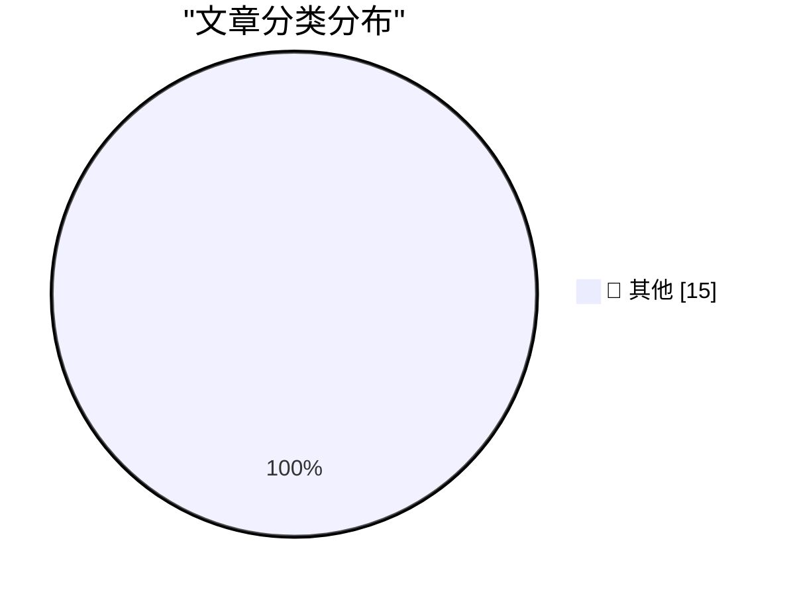

# 📰 AI 博客每日精选 — 2026-06-11

> 来自 Karpathy 推荐的 92 个顶级技术博客，AI 精选 Top 15

## 🏆 今日必读

🥇 **Anthropic Walks Back Policy That Could Have ‘Sabotaged’ AI Researchers Using Claude**

[Anthropic Walks Back Policy That Could Have ‘Sabotaged’ AI Researchers Using Claude](https://simonwillison.net/2026/Jun/11/anthropic-walks-back-policy/#atom-everything) — simonwillison.net · 10 小时前 · 📝 其他

> Anthropic Walks Back Policy That Could Have ‘Sabotaged’ AI Researchers Using Claude

🥈 **datasette-agent 0.2a0**

[datasette-agent 0.2a0](https://simonwillison.net/2026/Jun/10/datasette-agent/#atom-everything) — simonwillison.net · 13 小时前 · 📝 其他

> datasette-agent 0.2a0

🥉 **DiffusionGemma**

[DiffusionGemma](https://simonwillison.net/2026/Jun/10/diffusiongemma/#atom-everything) — simonwillison.net · 17 小时前 · 📝 其他

> DiffusionGemma

---

## 📊 数据概览

| 扫描源 | 抓取文章 | 时间范围 | 精选 |
|:---:|:---:|:---:|:---:|
| 82/92 | 2466 篇 → 37 篇 | 48h | **15 篇** |

### 分类分布

```mermaid
pie showData
    title "文章分类分布"
    "📝 其他" : 15
```

---

## 📝 其他

### 1. Anthropic Walks Back Policy That Could Have ‘Sabotaged’ AI Researchers Using Claude

[Anthropic Walks Back Policy That Could Have ‘Sabotaged’ AI Researchers Using Claude](https://simonwillison.net/2026/Jun/11/anthropic-walks-back-policy/#atom-everything) — **simonwillison.net** · 10 小时前 · ⭐ 15/30

> Anthropic Walks Back Policy That Could Have ‘Sabotaged’ AI Researchers Using Claude

---

### 2. datasette-agent 0.2a0

[datasette-agent 0.2a0](https://simonwillison.net/2026/Jun/10/datasette-agent/#atom-everything) — **simonwillison.net** · 13 小时前 · ⭐ 15/30

> datasette-agent 0.2a0

---

### 3. DiffusionGemma

[DiffusionGemma](https://simonwillison.net/2026/Jun/10/diffusiongemma/#atom-everything) — **simonwillison.net** · 17 小时前 · ⭐ 15/30

> DiffusionGemma

---

### 4. Quoting Jeremy Howard

[Quoting Jeremy Howard](https://simonwillison.net/2026/Jun/10/jeremy-howard/#atom-everything) — **simonwillison.net** · 22 小时前 · ⭐ 15/30

> Quoting Jeremy Howard

---

### 5. If Claude Fable stops helping you, you'll never know

[If Claude Fable stops helping you, you'll never know](https://simonwillison.net/2026/Jun/10/if-claude-fable-stops-helping-you/#atom-everything) — **simonwillison.net** · 1 天前 · ⭐ 15/30

> If Claude Fable stops helping you, you'll never know

---

### 6. Initial impressions of Claude Fable 5

[Initial impressions of Claude Fable 5](https://simonwillison.net/2026/Jun/9/claude-fable-5/#atom-everything) — **simonwillison.net** · 1 天前 · ⭐ 15/30

> Initial impressions of Claude Fable 5

---

### 7. llm 0.32a3

[llm 0.32a3](https://simonwillison.net/2026/Jun/9/llm/#atom-everything) — **simonwillison.net** · 1 天前 · ⭐ 15/30

> llm 0.32a3

---

### 8. Setting a custom price for a model in AgentsView

[Setting a custom price for a model in AgentsView](https://simonwillison.net/2026/Jun/9/agentsview-custom-model-price/#atom-everything) — **simonwillison.net** · 1 天前 · ⭐ 15/30

> Setting a custom price for a model in AgentsView

---

### 9. Quoting Andrej Karpathy

[Quoting Andrej Karpathy](https://simonwillison.net/2026/Jun/9/andrej-karpathy/#atom-everything) — **simonwillison.net** · 1 天前 · ⭐ 15/30

> Quoting Andrej Karpathy

---

### 10. Who Runs the Ransomware Group ‘The Gentlemen?’

[Who Runs the Ransomware Group ‘The Gentlemen?’](https://krebsonsecurity.com/2026/06/who-runs-the-ransomware-group-the-gentlemen/) — **krebsonsecurity.com** · 23 小时前 · ⭐ 15/30

> Who Runs the Ransomware Group ‘The Gentlemen?’

---

### 11. A Record-Breaking Patch Tuesday for June 2026

[A Record-Breaking Patch Tuesday for June 2026](https://krebsonsecurity.com/2026/06/a-record-breaking-patch-tuesday-for-june-2026/) — **krebsonsecurity.com** · 1 天前 · ⭐ 15/30

> A Record-Breaking Patch Tuesday for June 2026

---

### 12. Craig Federighi Details Apple’s Collaboration With Google for Siri AI — Live, on Stage

[Craig Federighi Details Apple’s Collaboration With Google for Siri AI — Live, on Stage](https://9to5mac.com/2026/06/08/craig-federighi-details-apples-collaboration-with-google-for-siri-ai-in-ios-27/) — **daringfireball.net** · 12 小时前 · ⭐ 15/30

> Craig Federighi Details Apple’s Collaboration With Google for Siri AI — Live, on Stage

---

### 13. ★ Sweet Jeebus, MacOS 27 Golden Gate Removes the Dumb Icons From Menu Items

[★ Sweet Jeebus, MacOS 27 Golden Gate Removes the Dumb Icons From Menu Items](https://daringfireball.net/2026/06/macos_27_golden_gate_removes_the_dumb_icons_from_menu_items) — **daringfireball.net** · 13 小时前 · ⭐ 15/30

> ★ Sweet Jeebus, MacOS 27 Golden Gate Removes the Dumb Icons From Menu Items

---

### 14. Apple OS 27: The Small Things

[Apple OS 27: The Small Things](https://blog.oneberri.com/posts/wwdc26-the-small-things) — **daringfireball.net** · 1 天前 · ⭐ 15/30

> Apple OS 27: The Small Things

---

### 15. The Talk Show Live From WWDC: Tonight, In-Person and Streaming

[The Talk Show Live From WWDC: Tonight, In-Person and Streaming](https://ti.to/daringfireball/the-talk-show-live-from-wwdc-2026) — **daringfireball.net** · 1 天前 · ⭐ 15/30

> The Talk Show Live From WWDC: Tonight, In-Person and Streaming

---

*生成于 2026-06-11 13:47 | 扫描 82 源 → 获取 2466 篇 → 精选 15 篇*
*基于 [Hacker News Popularity Contest 2025](https://refactoringenglish.com/tools/hn-popularity/) RSS 源列表，由 [Andrej Karpathy](https://x.com/karpathy) 推荐*
*由「懂点儿AI」制作，欢迎关注同名微信公众号获取更多 AI 实用技巧 💡*
