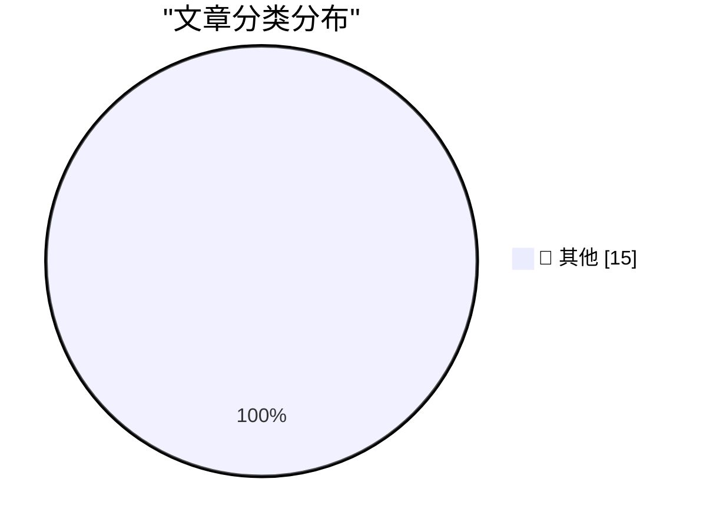

# 📰 AI 博客每日精选 — 2026-09-20

> 来自 Karpathy 推荐的 92 个顶级技术博客，AI 精选 Top 15

## 🏆 今日必读

🥇 **datasette-auth-github 1.0**

[datasette-auth-github 1.0](https://simonwillison.net/2026/Sep/19/datasette-auth-github/) — simonwillison.net · 17 小时前 · 📝 其他

> datasette-auth-github 1.0

🥈 **California Sea Lion, Brandt's Cormorant**

[California Sea Lion, Brandt's Cormorant](https://simonwillison.net/2026/Sep/19/sighting-401567341/) — simonwillison.net · 20 小时前 · 📝 其他

> California Sea Lion, Brandt's Cormorant

🥉 **Gemini Hacked Three Companies in First Known Breakout by Google’s AI**

[Gemini Hacked Three Companies in First Known Breakout by Google’s AI](https://simonwillison.net/2026/Sep/18/gemini-hacked-three-companies/) — simonwillison.net · 1 天前 · 📝 其他

> Gemini Hacked Three Companies in First Known Breakout by Google’s AI

---

## 📊 数据概览

| 扫描源 | 抓取文章 | 时间范围 | 精选 |
|:---:|:---:|:---:|:---:|
| 83/92 | 2527 篇 → 30 篇 | 48h | **15 篇** |

### 分类分布

```mermaid
pie showData
    title "文章分类分布"
    "📝 其他" : 15
```

---

## 📝 其他

### 1. datasette-auth-github 1.0

[datasette-auth-github 1.0](https://simonwillison.net/2026/Sep/19/datasette-auth-github/) — **simonwillison.net** · 17 小时前 · ⭐ 15/30

> datasette-auth-github 1.0

---

### 2. California Sea Lion, Brandt's Cormorant

[California Sea Lion, Brandt's Cormorant](https://simonwillison.net/2026/Sep/19/sighting-401567341/) — **simonwillison.net** · 20 小时前 · ⭐ 15/30

> California Sea Lion, Brandt's Cormorant

---

### 3. Gemini Hacked Three Companies in First Known Breakout by Google’s AI

[Gemini Hacked Three Companies in First Known Breakout by Google’s AI](https://simonwillison.net/2026/Sep/18/gemini-hacked-three-companies/) — **simonwillison.net** · 1 天前 · ⭐ 15/30

> Gemini Hacked Three Companies in First Known Breakout by Google’s AI

---

### 4. Note on 18th September 2026

[Note on 18th September 2026](https://simonwillison.net/2026/Sep/18/probably-gonna-eat-you/) — **simonwillison.net** · 1 天前 · ⭐ 15/30

> Note on 18th September 2026

---

### 5. Quoting Thariq Shihipar

[Quoting Thariq Shihipar](https://simonwillison.net/2026/Sep/18/thariq-shihipar/) — **simonwillison.net** · 1 天前 · ⭐ 15/30

> Quoting Thariq Shihipar

---

### 6. The Creative Spirit of Who Framed Roger Rabbit

[The Creative Spirit of Who Framed Roger Rabbit](https://simonwillison.net/2026/Sep/18/the-creative-spirit-of-who-framed-roger-rabbit/) — **simonwillison.net** · 1 天前 · ⭐ 15/30

> The Creative Spirit of Who Framed Roger Rabbit

---

### 7. NTP, an atomic clock, and having a great time at the world's largest VCF

[NTP, an atomic clock, and having a great time at the world's largest VCF](https://www.jeffgeerling.com/blog/2026/vcf-midwest-21-ntp-time/) — **jeffgeerling.com** · 1 天前 · ⭐ 15/30

> NTP, an atomic clock, and having a great time at the world's largest VCF

---

### 8. Grit your teeth and ship it

[Grit your teeth and ship it](https://seangoedecke.com/grit-your-teeth-and-ship-it/) — **seangoedecke.com** · 13 小时前 · ⭐ 15/30

> Grit your teeth and ship it

---

### 9. System One models like Jev can train their own replacements

[System One models like Jev can train their own replacements](https://seangoedecke.com/system-one-models-can-train-their-own-replacements/) — **seangoedecke.com** · 13 小时前 · ⭐ 15/30

> System One models like Jev can train their own replacements

---

### 10. Tyler Stalman’s iPhone 18 Pro Camera Review

[Tyler Stalman’s iPhone 18 Pro Camera Review](https://www.youtube.com/watch?v=m6cDErtCKAc) — **daringfireball.net** · 21 小时前 · ⭐ 15/30

> Tyler Stalman’s iPhone 18 Pro Camera Review

---

### 11. Austin Mann’s iPhone 18 Pro Camera Review, From Dunton, Colorado

[Austin Mann’s iPhone 18 Pro Camera Review, From Dunton, Colorado](https://www.austinmann.com/trek/iphone-18-pro-camera-review-dunton) — **daringfireball.net** · 22 小时前 · ⭐ 15/30

> Austin Mann’s iPhone 18 Pro Camera Review, From Dunton, Colorado

---

### 12. Just Me or Does This Argument Not Add Up?

[Just Me or Does This Argument Not Add Up?](https://www.nytimes.com/2026/09/16/opinion/university-of-california-sat.html?unlocked_article_code=1.CFE.bXBA.V6BFzBn1jlKG) — **daringfireball.net** · 1 天前 · ⭐ 15/30

> Just Me or Does This Argument Not Add Up?

---

### 13. Will Oremus Is a Duo Doubter

[Will Oremus Is a Duo Doubter](https://www.theatlantic.com/technology/2026/09/apple-folding-iphone/688562/?gift=aQyUJR7AIw1mJWdQ6Ed6yE6RbvpIGGpQGFPIX827p48) — **daringfireball.net** · 1 天前 · ⭐ 15/30

> Will Oremus Is a Duo Doubter

---

### 14. Apple Releases Xcode 27.1, First SDK With Support for iPhone Duo

[Apple Releases Xcode 27.1, First SDK With Support for iPhone Duo](https://developer.apple.com/news/?id=nyuppv9r) — **daringfireball.net** · 1 天前 · ⭐ 15/30

> Apple Releases Xcode 27.1, First SDK With Support for iPhone Duo

---

### 15. Warren Buffett, at 96, Steps Down as Chairman at Berkshire Hathaway

[Warren Buffett, at 96, Steps Down as Chairman at Berkshire Hathaway](https://www.berkshirehathaway.com/news/sep1826.pdf) — **daringfireball.net** · 1 天前 · ⭐ 15/30

> Warren Buffett, at 96, Steps Down as Chairman at Berkshire Hathaway

---

*生成于 2026-09-20 13:46 | 扫描 83 源 → 获取 2527 篇 → 精选 15 篇*
*基于 [Hacker News Popularity Contest 2025](https://refactoringenglish.com/tools/hn-popularity/) RSS 源列表，由 [Andrej Karpathy](https://x.com/karpathy) 推荐*
*由「懂点儿AI」制作，欢迎关注同名微信公众号获取更多 AI 实用技巧 💡*
