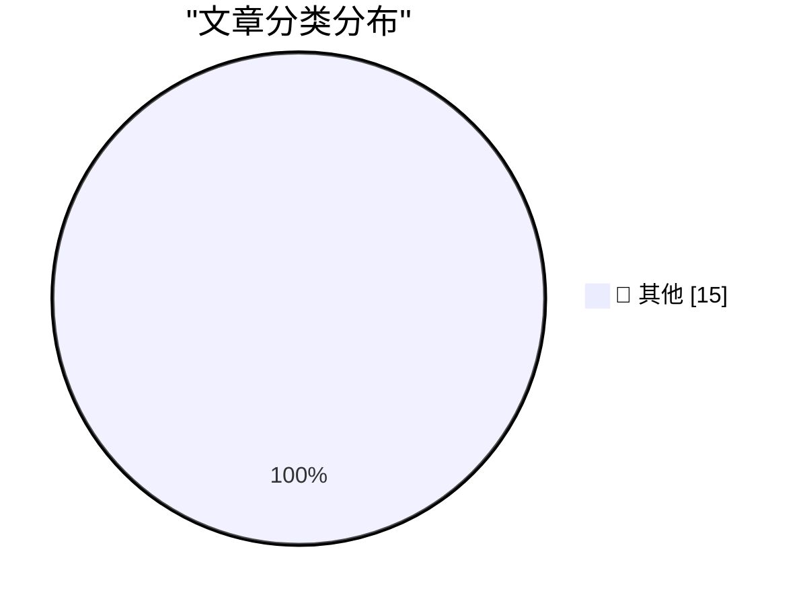

# 📰 AI 博客每日精选 — 2026-08-30

> 来自 Karpathy 推荐的 92 个顶级技术博客，AI 精选 Top 15

## 🏆 今日必读

🥇 **Introducing Hy4 Preview**

[Introducing Hy4 Preview](https://simonwillison.net/2026/Aug/29/hy4/) — simonwillison.net · 14 小时前 · 📝 其他

> Introducing Hy4 Preview

🥈 **Just a rumour of a bug is enough to find a security exploit these days**

[Just a rumour of a bug is enough to find a security exploit these days](https://simonwillison.net/2026/Aug/28/just-a-rumour-of-a-bug/) — simonwillison.net · 1 天前 · 📝 其他

> Just a rumour of a bug is enough to find a security exploit these days

🥉 **Building a mini Homelab that fits in my carry-on**

[Building a mini Homelab that fits in my carry-on](https://www.jeffgeerling.com/blog/2026/mini-homelab-network-fits-in-carry-on/) — jeffgeerling.com · 1 天前 · 📝 其他

> Building a mini Homelab that fits in my carry-on

---

## 📊 数据概览

| 扫描源 | 抓取文章 | 时间范围 | 精选 |
|:---:|:---:|:---:|:---:|
| 83/92 | 2528 篇 → 25 篇 | 48h | **15 篇** |

### 分类分布

```mermaid
pie showData
    title "文章分类分布"
    "📝 其他" : 15
```

---

## 📝 其他

### 1. Introducing Hy4 Preview

[Introducing Hy4 Preview](https://simonwillison.net/2026/Aug/29/hy4/) — **simonwillison.net** · 14 小时前 · ⭐ 15/30

> Introducing Hy4 Preview

---

### 2. Just a rumour of a bug is enough to find a security exploit these days

[Just a rumour of a bug is enough to find a security exploit these days](https://simonwillison.net/2026/Aug/28/just-a-rumour-of-a-bug/) — **simonwillison.net** · 1 天前 · ⭐ 15/30

> Just a rumour of a bug is enough to find a security exploit these days

---

### 3. Building a mini Homelab that fits in my carry-on

[Building a mini Homelab that fits in my carry-on](https://www.jeffgeerling.com/blog/2026/mini-homelab-network-fits-in-carry-on/) — **jeffgeerling.com** · 1 天前 · ⭐ 15/30

> Building a mini Homelab that fits in my carry-on

---

### 4. You have to beat the models at something

[You have to beat the models at something](https://seangoedecke.com/you-have-to-beat-the-models-at-something/) — **seangoedecke.com** · 14 小时前 · ⭐ 15/30

> You have to beat the models at something

---

### 5. ★ Thoughts and Observations on Apple’s First Immersive MLB Broadcast, a Yankees 1-0 Win Over the Red Sox

[★ Thoughts and Observations on Apple’s First Immersive MLB Broadcast, a Yankees 1-0 Win Over the Red Sox](https://daringfireball.net/2026/08/thoughts_and_observations_apple_immersive_mlb_broadcast) — **daringfireball.net** · 20 小时前 · ⭐ 15/30

> ★ Thoughts and Observations on Apple’s First Immersive MLB Broadcast, a Yankees 1-0 Win Over the Red Sox

---

### 6. Apple Announces Price Increase for Apple TV and Apple One Subscriptions

[Apple Announces Price Increase for Apple TV and Apple One Subscriptions](https://9to5mac.com/2026/08/28/apple-announces-price-increase-for-apple-tv-and-apple-one-subscriptions/) — **daringfireball.net** · 1 天前 · ⭐ 15/30

> Apple Announces Price Increase for Apple TV and Apple One Subscriptions

---

### 7. ‘I’m the Guy Who Destroys Antique Books After We Scan Them Into Our Company’s Insatiable AI Platform’

[‘I’m the Guy Who Destroys Antique Books After We Scan Them Into Our Company’s Insatiable AI Platform’](https://www.mcsweeneys.net/articles/im-the-guy-who-destroys-antique-books-after-we-scan-them-into-our-companys-insatiable-ai-platform) — **daringfireball.net** · 1 天前 · ⭐ 15/30

> ‘I’m the Guy Who Destroys Antique Books After We Scan Them Into Our Company’s Insatiable AI Platform’

---

### 8. ‘How Americans See E.U. Tech’

[‘How Americans See E.U. Tech’](https://www.youtube.com/watch?v=gGlpBuW6ZFc) — **daringfireball.net** · 1 天前 · ⭐ 15/30

> ‘How Americans See E.U. Tech’

---

### 9. We Certainly Have Made a Hames Out of This

[We Certainly Have Made a Hames Out of This](https://daringfireball.net/linked/2026/08/28/trump-lake-ontario) — **daringfireball.net** · 1 天前 · ⭐ 15/30

> We Certainly Have Made a Hames Out of This

---

### 10. ‘Not Sure How You Own Canada by Deleting Your Own History’

[‘Not Sure How You Own Canada by Deleting Your Own History’](https://x.com/MattWalshBlog/status/2093060290371870948) — **daringfireball.net** · 1 天前 · ⭐ 15/30

> ‘Not Sure How You Own Canada by Deleting Your Own History’

---

### 11. From the DF Archive: ‘Golfo Del Gringo Loco’

[From the DF Archive: ‘Golfo Del Gringo Loco’](https://daringfireball.net/2025/02/golfo_del_gringo_loco) — **daringfireball.net** · 1 天前 · ⭐ 15/30

> From the DF Archive: ‘Golfo Del Gringo Loco’

---

### 12. Technical note: transfer files over an ethernet patch cable

[Technical note: transfer files over an ethernet patch cable](https://maurycyz.com/misc/etherfiles/) — **maurycyz.com** · 1 天前 · ⭐ 15/30

> Technical note: transfer files over an ethernet patch cable

---

### 13. ActivityBot is the recipient of an NLnet grant!

[ActivityBot is the recipient of an NLnet grant!](https://shkspr.mobi/blog/2026/08/activitybot-is-the-recipient-of-an-nlnet-grant/) — **shkspr.mobi** · 2 小时前 · ⭐ 15/30

> ActivityBot is the recipient of an NLnet grant!

---

### 14. A simple "copy this code" button in JavaScript

[A simple "copy this code" button in JavaScript](https://shkspr.mobi/blog/2026/08/a-simple-copy-this-code-button-in-javascript/) — **shkspr.mobi** · 1 天前 · ⭐ 15/30

> A simple "copy this code" button in JavaScript

---

### 15. Making the unnecessary easier

[Making the unnecessary easier](https://www.johndcook.com/blog/2026/08/28/making-the-unnecessary-easier/) — **johndcook.com** · 1 天前 · ⭐ 15/30

> Making the unnecessary easier

---

*生成于 2026-08-30 14:32 | 扫描 83 源 → 获取 2528 篇 → 精选 15 篇*
*基于 [Hacker News Popularity Contest 2025](https://refactoringenglish.com/tools/hn-popularity/) RSS 源列表，由 [Andrej Karpathy](https://x.com/karpathy) 推荐*
*由「懂点儿AI」制作，欢迎关注同名微信公众号获取更多 AI 实用技巧 💡*
