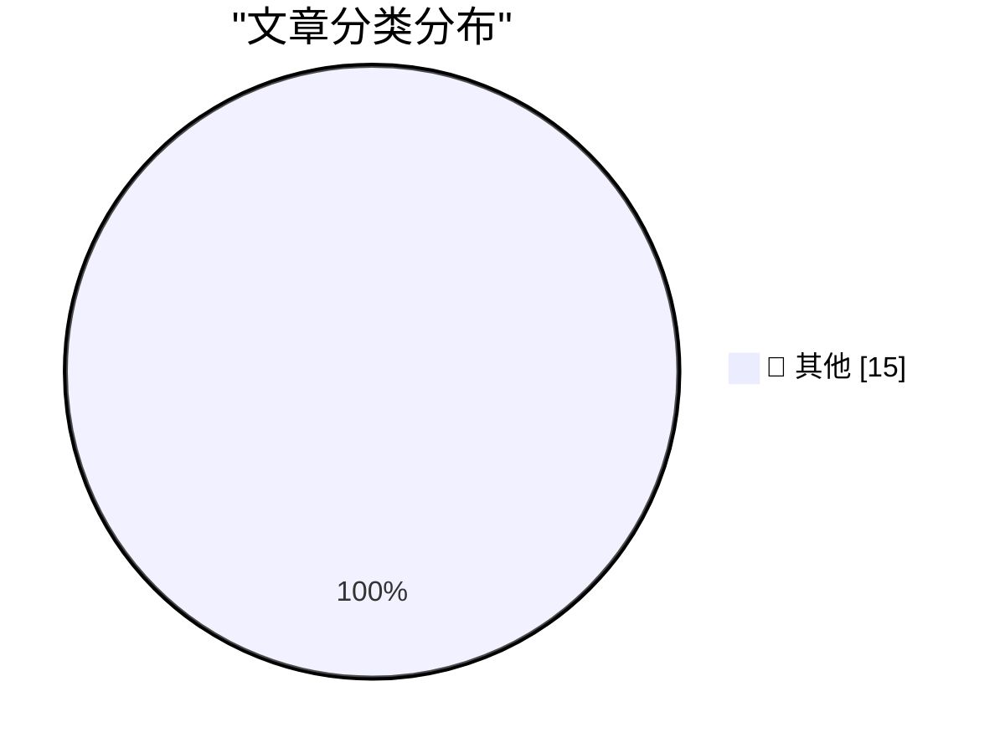

# 📰 AI 博客每日精选 — 2026-07-20

> 来自 Karpathy 推荐的 92 个顶级技术博客，AI 精选 Top 15

## 🏆 今日必读

🥇 **Quoting Sam Altman**

[Quoting Sam Altman](https://simonwillison.net/2026/Jul/20/sam-altman/#atom-everything) — simonwillison.net · 8 小时前 · 📝 其他

> Quoting Sam Altman

🥈 **AI Mania Is Eviscerating Global Decision-Making**

[AI Mania Is Eviscerating Global Decision-Making](https://simonwillison.net/2026/Jul/19/ai-mania/#atom-everything) — simonwillison.net · 1 天前 · 📝 其他

> AI Mania Is Eviscerating Global Decision-Making

🥉 **Claude Code uses Bun written in Rust now**

[Claude Code uses Bun written in Rust now](https://simonwillison.net/2026/Jul/19/claude-code-in-bun-in-rust/#atom-everything) — simonwillison.net · 1 天前 · 📝 其他

> Claude Code uses Bun written in Rust now

---

## 📊 数据概览

| 扫描源 | 抓取文章 | 时间范围 | 精选 |
|:---:|:---:|:---:|:---:|
| 82/92 | 2495 篇 → 17 篇 | 48h | **15 篇** |

### 分类分布

```mermaid
pie showData
    title "文章分类分布"
    "📝 其他" : 15
```

---

## 📝 其他

### 1. Quoting Sam Altman

[Quoting Sam Altman](https://simonwillison.net/2026/Jul/20/sam-altman/#atom-everything) — **simonwillison.net** · 8 小时前 · ⭐ 15/30

> Quoting Sam Altman

---

### 2. AI Mania Is Eviscerating Global Decision-Making

[AI Mania Is Eviscerating Global Decision-Making](https://simonwillison.net/2026/Jul/19/ai-mania/#atom-everything) — **simonwillison.net** · 1 天前 · ⭐ 15/30

> AI Mania Is Eviscerating Global Decision-Making

---

### 3. Claude Code uses Bun written in Rust now

[Claude Code uses Bun written in Rust now](https://simonwillison.net/2026/Jul/19/claude-code-in-bun-in-rust/#atom-everything) — **simonwillison.net** · 1 天前 · ⭐ 15/30

> Claude Code uses Bun written in Rust now

---

### 4. SQLite Query Explainer

[SQLite Query Explainer](https://simonwillison.net/2026/Jul/18/sqlite-query-explainer/#atom-everything) — **simonwillison.net** · 1 天前 · ⭐ 15/30

> SQLite Query Explainer

---

### 5. Impro is a handbook for running a cult

[Impro is a handbook for running a cult](https://seangoedecke.com/impro/) — **seangoedecke.com** · 1 天前 · ⭐ 15/30

> Impro is a handbook for running a cult

---

### 6. Paper

[Paper](https://paper.design/?utm_source=df) — **daringfireball.net** · 13 小时前 · ⭐ 15/30

> Paper

---

### 7. 9to5Mac Uncovers Dozens of Disguised Gambling Apps on the App Store in Brazil

[9to5Mac Uncovers Dozens of Disguised Gambling Apps on the App Store in Brazil](https://9to5mac.com/2026/07/17/investigation-reveals-dozens-of-disguised-gambling-apps-on-the-app-store-in-brazil/) — **daringfireball.net** · 18 小时前 · ⭐ 15/30

> 9to5Mac Uncovers Dozens of Disguised Gambling Apps on the App Store in Brazil

---

### 8. ★ Mornings in Cupertino Have the Aroma of Napalm Once Again

[★ Mornings in Cupertino Have the Aroma of Napalm Once Again](https://daringfireball.net/2026/07/mornings_in_cupertino_have_the_aroma_of_napalm_once_again) — **daringfireball.net** · 1 天前 · ⭐ 15/30

> ★ Mornings in Cupertino Have the Aroma of Napalm Once Again

---

### 9. Apple Sends Letters to Dozens of Former Employees Now at OpenAI

[Apple Sends Letters to Dozens of Former Employees Now at OpenAI](https://www.ft.com/content/1b8c9d52-88a9-426b-ba47-f1811f859166?syn-25a6b1a6=1) — **daringfireball.net** · 1 天前 · ⭐ 15/30

> Apple Sends Letters to Dozens of Former Employees Now at OpenAI

---

### 10. Public Transport - Don't Make Me Think!

[Public Transport - Don't Make Me Think!](https://shkspr.mobi/blog/2026/07/public-transport-dont-make-me-think/) — **shkspr.mobi** · 33 分钟前 · ⭐ 15/30

> Public Transport - Don't Make Me Think!

---

### 11. Fitting a regular expression to a list of words

[Fitting a regular expression to a list of words](https://www.johndcook.com/blog/2026/07/19/fitting-a-regex/) — **johndcook.com** · 16 小时前 · ⭐ 15/30

> Fitting a regular expression to a list of words

---

### 12. Sum of low squares

[Sum of low squares](https://www.johndcook.com/blog/2026/07/19/sum-of-low-squares/) — **johndcook.com** · 19 小时前 · ⭐ 15/30

> Sum of low squares

---

### 13. What's the deal with all the random weekly quota resets for agents lately?

[What's the deal with all the random weekly quota resets for agents lately?](https://minimaxir.com/2026/07/agent-quota-reset/) — **minimaxir.com** · 1 天前 · ⭐ 15/30

> What's the deal with all the random weekly quota resets for agents lately?

---

### 14. The MCI Worldcom merger, bankruptcy, and scandal

[The MCI Worldcom merger, bankruptcy, and scandal](https://dfarq.homeip.net/the-mci-worldcom-merger-bankruptcy-and-scandal/?utm_source=rss&#038;utm_medium=rss&#038;utm_campaign=the-mci-worldcom-merger-bankruptcy-and-scandal) — **dfarq.homeip.net** · 1 小时前 · ⭐ 15/30

> The MCI Worldcom merger, bankruptcy, and scandal

---

### 15. OpenTK: nu ook met Internetconsultaties & notificaties

[OpenTK: nu ook met Internetconsultaties & notificaties](https://berthub.eu/articles/posts/opentk-internetconsultaties/) — **berthub.eu** · 30 分钟前 · ⭐ 15/30

> OpenTK: nu ook met Internetconsultaties & notificaties

---

*生成于 2026-07-20 12:07 | 扫描 82 源 → 获取 2495 篇 → 精选 15 篇*
*基于 [Hacker News Popularity Contest 2025](https://refactoringenglish.com/tools/hn-popularity/) RSS 源列表，由 [Andrej Karpathy](https://x.com/karpathy) 推荐*
*由「懂点儿AI」制作，欢迎关注同名微信公众号获取更多 AI 实用技巧 💡*
