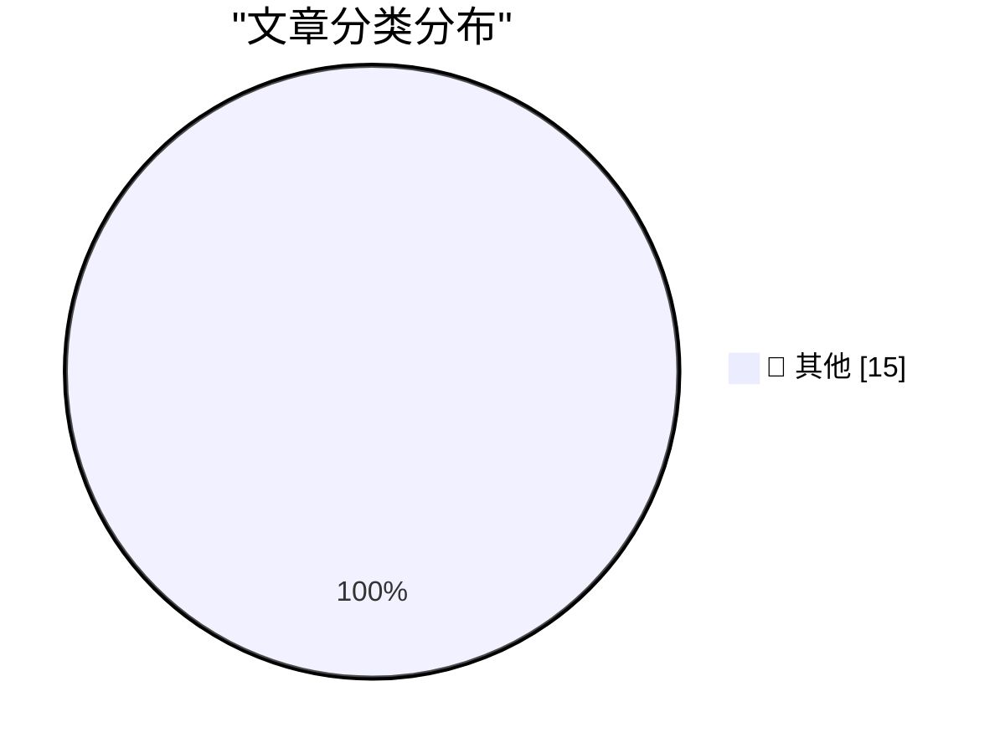

# 📰 AI 博客每日精选 — 2026-08-02

> 来自 Karpathy 推荐的 92 个顶级技术博客，AI 精选 Top 15

## 🏆 今日必读

🥇 **Open letters about AI development**

[Open letters about AI development](https://simonwillison.net/2026/Aug/2/open-letters/#atom-everything) — simonwillison.net · 6 小时前 · 📝 其他

> Open letters about AI development

🥈 **July 2026 newsletter**

[July 2026 newsletter](https://simonwillison.net/2026/Aug/2/july-newsletter/#atom-everything) — simonwillison.net · 6 小时前 · 📝 其他

> July 2026 newsletter

🥉 **Quoting Greg Brockman**

[Quoting Greg Brockman](https://simonwillison.net/2026/Aug/1/greg-brockman/#atom-everything) — simonwillison.net · 12 小时前 · 📝 其他

> Quoting Greg Brockman

---

## 📊 数据概览

| 扫描源 | 抓取文章 | 时间范围 | 精选 |
|:---:|:---:|:---:|:---:|
| 80/92 | 2466 篇 → 35 篇 | 48h | **15 篇** |

### 分类分布

```mermaid
pie showData
    title "文章分类分布"
    "📝 其他" : 15
```

---

## 📝 其他

### 1. Open letters about AI development

[Open letters about AI development](https://simonwillison.net/2026/Aug/2/open-letters/#atom-everything) — **simonwillison.net** · 6 小时前 · ⭐ 15/30

> Open letters about AI development

---

### 2. July 2026 newsletter

[July 2026 newsletter](https://simonwillison.net/2026/Aug/2/july-newsletter/#atom-everything) — **simonwillison.net** · 6 小时前 · ⭐ 15/30

> July 2026 newsletter

---

### 3. Quoting Greg Brockman

[Quoting Greg Brockman](https://simonwillison.net/2026/Aug/1/greg-brockman/#atom-everything) — **simonwillison.net** · 12 小时前 · ⭐ 15/30

> Quoting Greg Brockman

---

### 4. datasette-apps 0.2a0

[datasette-apps 0.2a0](https://simonwillison.net/2026/Aug/1/datasette-apps/#atom-everything) — **simonwillison.net** · 13 小时前 · ⭐ 15/30

> datasette-apps 0.2a0

---

### 5. Ten advances in mathematics and theoretical computer science

[Ten advances in mathematics and theoretical computer science](https://simonwillison.net/2026/Aug/1/ten-advances-in-mathematics/#atom-everything) — **simonwillison.net** · 14 小时前 · ⭐ 15/30

> Ten advances in mathematics and theoretical computer science

---

### 6. deepseek-ai/DeepSeek-V4-Flash-0731

[deepseek-ai/DeepSeek-V4-Flash-0731](https://simonwillison.net/2026/Jul/31/deepseek-v4-flash-0731/#atom-everything) — **simonwillison.net** · 1 天前 · ⭐ 15/30

> deepseek-ai/DeepSeek-V4-Flash-0731

---

### 7. Stateless MCP has recaptured my interest (and inspired mcp-explorer and datasette-mcp)

[Stateless MCP has recaptured my interest (and inspired mcp-explorer and datasette-mcp)](https://simonwillison.net/2026/Jul/31/stateless-mcp/#atom-everything) — **simonwillison.net** · 1 天前 · ⭐ 15/30

> Stateless MCP has recaptured my interest (and inspired mcp-explorer and datasette-mcp)

---

### 8. llm-mcp-client 0.1a0

[llm-mcp-client 0.1a0](https://simonwillison.net/2026/Jul/31/llm-mcp-client/#atom-everything) — **simonwillison.net** · 1 天前 · ⭐ 15/30

> llm-mcp-client 0.1a0

---

### 9. Oxide and Friends: The Open Weight Revolution with Simon Willison

[Oxide and Friends: The Open Weight Revolution with Simon Willison](https://simonwillison.net/2026/Jul/31/oxide-and-friends/#atom-everything) — **simonwillison.net** · 1 天前 · ⭐ 15/30

> Oxide and Friends: The Open Weight Revolution with Simon Willison

---

### 10. smevals - a small eval suite for evaluating models, prompts, and harnesses

[smevals - a small eval suite for evaluating models, prompts, and harnesses](https://simonwillison.net/2026/Jul/31/smevals/#atom-everything) — **simonwillison.net** · 1 天前 · ⭐ 15/30

> smevals - a small eval suite for evaluating models, prompts, and harnesses

---

### 11. Slack Emoji Maker

[Slack Emoji Maker](https://simonwillison.net/2026/Jul/31/slack-emoji-maker/#atom-everything) — **simonwillison.net** · 1 天前 · ⭐ 15/30

> Slack Emoji Maker

---

### 12. datasette-agent 0.4a0

[datasette-agent 0.4a0](https://simonwillison.net/2026/Jul/31/datasette-agent/#atom-everything) — **simonwillison.net** · 1 天前 · ⭐ 15/30

> datasette-agent 0.4a0

---

### 13. Getting 25 Gbps Thunderbolt Ethernet on my Mac Studio

[Getting 25 Gbps Thunderbolt Ethernet on my Mac Studio](https://www.jeffgeerling.com/blog/2026/getting-25g-ethernet-mac-thunderbolt/) — **jeffgeerling.com** · 1 天前 · ⭐ 15/30

> Getting 25 Gbps Thunderbolt Ethernet on my Mac Studio

---

### 14. The Apple Upgrade Situation

[The Apple Upgrade Situation](https://randsinrepose.com/archives/the-apple-upgrade-situation/) — **daringfireball.net** · 18 小时前 · ⭐ 15/30

> The Apple Upgrade Situation

---

### 15. Apple Q3 2026 Results

[Apple Q3 2026 Results](https://sixcolors.com/post/2026/07/apple-announces-record-q3-results/) — **daringfireball.net** · 18 小时前 · ⭐ 15/30

> Apple Q3 2026 Results

---

*生成于 2026-08-02 11:10 | 扫描 80 源 → 获取 2466 篇 → 精选 15 篇*
*基于 [Hacker News Popularity Contest 2025](https://refactoringenglish.com/tools/hn-popularity/) RSS 源列表，由 [Andrej Karpathy](https://x.com/karpathy) 推荐*
*由「懂点儿AI」制作，欢迎关注同名微信公众号获取更多 AI 实用技巧 💡*
