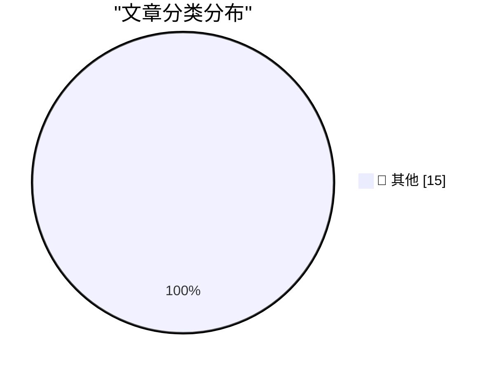

# 📰 AI 博客每日精选 — 2026-08-10

> 来自 Karpathy 推荐的 92 个顶级技术博客，AI 精选 Top 15

## 🏆 今日必读

🥇 **Quoting OpenClaw**

[Quoting OpenClaw](https://simonwillison.net/2026/Aug/10/openclaw/#atom-everything) — simonwillison.net · 8 小时前 · 📝 其他

> Quoting OpenClaw

🥈 **Quoting Claude Opus 5 system prompt**

[Quoting Claude Opus 5 system prompt](https://simonwillison.net/2026/Aug/9/claude-opus-5-system-prompt/#atom-everything) — simonwillison.net · 11 小时前 · 📝 其他

> Quoting Claude Opus 5 system prompt

🥉 **GitHub Models is now retired**

[GitHub Models is now retired](https://simonwillison.net/2026/Aug/9/github-models-is-now-retired/#atom-everything) — simonwillison.net · 12 小时前 · 📝 其他

> GitHub Models is now retired

---

## 📊 数据概览

| 扫描源 | 抓取文章 | 时间范围 | 精选 |
|:---:|:---:|:---:|:---:|
| 80/92 | 2444 篇 → 21 篇 | 48h | **15 篇** |

### 分类分布

```mermaid
pie showData
    title "文章分类分布"
    "📝 其他" : 15
```

---

## 📝 其他

### 1. Quoting OpenClaw

[Quoting OpenClaw](https://simonwillison.net/2026/Aug/10/openclaw/#atom-everything) — **simonwillison.net** · 8 小时前 · ⭐ 15/30

> Quoting OpenClaw

---

### 2. Quoting Claude Opus 5 system prompt

[Quoting Claude Opus 5 system prompt](https://simonwillison.net/2026/Aug/9/claude-opus-5-system-prompt/#atom-everything) — **simonwillison.net** · 11 小时前 · ⭐ 15/30

> Quoting Claude Opus 5 system prompt

---

### 3. GitHub Models is now retired

[GitHub Models is now retired](https://simonwillison.net/2026/Aug/9/github-models-is-now-retired/#atom-everything) — **simonwillison.net** · 12 小时前 · ⭐ 15/30

> GitHub Models is now retired

---

### 4. SQLite compressed text-history prototypes

[SQLite compressed text-history prototypes](https://simonwillison.net/2026/Aug/9/sqlite-text-history-prototype/#atom-everything) — **simonwillison.net** · 12 小时前 · ⭐ 15/30

> SQLite compressed text-history prototypes

---

### 5. Auto mode is now the default in Claude Code for Pro, Max, and Team plans

[Auto mode is now the default in Claude Code for Pro, Max, and Team plans](https://simonwillison.net/2026/Aug/8/auto-mode/#atom-everything) — **simonwillison.net** · 1 天前 · ⭐ 15/30

> Auto mode is now the default in Claude Code for Pro, Max, and Team plans

---

### 6. Now we have a timeline of the OpenAI accidental attack against Hugging Face

[Now we have a timeline of the OpenAI accidental attack against Hugging Face](https://simonwillison.net/2026/Aug/8/now-we-have-a-timeline-of-the-openai-accidental-attack-against-h/#atom-everything) — **simonwillison.net** · 1 天前 · ⭐ 15/30

> Now we have a timeline of the OpenAI accidental attack against Hugging Face

---

### 7. Advanced AI sycophancy

[Advanced AI sycophancy](https://seangoedecke.com/advanced-ai-sycophancy/) — **seangoedecke.com** · 10 小时前 · ⭐ 15/30

> Advanced AI sycophancy

---

### 8. I got an email about resistance

[I got an email about resistance](https://seangoedecke.com/i-got-an-email-about-resistance/) — **seangoedecke.com** · 1 天前 · ⭐ 15/30

> I got an email about resistance

---

### 9. WorkOS: Connect Your Agents to Your API

[WorkOS: Connect Your Agents to Your API](https://workos.com/blog/mcp-vs-rest?utm_source=daringfireball&amp;utm_medium=newsletter&amp;utm_campaign=q32026) — **daringfireball.net** · 11 小时前 · ⭐ 15/30

> WorkOS: Connect Your Agents to Your API

---

### 10. ★ Retraction: The App Store Rejection of the Week That Was, in Fact, a Correct Rejection

[★ Retraction: The App Store Rejection of the Week That Was, in Fact, a Correct Rejection](https://daringfireball.net/2026/08/retraction_app_store_rejection_of_the_week) — **daringfireball.net** · 1 天前 · ⭐ 15/30

> ★ Retraction: The App Store Rejection of the Week That Was, in Fact, a Correct Rejection

---

### 11. Corrupt Minds Think Alike

[Corrupt Minds Think Alike](https://www.nytimes.com/2026/08/06/business/fifa-world-cup-privatization.html?unlocked_article_code=1.3VA.4zqH.Pul7X9bQ2kv0&amp;smid=bs-share) — **daringfireball.net** · 1 天前 · ⭐ 15/30

> Corrupt Minds Think Alike

---

### 12. Maybe ‘Steal Underpants by Blowing a Fortune on AI Tokens’ Is, in Fact, Not a Good Business Plan

[Maybe ‘Steal Underpants by Blowing a Fortune on AI Tokens’ Is, in Fact, Not a Good Business Plan](https://www.404media.co/the-tokenpocalypse-is-here-companies-are-scrambling-to-stop-spending-so-much-on-ai/) — **daringfireball.net** · 1 天前 · ⭐ 15/30

> Maybe ‘Steal Underpants by Blowing a Fortune on AI Tokens’ Is, in Fact, Not a Good Business Plan

---

### 13. Failing after Success

[Failing after Success](https://idiallo.com/blog/failing-after-success) — **idiallo.com** · 3 小时前 · ⭐ 15/30

> Failing after Success

---

### 14. When the Aliens Finally Came to Visit

[When the Aliens Finally Came to Visit](https://idiallo.com/byte-size/when-the-aliens-came-to-visit) — **idiallo.com** · 6 小时前 · ⭐ 15/30

> When the Aliens Finally Came to Visit

---

### 15. Pluralistic: The bureaucratic AI arms-race is mutually assured destruction (10 Aug 2026)

[Pluralistic: The bureaucratic AI arms-race is mutually assured destruction (10 Aug 2026)](https://pluralistic.net/2026/08/10/deep-state-wopr/) — **pluralistic.net** · 3 小时前 · ⭐ 15/30

> Pluralistic: The bureaucratic AI arms-race is mutually assured destruction (10 Aug 2026)

---

*生成于 2026-08-10 10:55 | 扫描 80 源 → 获取 2444 篇 → 精选 15 篇*
*基于 [Hacker News Popularity Contest 2025](https://refactoringenglish.com/tools/hn-popularity/) RSS 源列表，由 [Andrej Karpathy](https://x.com/karpathy) 推荐*
*由「懂点儿AI」制作，欢迎关注同名微信公众号获取更多 AI 实用技巧 💡*
