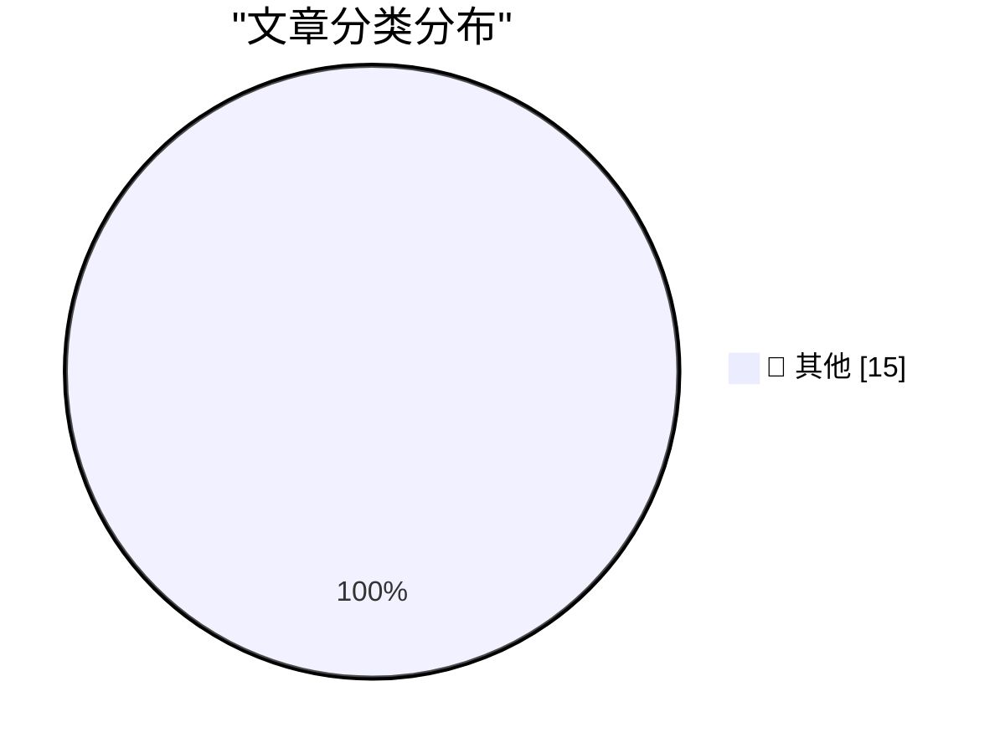

# 📰 AI 博客每日精选 — 2026-09-21

> 来自 Karpathy 推荐的 92 个顶级技术博客，AI 精选 Top 15

## 🏆 今日必读

🥇 **Quoting voxium**

[Quoting voxium](https://simonwillison.net/2026/Sep/20/voxium/) — simonwillison.net · 18 小时前 · 📝 其他

> Quoting voxium

🥈 **llm-keys-ui 0.1**

[llm-keys-ui 0.1](https://simonwillison.net/2026/Sep/20/llm-keys-ui/) — simonwillison.net · 20 小时前 · 📝 其他

> llm-keys-ui 0.1

🥉 **datasette-explain 0.2.2**

[datasette-explain 0.2.2](https://simonwillison.net/2026/Sep/20/datasette-explain/) — simonwillison.net · 1 天前 · 📝 其他

> datasette-explain 0.2.2

---

## 📊 数据概览

| 扫描源 | 抓取文章 | 时间范围 | 精选 |
|:---:|:---:|:---:|:---:|
| 84/92 | 2557 篇 → 23 篇 | 48h | **15 篇** |

### 分类分布

```mermaid
pie showData
    title "文章分类分布"
    "📝 其他" : 15
```

---

## 📝 其他

### 1. Quoting voxium

[Quoting voxium](https://simonwillison.net/2026/Sep/20/voxium/) — **simonwillison.net** · 18 小时前 · ⭐ 15/30

> Quoting voxium

---

### 2. llm-keys-ui 0.1

[llm-keys-ui 0.1](https://simonwillison.net/2026/Sep/20/llm-keys-ui/) — **simonwillison.net** · 20 小时前 · ⭐ 15/30

> llm-keys-ui 0.1

---

### 3. datasette-explain 0.2.2

[datasette-explain 0.2.2](https://simonwillison.net/2026/Sep/20/datasette-explain/) — **simonwillison.net** · 1 天前 · ⭐ 15/30

> datasette-explain 0.2.2

---

### 4. datasette-auth-github 1.0

[datasette-auth-github 1.0](https://simonwillison.net/2026/Sep/19/datasette-auth-github/) — **simonwillison.net** · 1 天前 · ⭐ 15/30

> datasette-auth-github 1.0

---

### 5. California Sea Lion, Brandt's Cormorant

[California Sea Lion, Brandt's Cormorant](https://simonwillison.net/2026/Sep/19/sighting-401567341/) — **simonwillison.net** · 1 天前 · ⭐ 15/30

> California Sea Lion, Brandt's Cormorant

---

### 6. System One models like Jev can train their own replacements

[System One models like Jev can train their own replacements](https://seangoedecke.com/system-one-models-can-train-their-own-replacements/) — **seangoedecke.com** · 1 天前 · ⭐ 15/30

> System One models like Jev can train their own replacements

---

### 7. Grit your teeth and ship it

[Grit your teeth and ship it](https://seangoedecke.com/grit-your-teeth-and-ship-it/) — **seangoedecke.com** · 1 天前 · ⭐ 15/30

> Grit your teeth and ship it

---

### 8. ‘Measuring Nothing (With Great Accuracy)’

[‘Measuring Nothing (With Great Accuracy)’](https://seths.blog/2014/01/measuring-nothing-with-great-accuracy/) — **daringfireball.net** · 1 小时前 · ⭐ 15/30

> ‘Measuring Nothing (With Great Accuracy)’

---

### 9. Apple TV to Finally Air ‘The Savant’ in Early 2027, Supposedly

[Apple TV to Finally Air ‘The Savant’ in Early 2027, Supposedly](https://deadline.com/2026/09/jessica-chastain-the-savant-new-release-date-apple-tv-1237108228/) — **daringfireball.net** · 15 小时前 · ⭐ 15/30

> Apple TV to Finally Air ‘The Savant’ in Early 2027, Supposedly

---

### 10. Yours Truly on CNBC’s ‘Squawk on the Street’ Friday

[Yours Truly on CNBC’s ‘Squawk on the Street’ Friday](https://youtu.be/WrwY_jVaN-w) — **daringfireball.net** · 15 小时前 · ⭐ 15/30

> Yours Truly on CNBC’s ‘Squawk on the Street’ Friday

---

### 11. WorkOS: How SSO Works and the Fastest Way to Add It

[WorkOS: How SSO Works and the Fastest Way to Add It](https://workos.com/guide/the-developers-guide-to-sso?utm_source=daringfireball&amp;utm_medium=newsletter&amp;utm_campaign=q32026) — **daringfireball.net** · 22 小时前 · ⭐ 15/30

> WorkOS: How SSO Works and the Fastest Way to Add It

---

### 12. GM Revives CarPlay for 2027 Trucks

[GM Revives CarPlay for 2027 Trucks](https://www.autoweek.com/news/a73761352/gm-revives-apple-carplay-for-2027-chevy-silverado-gmc-sierra/) — **daringfireball.net** · 22 小时前 · ⭐ 15/30

> GM Revives CarPlay for 2027 Trucks

---

### 13. Marques Brownlee’s iPhone 18 Pro Review

[Marques Brownlee’s iPhone 18 Pro Review](https://www.youtube.com/watch?v=ohqxP8EEumo) — **daringfireball.net** · 1 天前 · ⭐ 15/30

> Marques Brownlee’s iPhone 18 Pro Review

---

### 14. Tyler Stalman’s iPhone 18 Pro Camera Review

[Tyler Stalman’s iPhone 18 Pro Camera Review](https://www.youtube.com/watch?v=m6cDErtCKAc) — **daringfireball.net** · 1 天前 · ⭐ 15/30

> Tyler Stalman’s iPhone 18 Pro Camera Review

---

### 15. Pluralistic: The Claude Delusion (21 Sep 2026)

[Pluralistic: The Claude Delusion (21 Sep 2026)](https://pluralistic.net/2026/09/21/sunsetting/) — **pluralistic.net** · 4 小时前 · ⭐ 15/30

> Pluralistic: The Claude Delusion (21 Sep 2026)

---

*生成于 2026-09-21 16:03 | 扫描 84 源 → 获取 2557 篇 → 精选 15 篇*
*基于 [Hacker News Popularity Contest 2025](https://refactoringenglish.com/tools/hn-popularity/) RSS 源列表，由 [Andrej Karpathy](https://x.com/karpathy) 推荐*
*由「懂点儿AI」制作，欢迎关注同名微信公众号获取更多 AI 实用技巧 💡*
