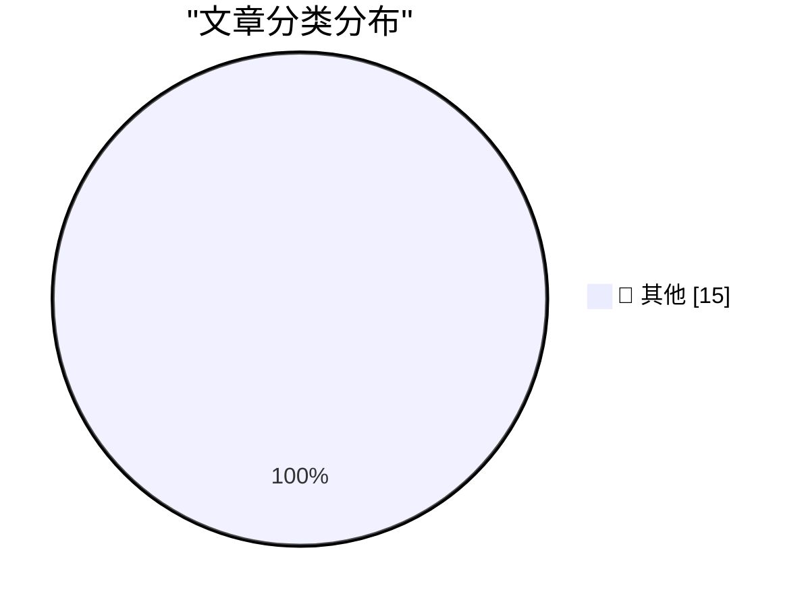

# 📰 AI 博客每日精选 — 2026-07-30

> 来自 Karpathy 推荐的 92 个顶级技术博客，AI 精选 Top 15

## 🏆 今日必读

🥇 **Quoting D. Richard Hipp**

[Quoting D. Richard Hipp](https://simonwillison.net/2026/Jul/29/d-richard-hipp/#atom-everything) — simonwillison.net · 14 小时前 · 📝 其他

> Quoting D. Richard Hipp

🥈 **AI Worming through Word**

[AI Worming through Word](https://simonwillison.net/2026/Jul/29/ai-worming-through-word/#atom-everything) — simonwillison.net · 17 小时前 · 📝 其他

> AI Worming through Word

🥉 **Quoting Matthew Green**

[Quoting Matthew Green](https://simonwillison.net/2026/Jul/29/matthew-green/#atom-everything) — simonwillison.net · 17 小时前 · 📝 其他

> Quoting Matthew Green

---

## 📊 数据概览

| 扫描源 | 抓取文章 | 时间范围 | 精选 |
|:---:|:---:|:---:|:---:|
| 83/92 | 2516 篇 → 32 篇 | 48h | **15 篇** |

### 分类分布

```mermaid
pie showData
    title "文章分类分布"
    "📝 其他" : 15
```

---

## 📝 其他

### 1. Quoting D. Richard Hipp

[Quoting D. Richard Hipp](https://simonwillison.net/2026/Jul/29/d-richard-hipp/#atom-everything) — **simonwillison.net** · 14 小时前 · ⭐ 15/30

> Quoting D. Richard Hipp

---

### 2. AI Worming through Word

[AI Worming through Word](https://simonwillison.net/2026/Jul/29/ai-worming-through-word/#atom-everything) — **simonwillison.net** · 17 小时前 · ⭐ 15/30

> AI Worming through Word

---

### 3. Quoting Matthew Green

[Quoting Matthew Green](https://simonwillison.net/2026/Jul/29/matthew-green/#atom-everything) — **simonwillison.net** · 17 小时前 · ⭐ 15/30

> Quoting Matthew Green

---

### 4. Adding a custom MCP server to Claude and ChatGPT

[Adding a custom MCP server to Claude and ChatGPT](https://simonwillison.net/2026/Jul/29/mcp-in-claude-and-chatgpt/#atom-everything) — **simonwillison.net** · 1 天前 · ⭐ 15/30

> Adding a custom MCP server to Claude and ChatGPT

---

### 5. Discovering cryptographic weaknesses with Claude

[Discovering cryptographic weaknesses with Claude](https://simonwillison.net/2026/Jul/28/discovering-cryptographic-weaknesses-with-claude/#atom-everything) — **simonwillison.net** · 1 天前 · ⭐ 15/30

> Discovering cryptographic weaknesses with Claude

---

### 6. Quoting Akshat Bubna

[Quoting Akshat Bubna](https://simonwillison.net/2026/Jul/28/akshat-bubna/#atom-everything) — **simonwillison.net** · 1 天前 · ⭐ 15/30

> Quoting Akshat Bubna

---

### 7. uv 0.12.0

[uv 0.12.0](https://simonwillison.net/2026/Jul/28/uv/#atom-everything) — **simonwillison.net** · 1 天前 · ⭐ 15/30

> uv 0.12.0

---

### 8. Anatomy of a Frontier Lab Agent Intrusion: A Technical Timeline of the July 2026 Incident

[Anatomy of a Frontier Lab Agent Intrusion: A Technical Timeline of the July 2026 Incident](https://simonwillison.net/2026/Jul/28/anatomy-of-a-frontier-lab-agent-intrusion/#atom-everything) — **simonwillison.net** · 1 天前 · ⭐ 15/30

> Anatomy of a Frontier Lab Agent Intrusion: A Technical Timeline of the July 2026 Incident

---

### 9. You don't have to be smart if you can think clearly

[You don't have to be smart if you can think clearly](https://seangoedecke.com/you-dont-have-to-be-smart-if-you-think-clearly/) — **seangoedecke.com** · 1 天前 · ⭐ 15/30

> You don't have to be smart if you can think clearly

---

### 10. Apple Says iOS 27 ‘Restricted Mode’ Isn’t for Users Who Miss Payments in New Apple Upgrade Program

[Apple Says iOS 27 ‘Restricted Mode’ Isn’t for Users Who Miss Payments in New Apple Upgrade Program](https://9to5mac.com/2026/07/28/apple-says-ios-27-restricted-mode-isnt-for-new-upgrade-program-leases/) — **daringfireball.net** · 14 小时前 · ⭐ 15/30

> Apple Says iOS 27 ‘Restricted Mode’ Isn’t for Users Who Miss Payments in New Apple Upgrade Program

---

### 11. Apple Upgrade — New Program With Klarna for Leasing iPhones, Macs, iPads, and More for Near-Zero Interest

[Apple Upgrade — New Program With Klarna for Leasing iPhones, Macs, iPads, and More for Near-Zero Interest](https://www.apple.com/newsroom/2026/07/apple-upgrade-launches-in-the-united-states/) — **daringfireball.net** · 18 小时前 · ⭐ 15/30

> Apple Upgrade — New Program With Klarna for Leasing iPhones, Macs, iPads, and More for Near-Zero Interest

---

### 12. Pastebot 3

[Pastebot 3](https://tapbots.com/pastebot/) — **daringfireball.net** · 19 小时前 · ⭐ 15/30

> Pastebot 3

---

### 13. Count Those Underscores

[Count Those Underscores](https://arstechnica.com/tech-policy/2026/07/police-missed-one-underscore-and-sent-the-wrong-man-to-prison/) — **daringfireball.net** · 20 小时前 · ⭐ 15/30

> Count Those Underscores

---

### 14. ‘eBay’s Bizarre Cyberstalking Saga Ends With a $56 Million Settlement’

[‘eBay’s Bizarre Cyberstalking Saga Ends With a $56 Million Settlement’](https://www.theverge.com/tech/972209/ebay-cyberstalking-harassment-settlement) — **daringfireball.net** · 21 小时前 · ⭐ 15/30

> ‘eBay’s Bizarre Cyberstalking Saga Ends With a $56 Million Settlement’

---

### 15. Steve Jobs in 2011: ‘We Build Products That We Want for Ourselves, Too, and We Just Don’t Want Ads’

[Steve Jobs in 2011: ‘We Build Products That We Want for Ourselves, Too, and We Just Don’t Want Ads’](https://www.businessinsider.com/apple-snubs-the-iad-2011-6) — **daringfireball.net** · 1 天前 · ⭐ 15/30

> Steve Jobs in 2011: ‘We Build Products That We Want for Ourselves, Too, and We Just Don’t Want Ads’

---

*生成于 2026-07-30 11:44 | 扫描 83 源 → 获取 2516 篇 → 精选 15 篇*
*基于 [Hacker News Popularity Contest 2025](https://refactoringenglish.com/tools/hn-popularity/) RSS 源列表，由 [Andrej Karpathy](https://x.com/karpathy) 推荐*
*由「懂点儿AI」制作，欢迎关注同名微信公众号获取更多 AI 实用技巧 💡*
