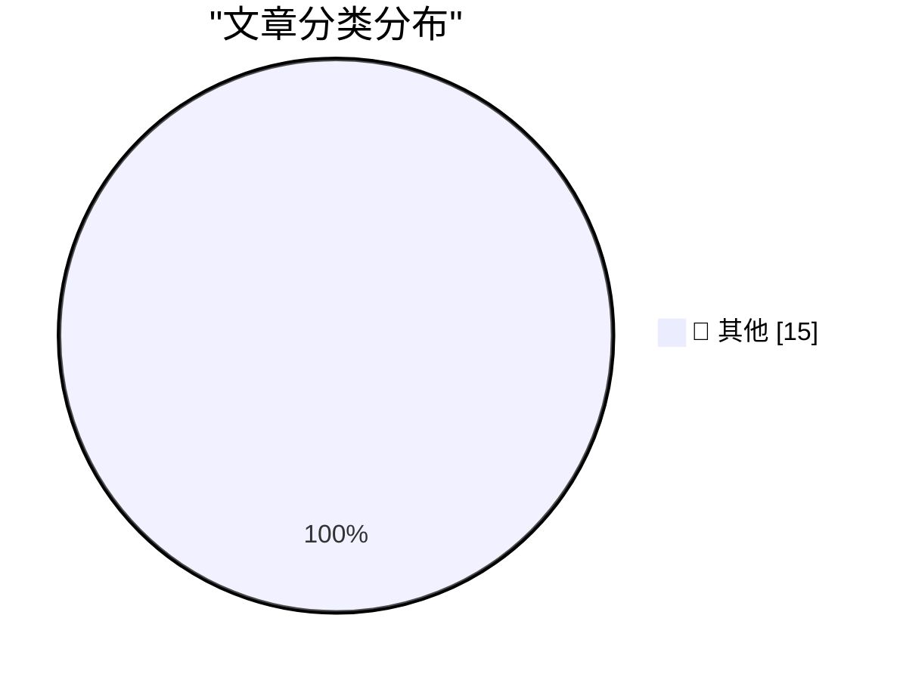

# 📰 AI 博客每日精选 — 2026-07-11

> 来自 Karpathy 推荐的 92 个顶级技术博客，AI 精选 Top 15

## 🏆 今日必读

🥇 **Quoting Nilay Patel**

[Quoting Nilay Patel](https://simonwillison.net/2026/Jul/10/nilay-patel/#atom-everything) — simonwillison.net · 17 小时前 · 📝 其他

> Quoting Nilay Patel

🥈 **Quoting OpenAI**

[Quoting OpenAI](https://simonwillison.net/2026/Jul/10/openai/#atom-everything) — simonwillison.net · 1 天前 · 📝 其他

> Quoting OpenAI

🥉 **The new GPT-5.6 family: Luna, Terra, Sol**

[The new GPT-5.6 family: Luna, Terra, Sol](https://simonwillison.net/2026/Jul/9/gpt-5-6/#atom-everything) — simonwillison.net · 1 天前 · 📝 其他

> The new GPT-5.6 family: Luna, Terra, Sol

---

## 📊 数据概览

| 扫描源 | 抓取文章 | 时间范围 | 精选 |
|:---:|:---:|:---:|:---:|
| 82/92 | 2486 篇 → 36 篇 | 48h | **15 篇** |

### 分类分布

```mermaid
pie showData
    title "文章分类分布"
    "📝 其他" : 15
```

---

## 📝 其他

### 1. Quoting Nilay Patel

[Quoting Nilay Patel](https://simonwillison.net/2026/Jul/10/nilay-patel/#atom-everything) — **simonwillison.net** · 17 小时前 · ⭐ 15/30

> Quoting Nilay Patel

---

### 2. Quoting OpenAI

[Quoting OpenAI](https://simonwillison.net/2026/Jul/10/openai/#atom-everything) — **simonwillison.net** · 1 天前 · ⭐ 15/30

> Quoting OpenAI

---

### 3. The new GPT-5.6 family: Luna, Terra, Sol

[The new GPT-5.6 family: Luna, Terra, Sol](https://simonwillison.net/2026/Jul/9/gpt-5-6/#atom-everything) — **simonwillison.net** · 1 天前 · ⭐ 15/30

> The new GPT-5.6 family: Luna, Terra, Sol

---

### 4. Introducing Muse Spark 1.1

[Introducing Muse Spark 1.1](https://simonwillison.net/2026/Jul/9/muse-spark-1-1/#atom-everything) — **simonwillison.net** · 1 天前 · ⭐ 15/30

> Introducing Muse Spark 1.1

---

### 5. llm-meta-ai 0.1

[llm-meta-ai 0.1](https://simonwillison.net/2026/Jul/9/llm-meta-ai/#atom-everything) — **simonwillison.net** · 1 天前 · ⭐ 15/30

> llm-meta-ai 0.1

---

### 6. llm 0.31.1

[llm 0.31.1](https://simonwillison.net/2026/Jul/9/llm/#atom-everything) — **simonwillison.net** · 1 天前 · ⭐ 15/30

> llm 0.31.1

---

### 7. QuadRF can spot drones and see WiFi through my wall

[QuadRF can spot drones and see WiFi through my wall](https://www.jeffgeerling.com/blog/2026/quadrf-can-spot-drones-and-see-wifi-through-my-wall/) — **jeffgeerling.com** · 20 小时前 · ⭐ 15/30

> QuadRF can spot drones and see WiFi through my wall

---

### 8. In defense of not understanding your codebase

[In defense of not understanding your codebase](https://seangoedecke.com/in-defense-of-not-understanding-your-codebase/) — **seangoedecke.com** · 10 小时前 · ⭐ 15/30

> In defense of not understanding your codebase

---

### 9. John Ternus Calls Sam Altman

[John Ternus Calls Sam Altman](https://www.youtube.com/watch?v=ClASuxd8jQY) — **daringfireball.net** · 7 小时前 · ⭐ 15/30

> John Ternus Calls Sam Altman

---

### 10. ‘No Interest’

[‘No Interest’](https://x.com/drewpusateri/status/2075708238650089981) — **daringfireball.net** · 7 小时前 · ⭐ 15/30

> ‘No Interest’

---

### 11. Ice Cold

[Ice Cold](https://www.threads.com/@alexheath/post/DaoI2jaEioX) — **daringfireball.net** · 7 小时前 · ⭐ 15/30

> Ice Cold

---

### 12. Ryanair Literally Sucks

[Ryanair Literally Sucks](https://apnews.com/article/greece-germany-ryanair-passenger-457c424f541152af1becdb387c90cfdd) — **daringfireball.net** · 7 小时前 · ⭐ 15/30

> Ryanair Literally Sucks

---

### 13. Newly Renamed Trump Airport in Palm Beach Has an AI Slop Logo

[Newly Renamed Trump Airport in Palm Beach Has an AI Slop Logo](https://futurism.com/artificial-intelligence/trump-airport-logo-ai) — **daringfireball.net** · 7 小时前 · ⭐ 15/30

> Newly Renamed Trump Airport in Palm Beach Has an AI Slop Logo

---

### 14. Mac OS 9’s Finder Had a ‘View as Buttons’ Mode

[Mac OS 9’s Finder Had a ‘View as Buttons’ Mode](https://www.cryan.com/blog/20240502.jsp) — **daringfireball.net** · 8 小时前 · ⭐ 15/30

> Mac OS 9’s Finder Had a ‘View as Buttons’ Mode

---

### 15. Squircle Jail Isn’t (Or at Least Shouldn’t Be) About Upcoming Touchscreen Macs

[Squircle Jail Isn’t (Or at Least Shouldn’t Be) About Upcoming Touchscreen Macs](https://daringfireball.net/2026/07/whats_good_for_the_ios_goose_is_often_not_good_for_the_macos_gander) — **daringfireball.net** · 8 小时前 · ⭐ 15/30

> Squircle Jail Isn’t (Or at Least Shouldn’t Be) About Upcoming Touchscreen Macs

---

*生成于 2026-07-11 10:51 | 扫描 82 源 → 获取 2486 篇 → 精选 15 篇*
*基于 [Hacker News Popularity Contest 2025](https://refactoringenglish.com/tools/hn-popularity/) RSS 源列表，由 [Andrej Karpathy](https://x.com/karpathy) 推荐*
*由「懂点儿AI」制作，欢迎关注同名微信公众号获取更多 AI 实用技巧 💡*
