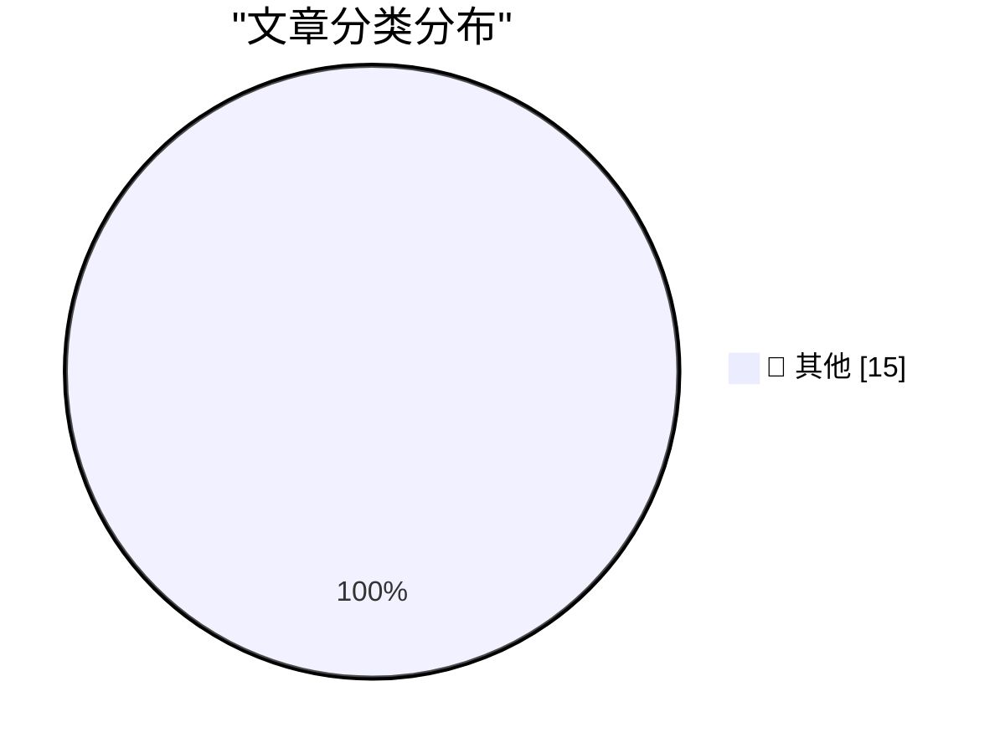

# 📰 AI 博客每日精选 — 2026-09-18

> 来自 Karpathy 推荐的 92 个顶级技术博客，AI 精选 Top 15

## 🏆 今日必读

🥇 **Be alert: targeted attacks on prominent Rustaceans**

[Be alert: targeted attacks on prominent Rustaceans](https://simonwillison.net/2026/Sep/17/targeted-attacks-on-rustaceans/) — simonwillison.net · 13 小时前 · 📝 其他

> Be alert: targeted attacks on prominent Rustaceans

🥈 **How To Write With An LLM**

[How To Write With An LLM](https://simonwillison.net/2026/Sep/17/how-to-write-with-an-llm/) — simonwillison.net · 14 小时前 · 📝 其他

> How To Write With An LLM

🥉 **Self-generated prompt injections in compaction summaries**

[Self-generated prompt injections in compaction summaries](https://simonwillison.net/2026/Sep/17/compaction-summaries/) — simonwillison.net · 16 小时前 · 📝 其他

> Self-generated prompt injections in compaction summaries

---

## 📊 数据概览

| 扫描源 | 抓取文章 | 时间范围 | 精选 |
|:---:|:---:|:---:|:---:|
| 83/92 | 2525 篇 → 34 篇 | 48h | **15 篇** |

### 分类分布

```mermaid
pie showData
    title "文章分类分布"
    "📝 其他" : 15
```

---

## 📝 其他

### 1. Be alert: targeted attacks on prominent Rustaceans

[Be alert: targeted attacks on prominent Rustaceans](https://simonwillison.net/2026/Sep/17/targeted-attacks-on-rustaceans/) — **simonwillison.net** · 13 小时前 · ⭐ 15/30

> Be alert: targeted attacks on prominent Rustaceans

---

### 2. How To Write With An LLM

[How To Write With An LLM](https://simonwillison.net/2026/Sep/17/how-to-write-with-an-llm/) — **simonwillison.net** · 14 小时前 · ⭐ 15/30

> How To Write With An LLM

---

### 3. Self-generated prompt injections in compaction summaries

[Self-generated prompt injections in compaction summaries](https://simonwillison.net/2026/Sep/17/compaction-summaries/) — **simonwillison.net** · 16 小时前 · ⭐ 15/30

> Self-generated prompt injections in compaction summaries

---

### 4. datasette 1.0a40

[datasette 1.0a40](https://simonwillison.net/2026/Sep/16/datasette/) — **simonwillison.net** · 1 天前 · ⭐ 15/30

> datasette 1.0a40

---

### 5. datasette 0.65.5

[datasette 0.65.5](https://simonwillison.net/2026/Sep/16/datasette-2/) — **simonwillison.net** · 1 天前 · ⭐ 15/30

> datasette 0.65.5

---

### 6. Claude Cowork and chat are now one Claude

[Claude Cowork and chat are now one Claude](https://simonwillison.net/2026/Sep/16/one-claude/) — **simonwillison.net** · 1 天前 · ⭐ 15/30

> Claude Cowork and chat are now one Claude

---

### 7. Quoting Mustafa Suleyman

[Quoting Mustafa Suleyman](https://simonwillison.net/2026/Sep/16/mustafa-suleyman/) — **simonwillison.net** · 1 天前 · ⭐ 15/30

> Quoting Mustafa Suleyman

---

### 8. Two techniques for working with System One models

[Two techniques for working with System One models](https://seangoedecke.com/two-techniques-for-working-with-system-one-models/) — **seangoedecke.com** · 13 小时前 · ⭐ 15/30

> Two techniques for working with System One models

---

### 9. Data Broker Radaris Loses Domains in Privacy Fight

[Data Broker Radaris Loses Domains in Privacy Fight](https://krebsonsecurity.com/2026/09/data-broker-radaris-loses-domains-in-privacy-fight/) — **krebsonsecurity.com** · 1 天前 · ⭐ 15/30

> Data Broker Radaris Loses Domains in Privacy Fight

---

### 10. ★ The iPhones 18 Pro

[★ The iPhones 18 Pro](https://daringfireball.net/2026/09/the_iphones_18_pro) — **daringfireball.net** · 11 小时前 · ⭐ 15/30

> ★ The iPhones 18 Pro

---

### 11. Why Do U.S. Models of the iPhone 18 Pro Max, and Only U.S. Models of the 18 Pro Max, Use Qualcomm Cellular Modems Instead of Apple’s Own Superior C2 Modem?

[Why Do U.S. Models of the iPhone 18 Pro Max, and Only U.S. Models of the 18 Pro Max, Use Qualcomm Cellular Modems Instead of Apple’s Own Superior C2 Modem?](https://www.macrumors.com/2026/09/12/iphone-18-pro-max-us-model-difference/) — **daringfireball.net** · 23 小时前 · ⭐ 15/30

> Why Do U.S. Models of the iPhone 18 Pro Max, and Only U.S. Models of the 18 Pro Max, Use Qualcomm Cellular Modems Instead of Apple’s Own Superior C2 Modem?

---

### 12. Xcode 27.2 Is Out, but 27.1 Is Not, Which Means Developers Still Can’t Get Started on Duo-Adapted Apps

[Xcode 27.2 Is Out, but 27.1 Is Not, Which Means Developers Still Can’t Get Started on Duo-Adapted Apps](https://developer.apple.com/documentation/xcode-release-notes/xcode-27_2-release-notes) — **daringfireball.net** · 1 天前 · ⭐ 15/30

> Xcode 27.2 Is Out, but 27.1 Is Not, Which Means Developers Still Can’t Get Started on Duo-Adapted Apps

---

### 13. Is That a Duo in Ternus’s Pocket or Was He Just Happy That Apple TV Shows Won 28 Emmys?

[Is That a Duo in Ternus’s Pocket or Was He Just Happy That Apple TV Shows Won 28 Emmys?](https://x.com/DEADLINE/status/2099645816361332775) — **daringfireball.net** · 1 天前 · ⭐ 15/30

> Is That a Duo in Ternus’s Pocket or Was He Just Happy That Apple TV Shows Won 28 Emmys?

---

### 14. Woz Launches Merch Store

[Woz Launches Merch Store](https://x.com/stevewoz/status/2100074363605397658) — **daringfireball.net** · 1 天前 · ⭐ 15/30

> Woz Launches Merch Store

---

### 15. Apple OS 27.2 Betas Are Out; Version 27.1 Is the Duo-Exclusive iOS Fork

[Apple OS 27.2 Betas Are Out; Version 27.1 Is the Duo-Exclusive iOS Fork](https://www.macrumors.com/2026/09/16/heres-why-apple-released-ios-27-2-beta/) — **daringfireball.net** · 1 天前 · ⭐ 15/30

> Apple OS 27.2 Betas Are Out; Version 27.1 Is the Duo-Exclusive iOS Fork

---

*生成于 2026-09-18 13:56 | 扫描 83 源 → 获取 2525 篇 → 精选 15 篇*
*基于 [Hacker News Popularity Contest 2025](https://refactoringenglish.com/tools/hn-popularity/) RSS 源列表，由 [Andrej Karpathy](https://x.com/karpathy) 推荐*
*由「懂点儿AI」制作，欢迎关注同名微信公众号获取更多 AI 实用技巧 💡*
