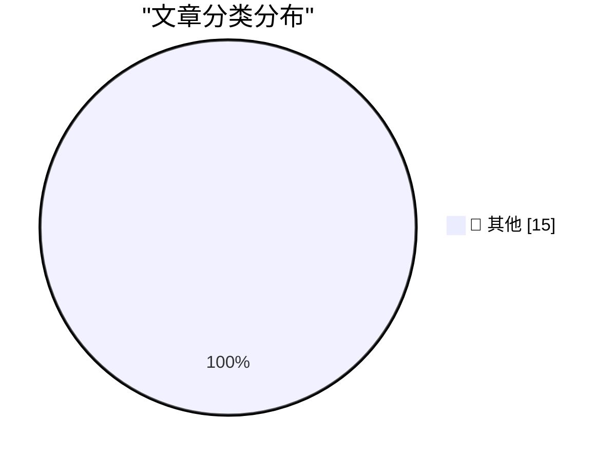

# 📰 AI 博客每日精选 — 2026-05-11

> 来自 Karpathy 推荐的 92 个顶级技术博客，AI 精选 Top 15

## 🏆 今日必读

🥇 **Quoting New York Times Editors’ Note**

[Quoting New York Times Editors’ Note](https://simonwillison.net/2026/May/10/new-york-times-editors-note/#atom-everything) — simonwillison.net · 12 小时前 · 📝 其他

> Quoting New York Times Editors’ Note

🥈 **Quoting Andrew Quinn**

[Quoting Andrew Quinn](https://simonwillison.net/2026/May/10/andrew-quinn/#atom-everything) — simonwillison.net · 21 小时前 · 📝 其他

> Quoting Andrew Quinn

🥉 **The left-wing case for AI**

[The left-wing case for AI](https://seangoedecke.com/the-left-wing-case-for-ai/) — seangoedecke.com · 1 天前 · 📝 其他

> The left-wing case for AI

---

## 📊 数据概览

| 扫描源 | 抓取文章 | 时间范围 | 精选 |
|:---:|:---:|:---:|:---:|
| 82/92 | 2416 篇 → 18 篇 | 48h | **15 篇** |

### 分类分布

```mermaid
pie showData
    title "文章分类分布"
    "📝 其他" : 15
```

---

## 📝 其他

### 1. Quoting New York Times Editors’ Note

[Quoting New York Times Editors’ Note](https://simonwillison.net/2026/May/10/new-york-times-editors-note/#atom-everything) — **simonwillison.net** · 12 小时前 · ⭐ 15/30

> Quoting New York Times Editors’ Note

---

### 2. Quoting Andrew Quinn

[Quoting Andrew Quinn](https://simonwillison.net/2026/May/10/andrew-quinn/#atom-everything) — **simonwillison.net** · 21 小时前 · ⭐ 15/30

> Quoting Andrew Quinn

---

### 3. The left-wing case for AI

[The left-wing case for AI](https://seangoedecke.com/the-left-wing-case-for-ai/) — **seangoedecke.com** · 1 天前 · ⭐ 15/30

> The left-wing case for AI

---

### 4. WorkOS

[WorkOS](https://workos.com/?utm_source=daringfireball&amp;utm_medium=newsletter&amp;utm_campaign=q22026) — **daringfireball.net** · 22 小时前 · ⭐ 15/30

> WorkOS

---

### 5. Meta to Start Capturing Employee Mouse Movements, Keystrokes for AI Training Data

[Meta to Start Capturing Employee Mouse Movements, Keystrokes for AI Training Data](https://www.reuters.com/sustainability/boards-policy-regulation/meta-start-capturing-employee-mouse-movements-keystrokes-ai-training-data-2026-04-21/) — **daringfireball.net** · 22 小时前 · ⭐ 15/30

> Meta to Start Capturing Employee Mouse Movements, Keystrokes for AI Training Data

---

### 6. We Are Not Going to Agree on AI

[We Are Not Going to Agree on AI](https://idiallo.com/blog/we-are-not-going-to-agree-on-ai?src=feed) — **idiallo.com** · 33 分钟前 · ⭐ 15/30

> We Are Not Going to Agree on AI

---

### 7. Pluralistic: 2024 (apart from the obvious) (11 May 2026)

[Pluralistic: 2024 (apart from the obvious) (11 May 2026)](https://pluralistic.net/2026/05/11/postmortem/) — **pluralistic.net** · 2 小时前 · ⭐ 15/30

> Pluralistic: 2024 (apart from the obvious) (11 May 2026)

---

### 8. Pluralistic: Trump's fruitless search for a goreable ox (09 May 2026)

[Pluralistic: Trump's fruitless search for a goreable ox (09 May 2026)](https://pluralistic.net/2026/05/09/cossie-livvie-crissie/) — **pluralistic.net** · 1 天前 · ⭐ 15/30

> Pluralistic: Trump's fruitless search for a goreable ox (09 May 2026)

---

### 9. The linear algebra of bit twiddling

[The linear algebra of bit twiddling](https://www.johndcook.com/blog/2026/05/10/the-linear-algebra-of-bit-twiddling/) — **johndcook.com** · 17 小时前 · ⭐ 15/30

> The linear algebra of bit twiddling

---

### 10. Reverse engineering Mersenne Twister with Linear Algebra

[Reverse engineering Mersenne Twister with Linear Algebra](https://www.johndcook.com/blog/2026/05/10/reverse-mersenne-twister/) — **johndcook.com** · 19 小时前 · ⭐ 15/30

> Reverse engineering Mersenne Twister with Linear Algebra

---

### 11. Fear is information.

[Fear is information.](https://www.joanwestenberg.com/fear-is-information/) — **joanwestenberg.com** · 8 小时前 · ⭐ 15/30

> Fear is information.

---

### 12. proxy

[proxy](https://nesbitt.io/2026/05/11/proxy.html) — **nesbitt.io** · 2 小时前 · ⭐ 15/30

> proxy

---

### 13. Madame Semver Will See You Now

[Madame Semver Will See You Now](https://nesbitt.io/2026/05/10/madame-semver-will-see-you-now.html) — **nesbitt.io** · 1 天前 · ⭐ 15/30

> Madame Semver Will See You Now

---

### 14. The Problem of Pedagogy in Advanced Mathematics

[The Problem of Pedagogy in Advanced Mathematics](https://susam.net/advanced-mathematics-pedagogy.html) — **susam.net** · 12 小时前 · ⭐ 15/30

> The Problem of Pedagogy in Advanced Mathematics

---

### 15. Out With the JS, In With the HTML

[Out With the JS, In With the HTML](https://blog.jim-nielsen.com/2026/out-with-js-in-with-html/) — **blog.jim-nielsen.com** · 17 小时前 · ⭐ 15/30

> Out With the JS, In With the HTML

---

*生成于 2026-05-11 12:33 | 扫描 82 源 → 获取 2416 篇 → 精选 15 篇*
*基于 [Hacker News Popularity Contest 2025](https://refactoringenglish.com/tools/hn-popularity/) RSS 源列表，由 [Andrej Karpathy](https://x.com/karpathy) 推荐*
*由「懂点儿AI」制作，欢迎关注同名微信公众号获取更多 AI 实用技巧 💡*
