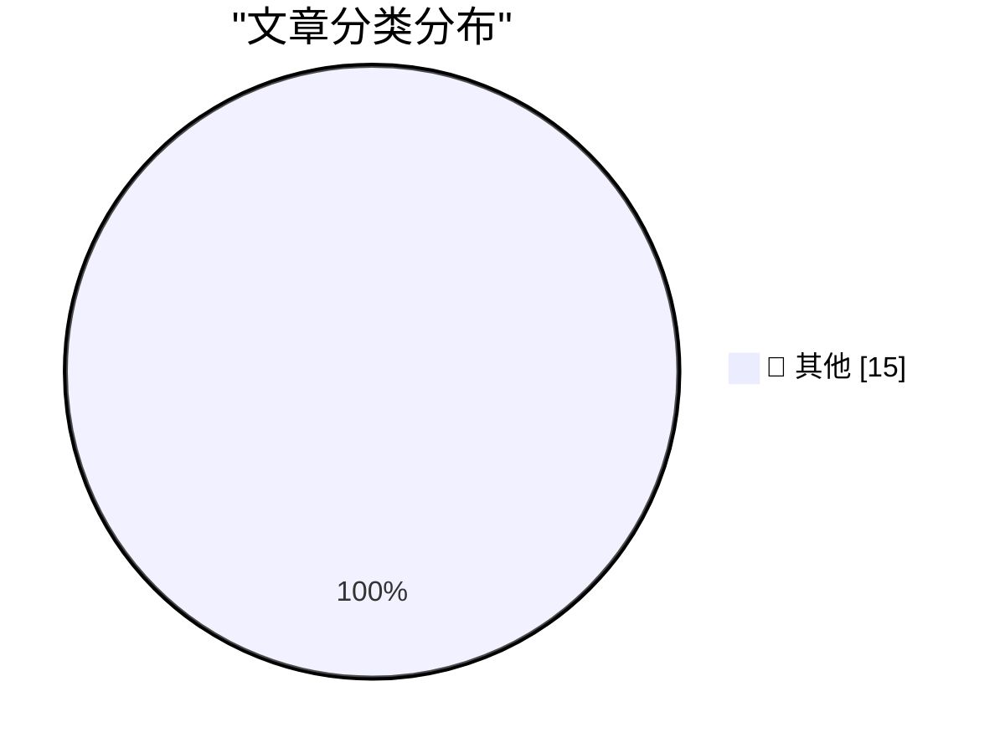

# 📰 AI 博客每日精选 — 2026-09-24

> 来自 Karpathy 推荐的 92 个顶级技术博客，AI 精选 Top 15

## 🏆 今日必读

🥇 **Gemini 3.8 TTS Playground**

[Gemini 3.8 TTS Playground](https://simonwillison.net/2026/Sep/23/gemini-tts-playground/) — simonwillison.net · 21 小时前 · 📝 其他

> Gemini 3.8 TTS Playground

🥈 **Shadow roots, explained with live examples**

[Shadow roots, explained with live examples](https://simonwillison.net/2026/Sep/23/shadow-roots/) — simonwillison.net · 21 小时前 · 📝 其他

> Shadow roots, explained with live examples

🥉 **SF October 14th: A Birds of a Feather Session on Agentic Engineering**

[SF October 14th: A Birds of a Feather Session on Agentic Engineering](https://simonwillison.net/2026/Sep/23/bof-agentic-engineering/) — simonwillison.net · 1 天前 · 📝 其他

> SF October 14th: A Birds of a Feather Session on Agentic Engineering

---

## 📊 数据概览

| 扫描源 | 抓取文章 | 时间范围 | 精选 |
|:---:|:---:|:---:|:---:|
| 81/92 | 2460 篇 → 32 篇 | 48h | **15 篇** |

### 分类分布

```mermaid
pie showData
    title "文章分类分布"
    "📝 其他" : 15
```

---

## 📝 其他

### 1. Gemini 3.8 TTS Playground

[Gemini 3.8 TTS Playground](https://simonwillison.net/2026/Sep/23/gemini-tts-playground/) — **simonwillison.net** · 21 小时前 · ⭐ 15/30

> Gemini 3.8 TTS Playground

---

### 2. Shadow roots, explained with live examples

[Shadow roots, explained with live examples](https://simonwillison.net/2026/Sep/23/shadow-roots/) — **simonwillison.net** · 21 小时前 · ⭐ 15/30

> Shadow roots, explained with live examples

---

### 3. SF October 14th: A Birds of a Feather Session on Agentic Engineering

[SF October 14th: A Birds of a Feather Session on Agentic Engineering](https://simonwillison.net/2026/Sep/23/bof-agentic-engineering/) — **simonwillison.net** · 1 天前 · ⭐ 15/30

> SF October 14th: A Birds of a Feather Session on Agentic Engineering

---

### 4. Claude Opus 5.5, GPT-6 Sol, GPT-6 Luna, and a new price war

[Claude Opus 5.5, GPT-6 Sol, GPT-6 Luna, and a new price war](https://simonwillison.net/2026/Sep/22/opus-and-sol-and-luna/) — **simonwillison.net** · 1 天前 · ⭐ 15/30

> Claude Opus 5.5, GPT-6 Sol, GPT-6 Luna, and a new price war

---

### 5. llm 0.36

[llm 0.36](https://simonwillison.net/2026/Sep/22/llm/) — **simonwillison.net** · 1 天前 · ⭐ 15/30

> llm 0.36

---

### 6. Quoting @therealcornpop

[Quoting @therealcornpop](https://simonwillison.net/2026/Sep/22/therealcornpop/) — **simonwillison.net** · 1 天前 · ⭐ 15/30

> Quoting @therealcornpop

---

### 7. llm-anthropic 0.29

[llm-anthropic 0.29](https://simonwillison.net/2026/Sep/22/llm-anthropic/) — **simonwillison.net** · 1 天前 · ⭐ 15/30

> llm-anthropic 0.29

---

### 8. llm-typesafe 0.1a0

[llm-typesafe 0.1a0](https://simonwillison.net/2026/Sep/22/llm-typesafe/) — **simonwillison.net** · 1 天前 · ⭐ 15/30

> llm-typesafe 0.1a0

---

### 9. Changes to App Tracking Transparency in the E.U.

[Changes to App Tracking Transparency in the E.U.](https://developer.apple.com/app-store/user-privacy-and-data-use/) — **daringfireball.net** · 14 小时前 · ⭐ 15/30

> Changes to App Tracking Transparency in the E.U.

---

### 10. ★ The iPhone 4 ‘Antennagate’ Press Conference Q&A — Finally

[★ The iPhone 4 ‘Antennagate’ Press Conference Q&A — Finally](https://daringfireball.net/2026/09/iphone_4_antennagate_q_and_a) — **daringfireball.net** · 16 小时前 · ⭐ 15/30

> ★ The iPhone 4 ‘Antennagate’ Press Conference Q&A — Finally

---

### 11. ‘Prepare to Ship’ Is a Clever Software Solution That Allows iPhone 18 Pro Max to Ship With a Battery That Would Otherwise Exceed International Shipping Regulations

[‘Prepare to Ship’ Is a Clever Software Solution That Allows iPhone 18 Pro Max to Ship With a Battery That Would Otherwise Exceed International Shipping Regulations](https://support.apple.com/en-us/127848) — **daringfireball.net** · 18 小时前 · ⭐ 15/30

> ‘Prepare to Ship’ Is a Clever Software Solution That Allows iPhone 18 Pro Max to Ship With a Battery That Would Otherwise Exceed International Shipping Regulations

---

### 12. App Store Scam of the Week: ‘Update My Phone & Apps: Guide’ by Tair Olzhasev

[App Store Scam of the Week: ‘Update My Phone & Apps: Guide’ by Tair Olzhasev](https://apps.apple.com/us/app/update-my-phone-apps-guide/id6753936837) — **daringfireball.net** · 19 小时前 · ⭐ 15/30

> App Store Scam of the Week: ‘Update My Phone & Apps: Guide’ by Tair Olzhasev

---

### 13. ★ AppZapper 3000

[★ AppZapper 3000](https://daringfireball.net/2026/09/appzapper_3000) — **daringfireball.net** · 20 小时前 · ⭐ 15/30

> ★ AppZapper 3000

---

### 14. Super Intelligence, Indeed

[Super Intelligence, Indeed](https://bsky.app/profile/atrupar.com/post/3mw4it5l5fd23) — **daringfireball.net** · 1 天前 · ⭐ 15/30

> Super Intelligence, Indeed

---

### 15. Meta’s Muse Logomark, Designed by Jessica Hische

[Meta’s Muse Logomark, Designed by Jessica Hische](https://thedieline.com/jessica-hische-metas-muse-and-the-ethical-landmines-of-design/) — **daringfireball.net** · 1 天前 · ⭐ 15/30

> Meta’s Muse Logomark, Designed by Jessica Hische

---

*生成于 2026-09-24 14:29 | 扫描 81 源 → 获取 2460 篇 → 精选 15 篇*
*基于 [Hacker News Popularity Contest 2025](https://refactoringenglish.com/tools/hn-popularity/) RSS 源列表，由 [Andrej Karpathy](https://x.com/karpathy) 推荐*
*由「懂点儿AI」制作，欢迎关注同名微信公众号获取更多 AI 实用技巧 💡*
