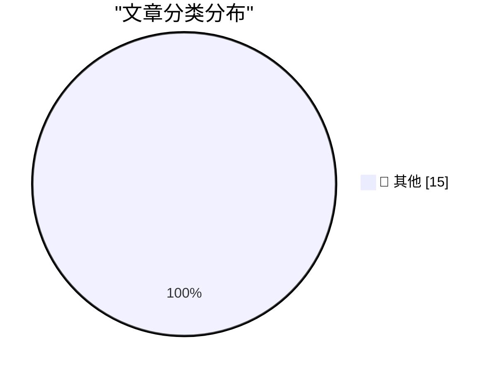

# 📰 AI 博客每日精选 — 2026-09-22

> 来自 Karpathy 推荐的 92 个顶级技术博客，AI 精选 Top 15

## 🏆 今日必读

🥇 **Jev introduces a new shape of LLM - System One, aka Decision Models**

[Jev introduces a new shape of LLM - System One, aka Decision Models](https://simonwillison.net/2026/Sep/21/jev/) — simonwillison.net · 15 小时前 · 📝 其他

> Jev introduces a new shape of LLM - System One, aka Decision Models

🥈 **Cloudflare Python Workers are now generally available**

[Cloudflare Python Workers are now generally available](https://simonwillison.net/2026/Sep/21/cloudflare-python-worker/) — simonwillison.net · 15 小时前 · 📝 其他

> Cloudflare Python Workers are now generally available

🥉 **Quoting voxium**

[Quoting voxium](https://simonwillison.net/2026/Sep/20/voxium/) — simonwillison.net · 1 天前 · 📝 其他

> Quoting voxium

---

## 📊 数据概览

| 扫描源 | 抓取文章 | 时间范围 | 精选 |
|:---:|:---:|:---:|:---:|
| 83/92 | 2527 篇 → 39 篇 | 48h | **15 篇** |

### 分类分布

```mermaid
pie showData
    title "文章分类分布"
    "📝 其他" : 15
```

---

## 📝 其他

### 1. Jev introduces a new shape of LLM - System One, aka Decision Models

[Jev introduces a new shape of LLM - System One, aka Decision Models](https://simonwillison.net/2026/Sep/21/jev/) — **simonwillison.net** · 15 小时前 · ⭐ 15/30

> Jev introduces a new shape of LLM - System One, aka Decision Models

---

### 2. Cloudflare Python Workers are now generally available

[Cloudflare Python Workers are now generally available](https://simonwillison.net/2026/Sep/21/cloudflare-python-worker/) — **simonwillison.net** · 15 小时前 · ⭐ 15/30

> Cloudflare Python Workers are now generally available

---

### 3. Quoting voxium

[Quoting voxium](https://simonwillison.net/2026/Sep/20/voxium/) — **simonwillison.net** · 1 天前 · ⭐ 15/30

> Quoting voxium

---

### 4. MCP was always a bad idea?

[MCP was always a bad idea?](https://simonwillison.net/2026/Sep/20/hn-49779718/) — **simonwillison.net** · 1 天前 · ⭐ 15/30

> MCP was always a bad idea?

---

### 5. llm-keys-ui 0.1

[llm-keys-ui 0.1](https://simonwillison.net/2026/Sep/20/llm-keys-ui/) — **simonwillison.net** · 1 天前 · ⭐ 15/30

> llm-keys-ui 0.1

---

### 6. Raspberry Pi locks down Pi 5 RAM upgrades in firmware

[Raspberry Pi locks down Pi 5 RAM upgrades in firmware](https://www.jeffgeerling.com/blog/2026/raspberry-pi-ram-lockdown/) — **jeffgeerling.com** · 21 小时前 · ⭐ 15/30

> Raspberry Pi locks down Pi 5 RAM upgrades in firmware

---

### 7. [Sponsor] Mux: Turn Your Video Into Context

[[Sponsor] Mux: Turn Your Video Into Context](https://www.mux.com/?utm_campaign=fireball&amp;utm_source=DF) — **daringfireball.net** · 15 小时前 · ⭐ 15/30

> [Sponsor] Mux: Turn Your Video Into Context

---

### 8. Lex Friedman Brings Back Strategery

[Lex Friedman Brings Back Strategery](https://lexontech.org/strategery-is-back-and-im-the-developer) — **daringfireball.net** · 15 小时前 · ⭐ 15/30

> Lex Friedman Brings Back Strategery

---

### 9. GM Confirms They’re Still Smoking Crack

[GM Confirms They’re Still Smoking Crack](https://x.com/JoannaStern/status/2102105565195288859) — **daringfireball.net** · 16 小时前 · ⭐ 15/30

> GM Confirms They’re Still Smoking Crack

---

### 10. America’s Decline Can Be Measured by the Names of Ballparks and Arenas

[America’s Decline Can Be Measured by the Names of Ballparks and Arenas](https://www.mlb.com/news/tigers-ballpark-name-changed-to-fifth-third-park) — **daringfireball.net** · 16 小时前 · ⭐ 15/30

> America’s Decline Can Be Measured by the Names of Ballparks and Arenas

---

### 11. Ichiro, at 52, Throws 127-Pitch Shutout Against All-Star Girls Team in Japan

[Ichiro, at 52, Throws 127-Pitch Shutout Against All-Star Girls Team in Japan](https://www.seattletimes.com/sports/mariners/ichiro-at-52-throws-127-pitch-shutout-against-all-star-girls-team-in-japan/) — **daringfireball.net** · 20 小时前 · ⭐ 15/30

> Ichiro, at 52, Throws 127-Pitch Shutout Against All-Star Girls Team in Japan

---

### 12. Glenn Fleishman on the Increasing Impracticality of Shipping From the U.S. to the E.U.

[Glenn Fleishman on the Increasing Impracticality of Shipping From the U.S. to the E.U.](https://glog.glennf.com/blog/2026/09/17/u-s-small-biz-cant-ship-to-the-eu-anymore/) — **daringfireball.net** · 20 小时前 · ⭐ 15/30

> Glenn Fleishman on the Increasing Impracticality of Shipping From the U.S. to the E.U.

---

### 13. David Pogue: ‘125 Tests of the New AI Siri’

[David Pogue: ‘125 Tests of the New AI Siri’](https://pogueman.substack.com/p/125-tests-of-the-new-ai-siri) — **daringfireball.net** · 20 小时前 · ⭐ 15/30

> David Pogue: ‘125 Tests of the New AI Siri’

---

### 14. Matthew Butterick: ‘Big AI to Humanity: Drop Dead’

[Matthew Butterick: ‘Big AI to Humanity: Drop Dead’](https://matthewbutterick.com/chron/drop-dead.html) — **daringfireball.net** · 21 小时前 · ⭐ 15/30

> Matthew Butterick: ‘Big AI to Humanity: Drop Dead’

---

### 15. ‘Measuring Nothing (With Great Accuracy)’

[‘Measuring Nothing (With Great Accuracy)’](https://seths.blog/2014/01/measuring-nothing-with-great-accuracy/) — **daringfireball.net** · 23 小时前 · ⭐ 15/30

> ‘Measuring Nothing (With Great Accuracy)’

---

*生成于 2026-09-22 14:13 | 扫描 83 源 → 获取 2527 篇 → 精选 15 篇*
*基于 [Hacker News Popularity Contest 2025](https://refactoringenglish.com/tools/hn-popularity/) RSS 源列表，由 [Andrej Karpathy](https://x.com/karpathy) 推荐*
*由「懂点儿AI」制作，欢迎关注同名微信公众号获取更多 AI 实用技巧 💡*
