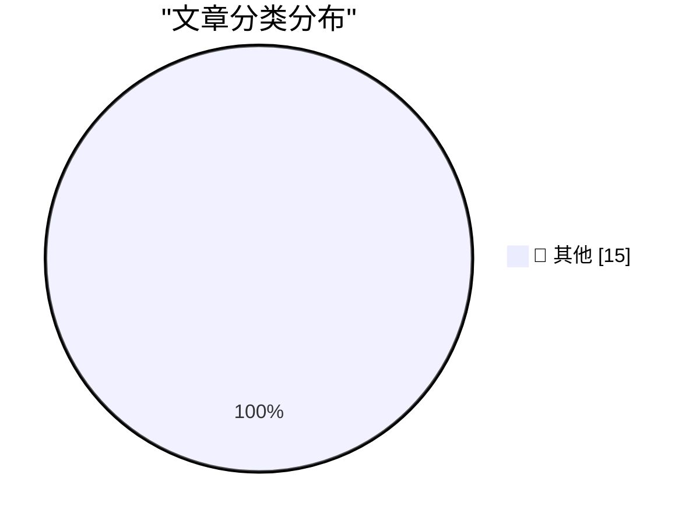

# 📰 AI 博客每日精选 — 2026-08-04

> 来自 Karpathy 推荐的 92 个顶级技术博客，AI 精选 Top 15

## 🏆 今日必读

🥇 **Quoting Steve Yegge**

[Quoting Steve Yegge](https://simonwillison.net/2026/Aug/4/steve-yegge/#atom-everything) — simonwillison.net · 11 小时前 · 📝 其他

> Quoting Steve Yegge

🥈 **Don't be a meat proxy**

[Don't be a meat proxy](https://simonwillison.net/2026/Aug/3/dont-be-a-meat-proxy/#atom-everything) — simonwillison.net · 12 小时前 · 📝 其他

> Don't be a meat proxy

🥉 **Quoting David Crawshaw's prompt**

[Quoting David Crawshaw's prompt](https://simonwillison.net/2026/Aug/3/david-crawshaw/#atom-everything) — simonwillison.net · 19 小时前 · 📝 其他

> Quoting David Crawshaw's prompt

---

## 📊 数据概览

| 扫描源 | 抓取文章 | 时间范围 | 精选 |
|:---:|:---:|:---:|:---:|
| 83/92 | 2518 篇 → 33 篇 | 48h | **15 篇** |

### 分类分布

```mermaid
pie showData
    title "文章分类分布"
    "📝 其他" : 15
```

---

## 📝 其他

### 1. Quoting Steve Yegge

[Quoting Steve Yegge](https://simonwillison.net/2026/Aug/4/steve-yegge/#atom-everything) — **simonwillison.net** · 11 小时前 · ⭐ 15/30

> Quoting Steve Yegge

---

### 2. Don't be a meat proxy

[Don't be a meat proxy](https://simonwillison.net/2026/Aug/3/dont-be-a-meat-proxy/#atom-everything) — **simonwillison.net** · 12 小时前 · ⭐ 15/30

> Don't be a meat proxy

---

### 3. Quoting David Crawshaw's prompt

[Quoting David Crawshaw's prompt](https://simonwillison.net/2026/Aug/3/david-crawshaw/#atom-everything) — **simonwillison.net** · 19 小时前 · ⭐ 15/30

> Quoting David Crawshaw's prompt

---

### 4. Devtools must be open source (exe.dev)

[Devtools must be open source (exe.dev)](https://simonwillison.net/2026/Aug/3/devtools-must-be-open-source-exedev/#atom-everything) — **simonwillison.net** · 20 小时前 · ⭐ 15/30

> Devtools must be open source (exe.dev)

---

### 5. condense-json 1.0

[condense-json 1.0](https://simonwillison.net/2026/Aug/2/condense-json/#atom-everything) — **simonwillison.net** · 1 天前 · ⭐ 15/30

> condense-json 1.0

---

### 6. TerminalWidget 1.0

[TerminalWidget 1.0](https://terminalwidget.app/) — **daringfireball.net** · 9 小时前 · ⭐ 15/30

> TerminalWidget 1.0

---

### 7. [Sponsor] MCP vs. REST: The Right Way to Connect Agents to Your API

[[Sponsor] MCP vs. REST: The Right Way to Connect Agents to Your API](https://workos.com/blog/mcp-vs-rest?utm_source=daringfireball&amp;utm_medium=newsletter&amp;utm_campaign=q32026) — **daringfireball.net** · 13 小时前 · ⭐ 15/30

> [Sponsor] MCP vs. REST: The Right Way to Connect Agents to Your API

---

### 8. John Ternus Has Rehired Former Hardware VP Laura Legros

[John Ternus Has Rehired Former Hardware VP Laura Legros](https://www.macrumors.com/2026/08/03/apple-john-ternus-hiring-retired-vp/) — **daringfireball.net** · 13 小时前 · ⭐ 15/30

> John Ternus Has Rehired Former Hardware VP Laura Legros

---

### 9. The Information on Apple’s Unusual Use of iCloud for Confidential Work

[The Information on Apple’s Unusual Use of iCloud for Confidential Work](https://www.theinformation.com/articles/apple-icloud-policy-fueled-employee-leaks-ahead-openai-suit?rc=jfy0lk) — **daringfireball.net** · 14 小时前 · ⭐ 15/30

> The Information on Apple’s Unusual Use of iCloud for Confidential Work

---

### 10. Om Malik’s Final Essay: ‘The Myth, the Mythos and the Man’

[Om Malik’s Final Essay: ‘The Myth, the Mythos and the Man’](https://om.co/2026/06/07/the-myth-the-mythos-and-the-man/) — **daringfireball.net** · 15 小时前 · ⭐ 15/30

> Om Malik’s Final Essay: ‘The Myth, the Mythos and the Man’

---

### 11. ★ Why Apple Requires a Cellular Account Through a Big Three Carrier to Lease an iPhone

[★ Why Apple Requires a Cellular Account Through a Big Three Carrier to Lease an iPhone](https://daringfireball.net/2026/08/followup_big_three_carrier_requirement) — **daringfireball.net** · 18 小时前 · ⭐ 15/30

> ★ Why Apple Requires a Cellular Account Through a Big Three Carrier to Lease an iPhone

---

### 12. Ulysses S. Grant on the Future Dividing Line

[Ulysses S. Grant on the Future Dividing Line](https://www.snopes.com/fact-check/grant-next-civil-war/) — **daringfireball.net** · 18 小时前 · ⭐ 15/30

> Ulysses S. Grant on the Future Dividing Line

---

### 13. Truth Social Launches Paid Early Access to Trump Posts

[Truth Social Launches Paid Early Access to Trump Posts](https://www.npr.org/2026/08/01/nx-s1-5912219/trump-truth-social-access-insider-trading) — **daringfireball.net** · 19 小时前 · ⭐ 15/30

> Truth Social Launches Paid Early Access to Trump Posts

---

### 14. Agent Fone

[Agent Fone](https://fail.xyz/phone/) — **daringfireball.net** · 1 天前 · ⭐ 15/30

> Agent Fone

---

### 15. Boris Cherny on Trying to Get Claude Code to Rewrite the Claude App

[Boris Cherny on Trying to Get Claude Code to Rewrite the Claude App](https://www.ycrootaccess.com/p/boris-cherny-building-claude-code) — **daringfireball.net** · 1 天前 · ⭐ 15/30

> Boris Cherny on Trying to Get Claude Code to Rewrite the Claude App

---

*生成于 2026-08-04 11:53 | 扫描 83 源 → 获取 2518 篇 → 精选 15 篇*
*基于 [Hacker News Popularity Contest 2025](https://refactoringenglish.com/tools/hn-popularity/) RSS 源列表，由 [Andrej Karpathy](https://x.com/karpathy) 推荐*
*由「懂点儿AI」制作，欢迎关注同名微信公众号获取更多 AI 实用技巧 💡*
