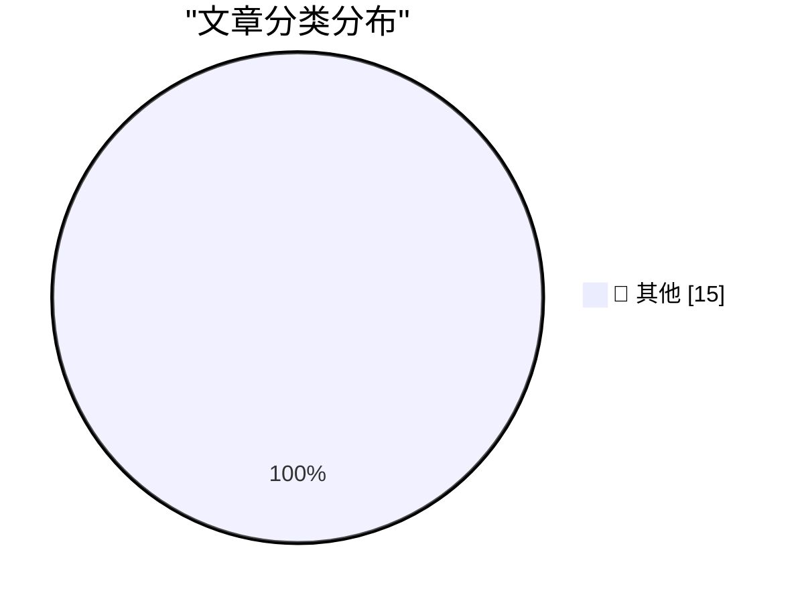

# 📰 AI 博客每日精选 — 2026-07-07

> 来自 Karpathy 推荐的 92 个顶级技术博客，AI 精选 Top 15

## 🏆 今日必读

🥇 **tencent/Hy3**

[tencent/Hy3](https://simonwillison.net/2026/Jul/6/hy3/#atom-everything) — simonwillison.net · 12 小时前 · 📝 其他

> tencent/Hy3

🥈 **sqlite-utils 4.0rc3**

[sqlite-utils 4.0rc3](https://simonwillison.net/2026/Jul/6/sqlite-utils/#atom-everything) — simonwillison.net · 1 天前 · 📝 其他

> sqlite-utils 4.0rc3

🥉 **★ Apple Should Eliminate the App Icon ‘Squircle Jail’**

[★ Apple Should Eliminate the App Icon ‘Squircle Jail’](https://daringfireball.net/2026/07/eliminate_app_icon_squircle_jail) — daringfireball.net · 13 小时前 · 📝 其他

> ★ Apple Should Eliminate the App Icon ‘Squircle Jail’

---

## 📊 数据概览

| 扫描源 | 抓取文章 | 时间范围 | 精选 |
|:---:|:---:|:---:|:---:|
| 80/92 | 2432 篇 → 24 篇 | 48h | **15 篇** |

### 分类分布

```mermaid
pie showData
    title "文章分类分布"
    "📝 其他" : 15
```

---

## 📝 其他

### 1. tencent/Hy3

[tencent/Hy3](https://simonwillison.net/2026/Jul/6/hy3/#atom-everything) — **simonwillison.net** · 12 小时前 · ⭐ 15/30

> tencent/Hy3

---

### 2. sqlite-utils 4.0rc3

[sqlite-utils 4.0rc3](https://simonwillison.net/2026/Jul/6/sqlite-utils/#atom-everything) — **simonwillison.net** · 1 天前 · ⭐ 15/30

> sqlite-utils 4.0rc3

---

### 3. ★ Apple Should Eliminate the App Icon ‘Squircle Jail’

[★ Apple Should Eliminate the App Icon ‘Squircle Jail’](https://daringfireball.net/2026/07/eliminate_app_icon_squircle_jail) — **daringfireball.net** · 13 小时前 · ⭐ 15/30

> ★ Apple Should Eliminate the App Icon ‘Squircle Jail’

---

### 4. Markdown Now Has a UTI in Apple’s Version 27 OSes

[Markdown Now Has a UTI in Apple’s Version 27 OSes](https://developer.apple.com/documentation/uniformtypeidentifiers/uttype-swift.struct/markdown) — **daringfireball.net** · 15 小时前 · ⭐ 15/30

> Markdown Now Has a UTI in Apple’s Version 27 OSes

---

### 5. Backblaze Versus Dropbox

[Backblaze Versus Dropbox](https://mjtsai.com/blog/2025/12/19/backblaze-no-longer-backs-up-dropbox/) — **daringfireball.net** · 17 小时前 · ⭐ 15/30

> Backblaze Versus Dropbox

---

### 6. Allen Pike, Back in November: ‘Why Is ChatGPT for Mac So Good?’

[Allen Pike, Back in November: ‘Why Is ChatGPT for Mac So Good?’](https://allenpike.com/2025/why-is-chatgpt-so-good-claude/) — **daringfireball.net** · 18 小时前 · ⭐ 15/30

> Allen Pike, Back in November: ‘Why Is ChatGPT for Mac So Good?’

---

### 7. ATP Member Special: Mac-Assed Mac Apps

[ATP Member Special: Mac-Assed Mac Apps](https://atp.fm/atp-dev-mac-assed-mac-apps) — **daringfireball.net** · 19 小时前 · ⭐ 15/30

> ATP Member Special: Mac-Assed Mac Apps

---

### 8. Maestral, the Open Source Splendidly Simple Mac Dropbox Client, Has Been Retired

[Maestral, the Open Source Splendidly Simple Mac Dropbox Client, Has Been Retired](https://maestral.app/) — **daringfireball.net** · 19 小时前 · ⭐ 15/30

> Maestral, the Open Source Splendidly Simple Mac Dropbox Client, Has Been Retired

---

### 9. Jason Snell Ends His Column, and 28-Year Run, at Macworld

[Jason Snell Ends His Column, and 28-Year Run, at Macworld](https://www.macworld.com/article/3175482) — **daringfireball.net** · 21 小时前 · ⭐ 15/30

> Jason Snell Ends His Column, and 28-Year Run, at Macworld

---

### 10. Amazon Basics, but for intellectual property.

[Amazon Basics, but for intellectual property.](https://idiallo.com/blog/amazon-basics-but-intellectual-property) — **idiallo.com** · 1 天前 · ⭐ 15/30

> Amazon Basics, but for intellectual property.

---

### 11. Stephan's Quintet

[Stephan's Quintet](https://maurycyz.com/astro/h92/) — **maurycyz.com** · 1 天前 · ⭐ 15/30

> Stephan's Quintet

---

### 12. I'm just so bored of AI

[I'm just so bored of AI](https://shkspr.mobi/blog/2026/07/im-just-so-bored-of-ai/) — **shkspr.mobi** · 1 天前 · ⭐ 15/30

> I'm just so bored of AI

---

### 13. Life with hazard ratios

[Life with hazard ratios](https://dynomight.net/hazard-ratios/) — **dynomight.net** · 1 天前 · ⭐ 15/30

> Life with hazard ratios

---

### 14. I opened a file with FILE_FLAG_DELETE_ON_CLOSE, but now I changed my mind

[I opened a file with FILE_FLAG_DELETE_ON_CLOSE, but now I changed my mind](https://devblogs.microsoft.com/oldnewthing/20260706-00/?p=112506) — **devblogs.microsoft.com/oldnewthing** · 22 小时前 · ⭐ 15/30

> I opened a file with FILE_FLAG_DELETE_ON_CLOSE, but now I changed my mind

---

### 15. Reproducing a geometry theorem diagram

[Reproducing a geometry theorem diagram](https://www.johndcook.com/blog/2026/07/06/arc-hypotenuse/) — **johndcook.com** · 21 小时前 · ⭐ 15/30

> Reproducing a geometry theorem diagram

---

*生成于 2026-07-07 12:20 | 扫描 80 源 → 获取 2432 篇 → 精选 15 篇*
*基于 [Hacker News Popularity Contest 2025](https://refactoringenglish.com/tools/hn-popularity/) RSS 源列表，由 [Andrej Karpathy](https://x.com/karpathy) 推荐*
*由「懂点儿AI」制作，欢迎关注同名微信公众号获取更多 AI 实用技巧 💡*
