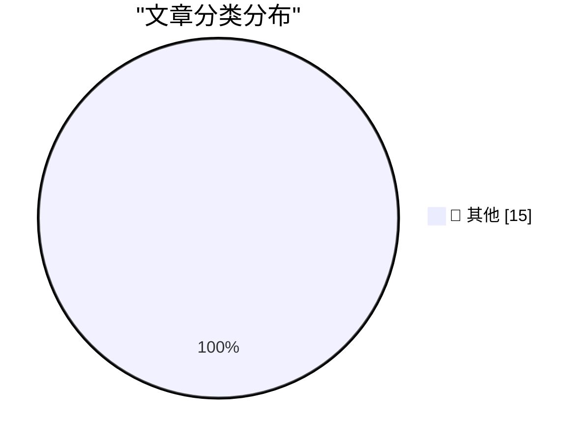

# 📰 AI 博客每日精选 — 2026-05-01

> 来自 Karpathy 推荐的 92 个顶级技术博客，AI 精选 Top 15

## 🏆 今日必读

🥇 **Codex CLI 0.128.0 adds /goal**

[Codex CLI 0.128.0 adds /goal](https://simonwillison.net/2026/Apr/30/codex-goals/#atom-everything) — simonwillison.net · 11 小时前 · 📝 其他

> Codex CLI 0.128.0 adds /goal

🥈 **Our evaluation of OpenAI's GPT-5.5 cyber capabilities**

[Our evaluation of OpenAI's GPT-5.5 cyber capabilities](https://simonwillison.net/2026/Apr/30/gpt-55-cyber-capabilities/#atom-everything) — simonwillison.net · 11 小时前 · 📝 其他

> Our evaluation of OpenAI's GPT-5.5 cyber capabilities

🥉 **Quoting Andrew Kelley**

[Quoting Andrew Kelley](https://simonwillison.net/2026/Apr/30/andrew-kelley/#atom-everything) — simonwillison.net · 13 小时前 · 📝 其他

> Quoting Andrew Kelley

---

## 📊 数据概览

| 扫描源 | 抓取文章 | 时间范围 | 精选 |
|:---:|:---:|:---:|:---:|
| 82/92 | 2433 篇 → 41 篇 | 48h | **15 篇** |

### 分类分布

```mermaid
pie showData
    title "文章分类分布"
    "📝 其他" : 15
```

---

## 📝 其他

### 1. Codex CLI 0.128.0 adds /goal

[Codex CLI 0.128.0 adds /goal](https://simonwillison.net/2026/Apr/30/codex-goals/#atom-everything) — **simonwillison.net** · 11 小时前 · ⭐ 15/30

> Codex CLI 0.128.0 adds /goal

---

### 2. Our evaluation of OpenAI's GPT-5.5 cyber capabilities

[Our evaluation of OpenAI's GPT-5.5 cyber capabilities](https://simonwillison.net/2026/Apr/30/gpt-55-cyber-capabilities/#atom-everything) — **simonwillison.net** · 11 小时前 · ⭐ 15/30

> Our evaluation of OpenAI's GPT-5.5 cyber capabilities

---

### 3. Quoting Andrew Kelley

[Quoting Andrew Kelley](https://simonwillison.net/2026/Apr/30/andrew-kelley/#atom-everything) — **simonwillison.net** · 13 小时前 · ⭐ 15/30

> Quoting Andrew Kelley

---

### 4. We need RSS for sharing abundant vibe-coded apps

[We need RSS for sharing abundant vibe-coded apps](https://simonwillison.net/2026/Apr/30/rss-vibe-coded-apps/#atom-everything) — **simonwillison.net** · 16 小时前 · ⭐ 15/30

> We need RSS for sharing abundant vibe-coded apps

---

### 5. The Zig project's rationale for their firm anti-AI contribution policy

[The Zig project's rationale for their firm anti-AI contribution policy](https://simonwillison.net/2026/Apr/30/zig-anti-ai/#atom-everything) — **simonwillison.net** · 1 天前 · ⭐ 15/30

> The Zig project's rationale for their firm anti-AI contribution policy

---

### 6. llm 0.32a1

[llm 0.32a1](https://simonwillison.net/2026/Apr/29/llm-3/#atom-everything) — **simonwillison.net** · 1 天前 · ⭐ 15/30

> llm 0.32a1

---

### 7. LLM 0.32a0  is a major backwards-compatible refactor

[LLM 0.32a0  is a major backwards-compatible refactor](https://simonwillison.net/2026/Apr/29/llm/#atom-everything) — **simonwillison.net** · 1 天前 · ⭐ 15/30

> LLM 0.32a0  is a major backwards-compatible refactor

---

### 8. llm 0.32a0

[llm 0.32a0](https://simonwillison.net/2026/Apr/29/llm-2/#atom-everything) — **simonwillison.net** · 1 天前 · ⭐ 15/30

> llm 0.32a0

---

### 9. Raspberry Pi Connect may control Windows soon

[Raspberry Pi Connect may control Windows soon](https://www.jeffgeerling.com/blog/2026/raspberry-pi-connect-may-control-windows-soon/) — **jeffgeerling.com** · 1 天前 · ⭐ 15/30

> Raspberry Pi Connect may control Windows soon

---

### 10. Anti-DDoS Firm Heaped Attacks on Brazilian ISPs

[Anti-DDoS Firm Heaped Attacks on Brazilian ISPs](https://krebsonsecurity.com/2026/04/anti-ddos-firm-heaped-attacks-on-brazilian-isps/) — **krebsonsecurity.com** · 20 小时前 · ⭐ 15/30

> Anti-DDoS Firm Heaped Attacks on Brazilian ISPs

---

### 11. The Talk Show: ‘Food and Beverage Director’

[The Talk Show: ‘Food and Beverage Director’](https://daringfireball.net/thetalkshow/2026/04/30/ep-446) — **daringfireball.net** · 8 小时前 · ⭐ 15/30

> The Talk Show: ‘Food and Beverage Director’

---

### 12. Scientology ‘Speed Running’ Trend

[Scientology ‘Speed Running’ Trend](https://www.theguardian.com/us-news/2026/apr/30/hollywood-church-of-scientology-speed-runs?CMP=bsky_gu) — **daringfireball.net** · 8 小时前 · ⭐ 15/30

> Scientology ‘Speed Running’ Trend

---

### 13. Apple Q2 2026 Results

[Apple Q2 2026 Results](https://www.apple.com/newsroom/2026/04/apple-reports-second-quarter-results/) — **daringfireball.net** · 10 小时前 · ⭐ 15/30

> Apple Q2 2026 Results

---

### 14. ★ On the Future of Apple’s Vision Platform

[★ On the Future of Apple’s Vision Platform](https://daringfireball.net/2026/04/on_the_future_of_apples_vision_platform) — **daringfireball.net** · 10 小时前 · ⭐ 15/30

> ★ On the Future of Apple’s Vision Platform

---

### 15. I’m Starting to Wonder What They’re Smoking Over There at MacRumors

[I’m Starting to Wonder What They’re Smoking Over There at MacRumors](https://www.macrumors.com/2026/04/29/apple-questioning-iphone-magsafe/) — **daringfireball.net** · 19 小时前 · ⭐ 15/30

> I’m Starting to Wonder What They’re Smoking Over There at MacRumors

---

*生成于 2026-05-01 11:00 | 扫描 82 源 → 获取 2433 篇 → 精选 15 篇*
*基于 [Hacker News Popularity Contest 2025](https://refactoringenglish.com/tools/hn-popularity/) RSS 源列表，由 [Andrej Karpathy](https://x.com/karpathy) 推荐*
*由「懂点儿AI」制作，欢迎关注同名微信公众号获取更多 AI 实用技巧 💡*
