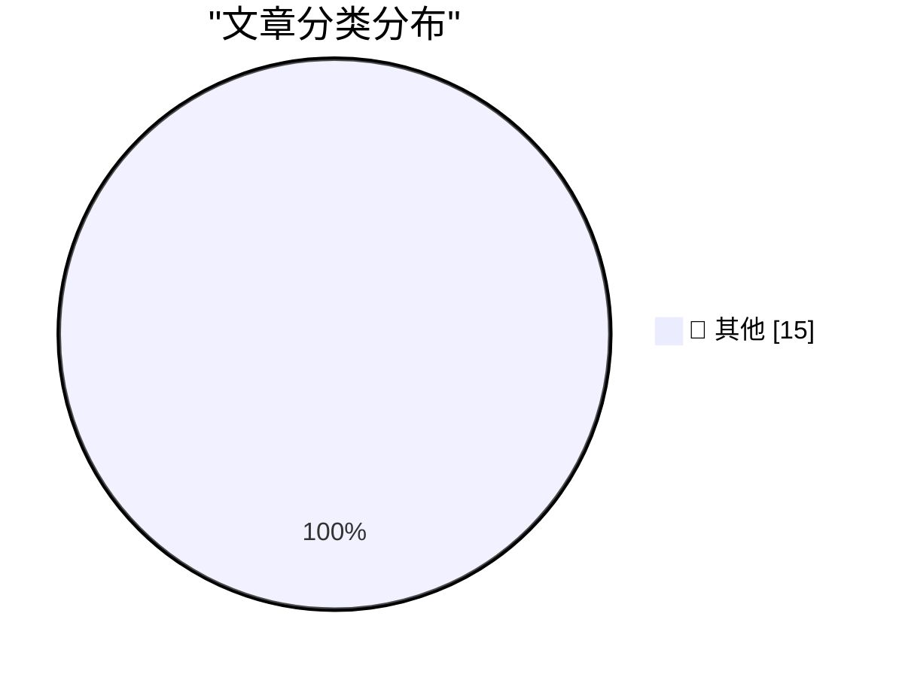

# 📰 AI 博客每日精选 — 2026-09-03

> 来自 Karpathy 推荐的 92 个顶级技术博客，AI 精选 Top 15

## 🏆 今日必读

🥇 **llm-gemini 0.34**

[llm-gemini 0.34](https://simonwillison.net/2026/Sep/2/llm-gemini/) — simonwillison.net · 21 小时前 · 📝 其他

> llm-gemini 0.34

🥈 **Claude's new system prompt really doesn't want to reproduce song lyrics**

[Claude's new system prompt really doesn't want to reproduce song lyrics](https://simonwillison.net/2026/Sep/2/claudes-new-system-prompt/) — simonwillison.net · 23 小时前 · 📝 其他

> Claude's new system prompt really doesn't want to reproduce song lyrics

🥉 **Quoting Rick Brewster**

[Quoting Rick Brewster](https://simonwillison.net/2026/Sep/2/rick-brewster/) — simonwillison.net · 1 天前 · 📝 其他

> Quoting Rick Brewster

---

## 📊 数据概览

| 扫描源 | 抓取文章 | 时间范围 | 精选 |
|:---:|:---:|:---:|:---:|
| 83/92 | 2520 篇 → 30 篇 | 48h | **15 篇** |

### 分类分布

```mermaid
pie showData
    title "文章分类分布"
    "📝 其他" : 15
```

---

## 📝 其他

### 1. llm-gemini 0.34

[llm-gemini 0.34](https://simonwillison.net/2026/Sep/2/llm-gemini/) — **simonwillison.net** · 21 小时前 · ⭐ 15/30

> llm-gemini 0.34

---

### 2. Claude's new system prompt really doesn't want to reproduce song lyrics

[Claude's new system prompt really doesn't want to reproduce song lyrics](https://simonwillison.net/2026/Sep/2/claudes-new-system-prompt/) — **simonwillison.net** · 23 小时前 · ⭐ 15/30

> Claude's new system prompt really doesn't want to reproduce song lyrics

---

### 3. Quoting Rick Brewster

[Quoting Rick Brewster](https://simonwillison.net/2026/Sep/2/rick-brewster/) — **simonwillison.net** · 1 天前 · ⭐ 15/30

> Quoting Rick Brewster

---

### 4. Claude Fable 5.1 made me a really nice animated pelican

[Claude Fable 5.1 made me a really nice animated pelican](https://simonwillison.net/2026/Sep/1/claude-fable-5-1/) — **simonwillison.net** · 1 天前 · ⭐ 15/30

> Claude Fable 5.1 made me a really nice animated pelican

---

### 5. Codex bundles LibreOffice

[Codex bundles LibreOffice](https://simonwillison.net/2026/Sep/1/codex-libreoffice/) — **simonwillison.net** · 1 天前 · ⭐ 15/30

> Codex bundles LibreOffice

---

### 6. GeoJSON Map Viewer

[GeoJSON Map Viewer](https://simonwillison.net/2026/Sep/1/geojson/) — **simonwillison.net** · 1 天前 · ⭐ 15/30

> GeoJSON Map Viewer

---

### 7. Quoting Tarn Adams

[Quoting Tarn Adams](https://simonwillison.net/2026/Sep/1/tarn-adams/) — **simonwillison.net** · 1 天前 · ⭐ 15/30

> Quoting Tarn Adams

---

### 8. datasette-mcp 0.2

[datasette-mcp 0.2](https://simonwillison.net/2026/Sep/1/datasette-mcp/) — **simonwillison.net** · 1 天前 · ⭐ 15/30

> datasette-mcp 0.2

---

### 9. Python 3.15.0 candidate 2 is here!

[Python 3.15.0 candidate 2 is here!](https://simonwillison.net/2026/Sep/1/python-315-rc-2/) — **simonwillison.net** · 1 天前 · ⭐ 15/30

> Python 3.15.0 candidate 2 is here!

---

### 10. How to protect yourself from workslop

[How to protect yourself from workslop](https://seangoedecke.com/how-to-protect-yourself-from-workslop/) — **seangoedecke.com** · 1 天前 · ⭐ 15/30

> How to protect yourself from workslop

---

### 11. FBI Probes Service Selling 153M+ Drivers Licenses

[FBI Probes Service Selling 153M+ Drivers Licenses](https://krebsonsecurity.com/2026/09/fbi-probes-service-selling-153m-drivers-licenses/) — **krebsonsecurity.com** · 1 天前 · ⭐ 15/30

> FBI Probes Service Selling 153M+ Drivers Licenses

---

### 12. iOS 27 Introduces New ‘iPhone Handoff’ Feature

[iOS 27 Introduces New ‘iPhone Handoff’ Feature](https://www.macrumors.com/2026/09/02/ios-27-iphone-handoff-feature/) — **daringfireball.net** · 16 小时前 · ⭐ 15/30

> iOS 27 Introduces New ‘iPhone Handoff’ Feature

---

### 13. Tim Cook’s Departure Memo on His Last Day as CEO

[Tim Cook’s Departure Memo on His Last Day as CEO](https://9to5mac.com/2026/08/31/read-tim-cooks-full-memo-to-apple-employees-on-his-last-day-as-ceo/) — **daringfireball.net** · 1 天前 · ⭐ 15/30

> Tim Cook’s Departure Memo on His Last Day as CEO

---

### 14. Apple Reveals Forensic Evidence From Chang Liu’s MacBook in OpenAI Lawsuit

[Apple Reveals Forensic Evidence From Chang Liu’s MacBook in OpenAI Lawsuit](https://9to5mac.com/2026/08/31/apple-openai-forensic-macbook-evidence/) — **daringfireball.net** · 1 天前 · ⭐ 15/30

> Apple Reveals Forensic Evidence From Chang Liu’s MacBook in OpenAI Lawsuit

---

### 15. Pluralistic: Preparing for a post-Trump internet (03 Sep 2026)

[Pluralistic: Preparing for a post-Trump internet (03 Sep 2026)](https://pluralistic.net/2026/09/03/broken-arrows/) — **pluralistic.net** · 5 小时前 · ⭐ 15/30

> Pluralistic: Preparing for a post-Trump internet (03 Sep 2026)

---

*生成于 2026-09-03 13:58 | 扫描 83 源 → 获取 2520 篇 → 精选 15 篇*
*基于 [Hacker News Popularity Contest 2025](https://refactoringenglish.com/tools/hn-popularity/) RSS 源列表，由 [Andrej Karpathy](https://x.com/karpathy) 推荐*
*由「懂点儿AI」制作，欢迎关注同名微信公众号获取更多 AI 实用技巧 💡*
