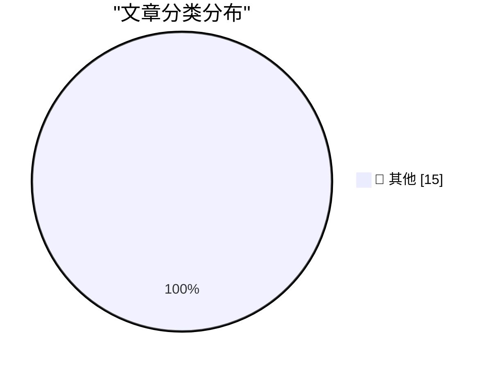

# 📰 AI 博客每日精选 — 2026-07-31

> 来自 Karpathy 推荐的 92 个顶级技术博客，AI 精选 Top 15

## 🏆 今日必读

🥇 **Advancing the price-performance frontier with GPT‑5.6**

[Advancing the price-performance frontier with GPT‑5.6](https://simonwillison.net/2026/Jul/30/luna-price-drop/#atom-everything) — simonwillison.net · 11 小时前 · 📝 其他

> Advancing the price-performance frontier with GPT‑5.6

🥈 **Investigating three real-world incidents in our cybersecurity evaluations**

[Investigating three real-world incidents in our cybersecurity evaluations](https://simonwillison.net/2026/Jul/30/three-real-world-incidents/#atom-everything) — simonwillison.net · 12 小时前 · 📝 其他

> Investigating three real-world incidents in our cybersecurity evaluations

🥉 **llm 0.32rc2**

[llm 0.32rc2](https://simonwillison.net/2026/Jul/30/llm-rc2/#atom-everything) — simonwillison.net · 12 小时前 · 📝 其他

> llm 0.32rc2

---

## 📊 数据概览

| 扫描源 | 抓取文章 | 时间范围 | 精选 |
|:---:|:---:|:---:|:---:|
| 82/92 | 2505 篇 → 41 篇 | 48h | **15 篇** |

### 分类分布

```mermaid
pie showData
    title "文章分类分布"
    "📝 其他" : 15
```

---

## 📝 其他

### 1. Advancing the price-performance frontier with GPT‑5.6

[Advancing the price-performance frontier with GPT‑5.6](https://simonwillison.net/2026/Jul/30/luna-price-drop/#atom-everything) — **simonwillison.net** · 11 小时前 · ⭐ 15/30

> Advancing the price-performance frontier with GPT‑5.6

---

### 2. Investigating three real-world incidents in our cybersecurity evaluations

[Investigating three real-world incidents in our cybersecurity evaluations](https://simonwillison.net/2026/Jul/30/three-real-world-incidents/#atom-everything) — **simonwillison.net** · 12 小时前 · ⭐ 15/30

> Investigating three real-world incidents in our cybersecurity evaluations

---

### 3. llm 0.32rc2

[llm 0.32rc2](https://simonwillison.net/2026/Jul/30/llm-rc2/#atom-everything) — **simonwillison.net** · 12 小时前 · ⭐ 15/30

> llm 0.32rc2

---

### 4. Quoting Bruce Schneier

[Quoting Bruce Schneier](https://simonwillison.net/2026/Jul/30/bruce-schneier/#atom-everything) — **simonwillison.net** · 17 小时前 · ⭐ 15/30

> Quoting Bruce Schneier

---

### 5. llm-chat-completions-server 0.1a0

[llm-chat-completions-server 0.1a0](https://simonwillison.net/2026/Jul/30/llm-chat-completions-server/#atom-everything) — **simonwillison.net** · 20 小时前 · ⭐ 15/30

> llm-chat-completions-server 0.1a0

---

### 6. llm 0.32rc1

[llm 0.32rc1](https://simonwillison.net/2026/Jul/30/llm-rc1/#atom-everything) — **simonwillison.net** · 20 小时前 · ⭐ 15/30

> llm 0.32rc1

---

### 7. Quoting D. Richard Hipp

[Quoting D. Richard Hipp](https://simonwillison.net/2026/Jul/29/d-richard-hipp/#atom-everything) — **simonwillison.net** · 1 天前 · ⭐ 15/30

> Quoting D. Richard Hipp

---

### 8. AI Worming through Word

[AI Worming through Word](https://simonwillison.net/2026/Jul/29/ai-worming-through-word/#atom-everything) — **simonwillison.net** · 1 天前 · ⭐ 15/30

> AI Worming through Word

---

### 9. Quoting Matthew Green

[Quoting Matthew Green](https://simonwillison.net/2026/Jul/29/matthew-green/#atom-everything) — **simonwillison.net** · 1 天前 · ⭐ 15/30

> Quoting Matthew Green

---

### 10. AI models need moral support to make discoveries

[AI models need moral support to make discoveries](https://seangoedecke.com/ai-models-need-moral-support/) — **seangoedecke.com** · 11 小时前 · ⭐ 15/30

> AI models need moral support to make discoveries

---

### 11. Read This Before You Buy That TV Streaming Stick

[Read This Before You Buy That TV Streaming Stick](https://krebsonsecurity.com/2026/07/read-this-before-you-buy-that-tv-streaming-stick/) — **krebsonsecurity.com** · 19 小时前 · ⭐ 15/30

> Read This Before You Buy That TV Streaming Stick

---

### 12. Mark Zuckerberg: ‘The AI Future Is for Everyone’

[Mark Zuckerberg: ‘The AI Future Is for Everyone’](https://www.wsj.com/opinion/the-ai-future-is-for-everyone-a0c24e20?st=T6AAwM) — **daringfireball.net** · 14 小时前 · ⭐ 15/30

> Mark Zuckerberg: ‘The AI Future Is for Everyone’

---

### 13. Apple Releases iOS and MacOS 26.6, MacOS 15.7.8, and More

[Apple Releases iOS and MacOS 26.6, MacOS 15.7.8, and More](https://arstechnica.com/gadgets/2026/07/ios-and-macos-26-6-arrive-today-paving-the-way-for-ios-and-macos-27/) — **daringfireball.net** · 15 小时前 · ⭐ 15/30

> Apple Releases iOS and MacOS 26.6, MacOS 15.7.8, and More

---

### 14. Rogue Amoeba: Unobtrusive Update Notifications

[Rogue Amoeba: Unobtrusive Update Notifications](https://weblog.rogueamoeba.com/2026/04/28/unobtrusive-update-notifications/) — **daringfireball.net** · 15 小时前 · ⭐ 15/30

> Rogue Amoeba: Unobtrusive Update Notifications

---

### 15. Looking for the Catch in Apple Upgrade

[Looking for the Catch in Apple Upgrade](https://www.theatlantic.com/technology/2026/07/apple-lease-upgrade-program/688106/) — **daringfireball.net** · 18 小时前 · ⭐ 15/30

> Looking for the Catch in Apple Upgrade

---

*生成于 2026-07-31 11:50 | 扫描 82 源 → 获取 2505 篇 → 精选 15 篇*
*基于 [Hacker News Popularity Contest 2025](https://refactoringenglish.com/tools/hn-popularity/) RSS 源列表，由 [Andrej Karpathy](https://x.com/karpathy) 推荐*
*由「懂点儿AI」制作，欢迎关注同名微信公众号获取更多 AI 实用技巧 💡*
