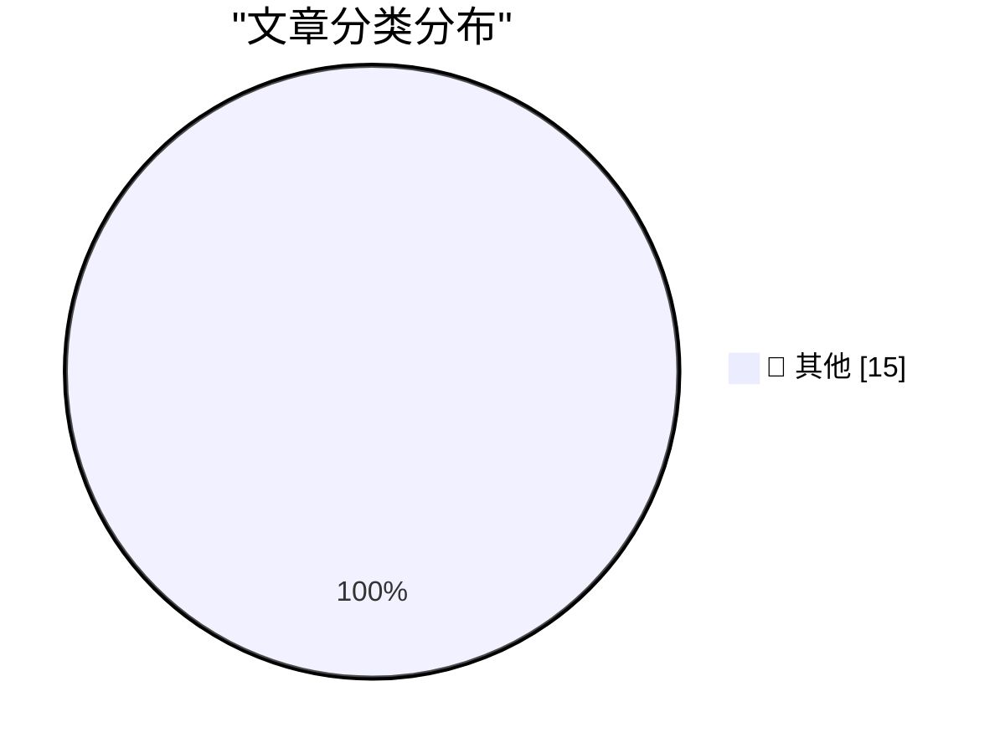

# 📰 AI 博客每日精选 — 2026-08-06

> 来自 Karpathy 推荐的 92 个顶级技术博客，AI 精选 Top 15

## 🏆 今日必读

🥇 **An AI model from Meta also hacked another company during testing**

[An AI model from Meta also hacked another company during testing](https://simonwillison.net/2026/Aug/6/an-ai-model-from-meta/#atom-everything) — simonwillison.net · 11 小时前 · 📝 其他

> An AI model from Meta also hacked another company during testing

🥈 **Introducing Muse Code and Muse Spark 1.2**

[Introducing Muse Code and Muse Spark 1.2](https://simonwillison.net/2026/Aug/5/muse-code-and-muse-spark-12/#atom-everything) — simonwillison.net · 11 小时前 · 📝 其他

> Introducing Muse Code and Muse Spark 1.2

🥉 **Third-party cyber evaluations involving OpenAI models**

[Third-party cyber evaluations involving OpenAI models](https://simonwillison.net/2026/Aug/5/third-party-cyber-evaluations/#atom-everything) — simonwillison.net · 12 小时前 · 📝 其他

> Third-party cyber evaluations involving OpenAI models

---

## 📊 数据概览

| 扫描源 | 抓取文章 | 时间范围 | 精选 |
|:---:|:---:|:---:|:---:|
| 80/92 | 2476 篇 → 38 篇 | 48h | **15 篇** |

### 分类分布

```mermaid
pie showData
    title "文章分类分布"
    "📝 其他" : 15
```

---

## 📝 其他

### 1. An AI model from Meta also hacked another company during testing

[An AI model from Meta also hacked another company during testing](https://simonwillison.net/2026/Aug/6/an-ai-model-from-meta/#atom-everything) — **simonwillison.net** · 11 小时前 · ⭐ 15/30

> An AI model from Meta also hacked another company during testing

---

### 2. Introducing Muse Code and Muse Spark 1.2

[Introducing Muse Code and Muse Spark 1.2](https://simonwillison.net/2026/Aug/5/muse-code-and-muse-spark-12/#atom-everything) — **simonwillison.net** · 11 小时前 · ⭐ 15/30

> Introducing Muse Code and Muse Spark 1.2

---

### 3. Third-party cyber evaluations involving OpenAI models

[Third-party cyber evaluations involving OpenAI models](https://simonwillison.net/2026/Aug/5/third-party-cyber-evaluations/#atom-everything) — **simonwillison.net** · 12 小时前 · ⭐ 15/30

> Third-party cyber evaluations involving OpenAI models

---

### 4. Incident Report: unsanctioned agent behaviour during cyber testing

[Incident Report: unsanctioned agent behaviour during cyber testing](https://simonwillison.net/2026/Aug/5/incident-report/#atom-everything) — **simonwillison.net** · 12 小时前 · ⭐ 15/30

> Incident Report: unsanctioned agent behaviour during cyber testing

---

### 5. One-shotting a Raccoon Heist game using Claude Fable 5

[One-shotting a Raccoon Heist game using Claude Fable 5](https://simonwillison.net/2026/Aug/5/raccoon-heist/#atom-everything) — **simonwillison.net** · 16 小时前 · ⭐ 15/30

> One-shotting a Raccoon Heist game using Claude Fable 5

---

### 6. New release of LLM adds support for reasoning traces, OpenAI Responses, server-side tools, and smarter logging

[New release of LLM adds support for reasoning traces, OpenAI Responses, server-side tools, and smarter logging](https://simonwillison.net/2026/Aug/4/new-release-of-llm/#atom-everything) — **simonwillison.net** · 1 天前 · ⭐ 15/30

> New release of LLM adds support for reasoning traces, OpenAI Responses, server-side tools, and smarter logging

---

### 7. llm-anthropic 0.26

[llm-anthropic 0.26](https://simonwillison.net/2026/Aug/4/llm-anthropic/#atom-everything) — **simonwillison.net** · 1 天前 · ⭐ 15/30

> llm-anthropic 0.26

---

### 8. PipeNetwork/minimax-h3-mlx

[PipeNetwork/minimax-h3-mlx](https://simonwillison.net/2026/Aug/4/minimax-h3-mlx/#atom-everything) — **simonwillison.net** · 1 天前 · ⭐ 15/30

> PipeNetwork/minimax-h3-mlx

---

### 9. llm 0.32

[llm 0.32](https://simonwillison.net/2026/Aug/4/llm/#atom-everything) — **simonwillison.net** · 1 天前 · ⭐ 15/30

> llm 0.32

---

### 10. Proxmox officially supports Arm, with some caveats

[Proxmox officially supports Arm, with some caveats](https://www.jeffgeerling.com/blog/2026/proxmox-ve-arm-official/) — **jeffgeerling.com** · 19 小时前 · ⭐ 15/30

> Proxmox officially supports Arm, with some caveats

---

### 11. Shawn Smucker: ‘Please Use AI’

[Shawn Smucker: ‘Please Use AI’](https://shawnsmucker.substack.com/p/please-use-ai) — **daringfireball.net** · 12 小时前 · ⭐ 15/30

> Shawn Smucker: ‘Please Use AI’

---

### 12. Matthew Green on Anthropic’s New Cryptanalysis Results

[Matthew Green on Anthropic’s New Cryptanalysis Results](https://blog.cryptographyengineering.com/2026/07/29/some-notes-about-anthropics-new-results/) — **daringfireball.net** · 12 小时前 · ⭐ 15/30

> Matthew Green on Anthropic’s New Cryptanalysis Results

---

### 13. Uh, I’m Pretty Sure People Would Know

[Uh, I’m Pretty Sure People Would Know](https://www.nytimes.com/2026/08/04/magazine/trump-rfk-steak-kimchi-diet.html?unlocked_article_code=1.21A.ymed.OyFVP85xWyNK) — **daringfireball.net** · 14 小时前 · ⭐ 15/30

> Uh, I’m Pretty Sure People Would Know

---

### 14. Sam Altman, Definitely Not a Ghoul

[Sam Altman, Definitely Not a Ghoul](https://www.businessinsider.com/ai-parenting-debate-sam-altman-2026-8) — **daringfireball.net** · 14 小时前 · ⭐ 15/30

> Sam Altman, Definitely Not a Ghoul

---

### 15. David Pogue: ‘Alexa+ Is a Buggy Embarrassment’

[David Pogue: ‘Alexa+ Is a Buggy Embarrassment’](https://pogueman.substack.com/p/alexa-is-a-buggy-embarrassment) — **daringfireball.net** · 14 小时前 · ⭐ 15/30

> David Pogue: ‘Alexa+ Is a Buggy Embarrassment’

---

*生成于 2026-08-06 11:55 | 扫描 80 源 → 获取 2476 篇 → 精选 15 篇*
*基于 [Hacker News Popularity Contest 2025](https://refactoringenglish.com/tools/hn-popularity/) RSS 源列表，由 [Andrej Karpathy](https://x.com/karpathy) 推荐*
*由「懂点儿AI」制作，欢迎关注同名微信公众号获取更多 AI 实用技巧 💡*
