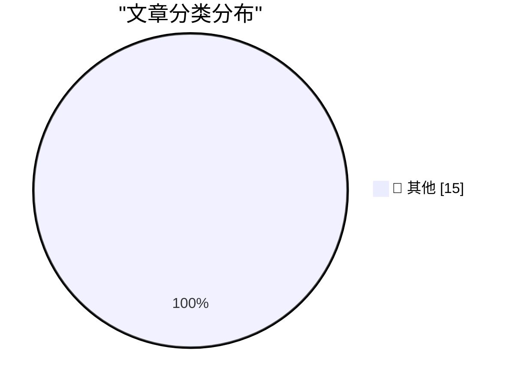

# 📰 AI 博客每日精选 — 2026-08-01

> 来自 Karpathy 推荐的 92 个顶级技术博客，AI 精选 Top 15

## 🏆 今日必读

🥇 **deepseek-ai/DeepSeek-V4-Flash-0731**

[deepseek-ai/DeepSeek-V4-Flash-0731](https://simonwillison.net/2026/Jul/31/deepseek-v4-flash-0731/#atom-everything) — simonwillison.net · 11 小时前 · 📝 其他

> deepseek-ai/DeepSeek-V4-Flash-0731

🥈 **Stateless MCP has recaptured my interest (and inspired mcp-explorer and datasette-mcp)**

[Stateless MCP has recaptured my interest (and inspired mcp-explorer and datasette-mcp)](https://simonwillison.net/2026/Jul/31/stateless-mcp/#atom-everything) — simonwillison.net · 11 小时前 · 📝 其他

> Stateless MCP has recaptured my interest (and inspired mcp-explorer and datasette-mcp)

🥉 **llm-mcp-client 0.1a0**

[llm-mcp-client 0.1a0](https://simonwillison.net/2026/Jul/31/llm-mcp-client/#atom-everything) — simonwillison.net · 12 小时前 · 📝 其他

> llm-mcp-client 0.1a0

---

## 📊 数据概览

| 扫描源 | 抓取文章 | 时间范围 | 精选 |
|:---:|:---:|:---:|:---:|
| 84/92 | 2536 篇 → 41 篇 | 48h | **15 篇** |

### 分类分布

```mermaid
pie showData
    title "文章分类分布"
    "📝 其他" : 15
```

---

## 📝 其他

### 1. deepseek-ai/DeepSeek-V4-Flash-0731

[deepseek-ai/DeepSeek-V4-Flash-0731](https://simonwillison.net/2026/Jul/31/deepseek-v4-flash-0731/#atom-everything) — **simonwillison.net** · 11 小时前 · ⭐ 15/30

> deepseek-ai/DeepSeek-V4-Flash-0731

---

### 2. Stateless MCP has recaptured my interest (and inspired mcp-explorer and datasette-mcp)

[Stateless MCP has recaptured my interest (and inspired mcp-explorer and datasette-mcp)](https://simonwillison.net/2026/Jul/31/stateless-mcp/#atom-everything) — **simonwillison.net** · 11 小时前 · ⭐ 15/30

> Stateless MCP has recaptured my interest (and inspired mcp-explorer and datasette-mcp)

---

### 3. llm-mcp-client 0.1a0

[llm-mcp-client 0.1a0](https://simonwillison.net/2026/Jul/31/llm-mcp-client/#atom-everything) — **simonwillison.net** · 12 小时前 · ⭐ 15/30

> llm-mcp-client 0.1a0

---

### 4. Oxide and Friends: The Open Weight Revolution with Simon Willison

[Oxide and Friends: The Open Weight Revolution with Simon Willison](https://simonwillison.net/2026/Jul/31/oxide-and-friends/#atom-everything) — **simonwillison.net** · 13 小时前 · ⭐ 15/30

> Oxide and Friends: The Open Weight Revolution with Simon Willison

---

### 5. smevals - a small eval suite for evaluating models, prompts, and harnesses

[smevals - a small eval suite for evaluating models, prompts, and harnesses](https://simonwillison.net/2026/Jul/31/smevals/#atom-everything) — **simonwillison.net** · 13 小时前 · ⭐ 15/30

> smevals - a small eval suite for evaluating models, prompts, and harnesses

---

### 6. datasette-agent 0.4a0

[datasette-agent 0.4a0](https://simonwillison.net/2026/Jul/31/datasette-agent/#atom-everything) — **simonwillison.net** · 20 小时前 · ⭐ 15/30

> datasette-agent 0.4a0

---

### 7. Advancing the price-performance frontier with GPT‑5.6

[Advancing the price-performance frontier with GPT‑5.6](https://simonwillison.net/2026/Jul/30/luna-price-drop/#atom-everything) — **simonwillison.net** · 1 天前 · ⭐ 15/30

> Advancing the price-performance frontier with GPT‑5.6

---

### 8. Investigating three real-world incidents in our cybersecurity evaluations

[Investigating three real-world incidents in our cybersecurity evaluations](https://simonwillison.net/2026/Jul/30/three-real-world-incidents/#atom-everything) — **simonwillison.net** · 1 天前 · ⭐ 15/30

> Investigating three real-world incidents in our cybersecurity evaluations

---

### 9. llm 0.32rc2

[llm 0.32rc2](https://simonwillison.net/2026/Jul/30/llm-rc2/#atom-everything) — **simonwillison.net** · 1 天前 · ⭐ 15/30

> llm 0.32rc2

---

### 10. Quoting Bruce Schneier

[Quoting Bruce Schneier](https://simonwillison.net/2026/Jul/30/bruce-schneier/#atom-everything) — **simonwillison.net** · 1 天前 · ⭐ 15/30

> Quoting Bruce Schneier

---

### 11. llm-chat-completions-server 0.1a0

[llm-chat-completions-server 0.1a0](https://simonwillison.net/2026/Jul/30/llm-chat-completions-server/#atom-everything) — **simonwillison.net** · 1 天前 · ⭐ 15/30

> llm-chat-completions-server 0.1a0

---

### 12. llm 0.32rc1

[llm 0.32rc1](https://simonwillison.net/2026/Jul/30/llm-rc1/#atom-everything) — **simonwillison.net** · 1 天前 · ⭐ 15/30

> llm 0.32rc1

---

### 13. Getting 25 Gbps Thunderbolt Ethernet on my Mac Studio

[Getting 25 Gbps Thunderbolt Ethernet on my Mac Studio](https://www.jeffgeerling.com/blog/2026/getting-25g-ethernet-mac-thunderbolt/) — **jeffgeerling.com** · 21 小时前 · ⭐ 15/30

> Getting 25 Gbps Thunderbolt Ethernet on my Mac Studio

---

### 14. AI models need moral support to make discoveries

[AI models need moral support to make discoveries](https://seangoedecke.com/ai-models-need-moral-support/) — **seangoedecke.com** · 1 天前 · ⭐ 15/30

> AI models need moral support to make discoveries

---

### 15. Read This Before You Buy That TV Streaming Stick

[Read This Before You Buy That TV Streaming Stick](https://krebsonsecurity.com/2026/07/read-this-before-you-buy-that-tv-streaming-stick/) — **krebsonsecurity.com** · 1 天前 · ⭐ 15/30

> Read This Before You Buy That TV Streaming Stick

---

*生成于 2026-08-01 11:09 | 扫描 84 源 → 获取 2536 篇 → 精选 15 篇*
*基于 [Hacker News Popularity Contest 2025](https://refactoringenglish.com/tools/hn-popularity/) RSS 源列表，由 [Andrej Karpathy](https://x.com/karpathy) 推荐*
*由「懂点儿AI」制作，欢迎关注同名微信公众号获取更多 AI 实用技巧 💡*
