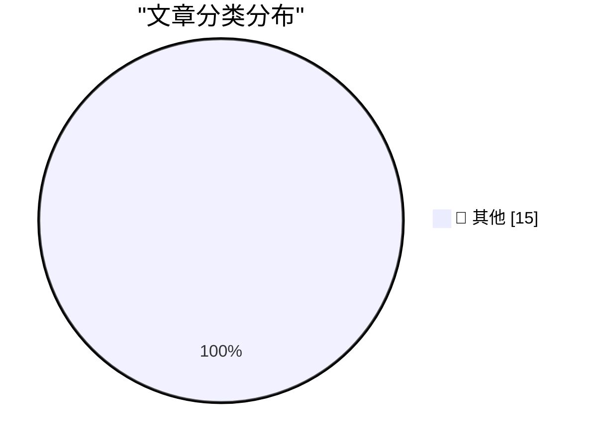

# 📰 AI 博客每日精选 — 2026-09-08

> 来自 Karpathy 推荐的 92 个顶级技术博客，AI 精选 Top 15

## 🏆 今日必读

🥇 **llm 0.35**

[llm 0.35](https://simonwillison.net/2026/Sep/7/llm/) — simonwillison.net · 14 小时前 · 📝 其他

> llm 0.35

🥈 **Creepy crawlies**

[Creepy crawlies](https://simonwillison.net/2026/Sep/7/creepy-crawlies/) — simonwillison.net · 14 小时前 · 📝 其他

> Creepy crawlies

🥉 **Quoting Jakub Pachocki**

[Quoting Jakub Pachocki](https://simonwillison.net/2026/Sep/7/jakub-pachocki/) — simonwillison.net · 15 小时前 · 📝 其他

> Quoting Jakub Pachocki

---

## 📊 数据概览

| 扫描源 | 抓取文章 | 时间范围 | 精选 |
|:---:|:---:|:---:|:---:|
| 83/92 | 2524 篇 → 31 篇 | 48h | **15 篇** |

### 分类分布

```mermaid
pie showData
    title "文章分类分布"
    "📝 其他" : 15
```

---

## 📝 其他

### 1. llm 0.35

[llm 0.35](https://simonwillison.net/2026/Sep/7/llm/) — **simonwillison.net** · 14 小时前 · ⭐ 15/30

> llm 0.35

---

### 2. Creepy crawlies

[Creepy crawlies](https://simonwillison.net/2026/Sep/7/creepy-crawlies/) — **simonwillison.net** · 14 小时前 · ⭐ 15/30

> Creepy crawlies

---

### 3. Quoting Jakub Pachocki

[Quoting Jakub Pachocki](https://simonwillison.net/2026/Sep/7/jakub-pachocki/) — **simonwillison.net** · 15 小时前 · ⭐ 15/30

> Quoting Jakub Pachocki

---

### 4. Video compressor

[Video compressor](https://simonwillison.net/2026/Sep/7/video-compressor/) — **simonwillison.net** · 19 小时前 · ⭐ 15/30

> Video compressor

---

### 5. Mercator ↔ Equal Earth

[Mercator ↔ Equal Earth](https://simonwillison.net/2026/Sep/7/equal-earth/) — **simonwillison.net** · 21 小时前 · ⭐ 15/30

> Mercator ↔ Equal Earth

---

### 6. Research acceleration: The view inside OpenAI

[Research acceleration: The view inside OpenAI](https://simonwillison.net/2026/Sep/6/research-acceleration-the-view-inside-openai/) — **simonwillison.net** · 1 天前 · ⭐ 15/30

> Research acceleration: The view inside OpenAI

---

### 7. The purpose of DNS is to spread scams

[The purpose of DNS is to spread scams](https://simonwillison.net/2026/Sep/6/the-purpose-of-dns-is-to-spread-scams/) — **simonwillison.net** · 1 天前 · ⭐ 15/30

> The purpose of DNS is to spread scams

---

### 8. Automatically detecting AI text in my browser

[Automatically detecting AI text in my browser](https://seangoedecke.com/deckard/) — **seangoedecke.com** · 13 小时前 · ⭐ 15/30

> Automatically detecting AI text in my browser

---

### 9. [Sponsor] Glyphs 4

[[Sponsor] Glyphs 4](https://glyphsapp.com/) — **daringfireball.net** · 15 小时前 · ⭐ 15/30

> [Sponsor] Glyphs 4

---

### 10. Trackables 1.5

[Trackables 1.5](https://trackables.app/) — **daringfireball.net** · 15 小时前 · ⭐ 15/30

> Trackables 1.5

---

### 11. The Onion’s Exclusive Interview With Larry Ellison

[The Onion’s Exclusive Interview With Larry Ellison](https://theonion.com/the-onions-exclusive-interview-with-larry-ellison/) — **daringfireball.net** · 17 小时前 · ⭐ 15/30

> The Onion’s Exclusive Interview With Larry Ellison

---

### 12. McKinley 1.0

[McKinley 1.0](https://mckinleysymbols.com/) — **daringfireball.net** · 17 小时前 · ⭐ 15/30

> McKinley 1.0

---

### 13. Matt Birchler’s Folding iPhone Predictions

[Matt Birchler’s Folding iPhone Predictions](https://birchtree.me/blog/my-folding-iphone-predictions/) — **daringfireball.net** · 17 小时前 · ⭐ 15/30

> Matt Birchler’s Folding iPhone Predictions

---

### 14. ★ And It’s True That I Stole Your Lighter, and It’s Also True That I Lost the Map

[★ And It’s True That I Stole Your Lighter, and It’s Also True That I Lost the Map](https://daringfireball.net/2026/09/its_true_that_i_stole_your_lighter) — **daringfireball.net** · 21 小时前 · ⭐ 15/30

> ★ And It’s True That I Stole Your Lighter, and It’s Also True That I Lost the Map

---

### 15. Meta AI Has a Native Mac App Now, and It Seems Decent

[Meta AI Has a Native Mac App Now, and It Seems Decent](https://9to5mac.com/2026/08/19/meta-ai-is-now-available-as-a-more-capable-desktop-app-for-mac/) — **daringfireball.net** · 1 天前 · ⭐ 15/30

> Meta AI Has a Native Mac App Now, and It Seems Decent

---

*生成于 2026-09-08 13:57 | 扫描 83 源 → 获取 2524 篇 → 精选 15 篇*
*基于 [Hacker News Popularity Contest 2025](https://refactoringenglish.com/tools/hn-popularity/) RSS 源列表，由 [Andrej Karpathy](https://x.com/karpathy) 推荐*
*由「懂点儿AI」制作，欢迎关注同名微信公众号获取更多 AI 实用技巧 💡*
