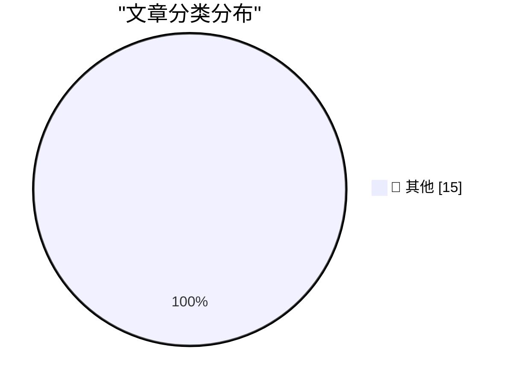

# 📰 AI 博客每日精选 — 2026-08-23

> 来自 Karpathy 推荐的 92 个顶级技术博客，AI 精选 Top 15

## 🏆 今日必读

🥇 **Quoting Linus Torvalds**

[Quoting Linus Torvalds](https://simonwillison.net/2026/Aug/22/linus-torvalds/) — simonwillison.net · 13 小时前 · 📝 其他

> Quoting Linus Torvalds

🥈 **llm 0.33**

[llm 0.33](https://simonwillison.net/2026/Aug/22/llm/) — simonwillison.net · 17 小时前 · 📝 其他

> llm 0.33

🥉 **More than just code review**

[More than just code review](https://simonwillison.net/2026/Aug/22/more-than-just-code-review/) — simonwillison.net · 18 小时前 · 📝 其他

> More than just code review

---

## 📊 数据概览

| 扫描源 | 抓取文章 | 时间范围 | 精选 |
|:---:|:---:|:---:|:---:|
| 84/92 | 2542 篇 → 32 篇 | 48h | **15 篇** |

### 分类分布

```mermaid
pie showData
    title "文章分类分布"
    "📝 其他" : 15
```

---

## 📝 其他

### 1. Quoting Linus Torvalds

[Quoting Linus Torvalds](https://simonwillison.net/2026/Aug/22/linus-torvalds/) — **simonwillison.net** · 13 小时前 · ⭐ 15/30

> Quoting Linus Torvalds

---

### 2. llm 0.33

[llm 0.33](https://simonwillison.net/2026/Aug/22/llm/) — **simonwillison.net** · 17 小时前 · ⭐ 15/30

> llm 0.33

---

### 3. More than just code review

[More than just code review](https://simonwillison.net/2026/Aug/22/more-than-just-code-review/) — **simonwillison.net** · 18 小时前 · ⭐ 15/30

> More than just code review

---

### 4. llm 0.32.1

[llm 0.32.1](https://simonwillison.net/2026/Aug/21/llm/) — **simonwillison.net** · 1 天前 · ⭐ 15/30

> llm 0.32.1

---

### 5. llm-openrouter 0.7

[llm-openrouter 0.7](https://simonwillison.net/2026/Aug/21/llm-openrouter/) — **simonwillison.net** · 1 天前 · ⭐ 15/30

> llm-openrouter 0.7

---

### 6. Stop Making TUIs

[Stop Making TUIs](https://simonwillison.net/2026/Aug/21/stop-making-tuis/) — **simonwillison.net** · 1 天前 · ⭐ 15/30

> Stop Making TUIs

---

### 7. Quoting Matt Webb

[Quoting Matt Webb](https://simonwillison.net/2026/Aug/21/matt-webb/) — **simonwillison.net** · 1 天前 · ⭐ 15/30

> Quoting Matt Webb

---

### 8. You should never be angry at work

[You should never be angry at work](https://seangoedecke.com/you-should-never-be-angry-at-work/) — **seangoedecke.com** · 1 天前 · ⭐ 15/30

> You should never be angry at work

---

### 9. Mark Carney on the U.S. Under Trump: ‘Sometimes, Its Signature Is Written in Pencil’

[Mark Carney on the U.S. Under Trump: ‘Sometimes, Its Signature Is Written in Pencil’](https://www.nytimes.com/2026/08/22/world/canada/carney-tariffs-trade-trump.html?unlocked_article_code=1.7VA.r3Ue.GTc_tOhX0qSn) — **daringfireball.net** · 17 小时前 · ⭐ 15/30

> Mark Carney on the U.S. Under Trump: ‘Sometimes, Its Signature Is Written in Pencil’

---

### 10. WorkOS: Agents Can Now Sign Up for Your App

[WorkOS: Agents Can Now Sign Up for Your App](https://workos.com/auth-md?utm_source=daringfireball&amp;utm_medium=newsletter&amp;utm_campaign=q32026) — **daringfireball.net** · 19 小时前 · ⭐ 15/30

> WorkOS: Agents Can Now Sign Up for Your App

---

### 11. Dutch Regulator Fines Uber $1 Billion for Suspending Dishonest Drivers

[Dutch Regulator Fines Uber $1 Billion for Suspending Dishonest Drivers](https://www.reuters.com/world/dutch-regulator-fines-uber-966-million-automating-driver-suspensions-document-2026-08-21/) — **daringfireball.net** · 19 小时前 · ⭐ 15/30

> Dutch Regulator Fines Uber $1 Billion for Suspending Dishonest Drivers

---

### 12. The Fourth Horseman of the File-Format-Hegemony Apocalypse

[The Fourth Horseman of the File-Format-Hegemony Apocalypse](https://techcommunity.microsoft.com/blog/onedriveblog/introducing-markdown-support-in-sharepoint-and-onedrive/4512174) — **daringfireball.net** · 1 天前 · ⭐ 15/30

> The Fourth Horseman of the File-Format-Hegemony Apocalypse

---

### 13. Walmart Finally Caves, Will Soon Support Apple Pay

[Walmart Finally Caves, Will Soon Support Apple Pay](https://corporate.walmart.com/news/2026/08/21/more-ways-to-pay-tap-to-pay-is-coming-to-walmart-and-sams-club) — **daringfireball.net** · 1 天前 · ⭐ 15/30

> Walmart Finally Caves, Will Soon Support Apple Pay

---

### 14. ★ When New DF Posts Drop in a Forest and No One Is There to Read Them

[★ When New DF Posts Drop in a Forest and No One Is There to Read Them](https://daringfireball.net/2026/08/df_posts_drop_in_a_forest) — **daringfireball.net** · 1 天前 · ⭐ 15/30

> ★ When New DF Posts Drop in a Forest and No One Is There to Read Them

---

### 15. Bluesky’s Active User Base Is Shrinking, and Remains Tiny Compared to Threads and Twitter/X

[Bluesky’s Active User Base Is Shrinking, and Remains Tiny Compared to Threads and Twitter/X](https://techcrunch.com/2026/08/11/blueskys-active-user-base-is-shrinking-as-its-focus-expands-beyond-the-app/) — **daringfireball.net** · 1 天前 · ⭐ 15/30

> Bluesky’s Active User Base Is Shrinking, and Remains Tiny Compared to Threads and Twitter/X

---

*生成于 2026-08-23 10:11 | 扫描 84 源 → 获取 2542 篇 → 精选 15 篇*
*基于 [Hacker News Popularity Contest 2025](https://refactoringenglish.com/tools/hn-popularity/) RSS 源列表，由 [Andrej Karpathy](https://x.com/karpathy) 推荐*
*由「懂点儿AI」制作，欢迎关注同名微信公众号获取更多 AI 实用技巧 💡*
