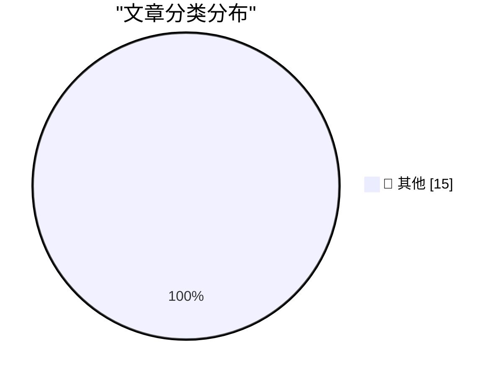

# 📰 AI 博客每日精选 — 2026-09-19

> 来自 Karpathy 推荐的 92 个顶级技术博客，AI 精选 Top 15

## 🏆 今日必读

🥇 **Gemini Hacked Three Companies in First Known Breakout by Google’s AI**

[Gemini Hacked Three Companies in First Known Breakout by Google’s AI](https://simonwillison.net/2026/Sep/18/gemini-hacked-three-companies/) — simonwillison.net · 13 小时前 · 📝 其他

> Gemini Hacked Three Companies in First Known Breakout by Google’s AI

🥈 **Note on 18th September 2026**

[Note on 18th September 2026](https://simonwillison.net/2026/Sep/18/probably-gonna-eat-you/) — simonwillison.net · 18 小时前 · 📝 其他

> Note on 18th September 2026

🥉 **Quoting Thariq Shihipar**

[Quoting Thariq Shihipar](https://simonwillison.net/2026/Sep/18/thariq-shihipar/) — simonwillison.net · 18 小时前 · 📝 其他

> Quoting Thariq Shihipar

---

## 📊 数据概览

| 扫描源 | 抓取文章 | 时间范围 | 精选 |
|:---:|:---:|:---:|:---:|
| 82/92 | 2502 篇 → 37 篇 | 48h | **15 篇** |

### 分类分布

```mermaid
pie showData
    title "文章分类分布"
    "📝 其他" : 15
```

---

## 📝 其他

### 1. Gemini Hacked Three Companies in First Known Breakout by Google’s AI

[Gemini Hacked Three Companies in First Known Breakout by Google’s AI](https://simonwillison.net/2026/Sep/18/gemini-hacked-three-companies/) — **simonwillison.net** · 13 小时前 · ⭐ 15/30

> Gemini Hacked Three Companies in First Known Breakout by Google’s AI

---

### 2. Note on 18th September 2026

[Note on 18th September 2026](https://simonwillison.net/2026/Sep/18/probably-gonna-eat-you/) — **simonwillison.net** · 18 小时前 · ⭐ 15/30

> Note on 18th September 2026

---

### 3. Quoting Thariq Shihipar

[Quoting Thariq Shihipar](https://simonwillison.net/2026/Sep/18/thariq-shihipar/) — **simonwillison.net** · 18 小时前 · ⭐ 15/30

> Quoting Thariq Shihipar

---

### 4. The Creative Spirit of Who Framed Roger Rabbit

[The Creative Spirit of Who Framed Roger Rabbit](https://simonwillison.net/2026/Sep/18/the-creative-spirit-of-who-framed-roger-rabbit/) — **simonwillison.net** · 22 小时前 · ⭐ 15/30

> The Creative Spirit of Who Framed Roger Rabbit

---

### 5. Be alert: targeted attacks on prominent Rustaceans

[Be alert: targeted attacks on prominent Rustaceans](https://simonwillison.net/2026/Sep/17/targeted-attacks-on-rustaceans/) — **simonwillison.net** · 1 天前 · ⭐ 15/30

> Be alert: targeted attacks on prominent Rustaceans

---

### 6. How To Write With An LLM

[How To Write With An LLM](https://simonwillison.net/2026/Sep/17/how-to-write-with-an-llm/) — **simonwillison.net** · 1 天前 · ⭐ 15/30

> How To Write With An LLM

---

### 7. Self-generated prompt injections in compaction summaries

[Self-generated prompt injections in compaction summaries](https://simonwillison.net/2026/Sep/17/compaction-summaries/) — **simonwillison.net** · 1 天前 · ⭐ 15/30

> Self-generated prompt injections in compaction summaries

---

### 8. NTP, an atomic clock, and having a great time at the world's largest VCF

[NTP, an atomic clock, and having a great time at the world's largest VCF](https://www.jeffgeerling.com/blog/2026/vcf-midwest-21-ntp-time/) — **jeffgeerling.com** · 23 小时前 · ⭐ 15/30

> NTP, an atomic clock, and having a great time at the world's largest VCF

---

### 9. Two techniques for working with System One models

[Two techniques for working with System One models](https://seangoedecke.com/two-techniques-for-working-with-system-one-models/) — **seangoedecke.com** · 1 天前 · ⭐ 15/30

> Two techniques for working with System One models

---

### 10. Just Me or Does This Argument Not Add Up?

[Just Me or Does This Argument Not Add Up?](https://www.nytimes.com/2026/09/16/opinion/university-of-california-sat.html?unlocked_article_code=1.CFE.bXBA.V6BFzBn1jlKG) — **daringfireball.net** · 16 小时前 · ⭐ 15/30

> Just Me or Does This Argument Not Add Up?

---

### 11. Will Oremus Is a Duo Doubter

[Will Oremus Is a Duo Doubter](https://www.theatlantic.com/technology/2026/09/apple-folding-iphone/688562/?gift=aQyUJR7AIw1mJWdQ6Ed6yE6RbvpIGGpQGFPIX827p48) — **daringfireball.net** · 16 小时前 · ⭐ 15/30

> Will Oremus Is a Duo Doubter

---

### 12. Apple Releases Xcode 27.1, First SDK With Support for iPhone Duo

[Apple Releases Xcode 27.1, First SDK With Support for iPhone Duo](https://developer.apple.com/news/?id=nyuppv9r) — **daringfireball.net** · 17 小时前 · ⭐ 15/30

> Apple Releases Xcode 27.1, First SDK With Support for iPhone Duo

---

### 13. Warren Buffett, at 96, Steps Down as Chairman at Berkshire Hathaway

[Warren Buffett, at 96, Steps Down as Chairman at Berkshire Hathaway](https://www.berkshirehathaway.com/news/sep1826.pdf) — **daringfireball.net** · 18 小时前 · ⭐ 15/30

> Warren Buffett, at 96, Steps Down as Chairman at Berkshire Hathaway

---

### 14. Trump Says He’s Banning MS NOW, CNN, and Politico From White House

[Trump Says He’s Banning MS NOW, CNN, and Politico From White House](https://truthsocial.com/@realDonaldTrump/posts/117293599348325006) — **daringfireball.net** · 18 小时前 · ⭐ 15/30

> Trump Says He’s Banning MS NOW, CNN, and Politico From White House

---

### 15. Hollywood Wants the Duo

[Hollywood Wants the Duo](https://pagesix.com/2026/09/16/hollywood/mysterious-apple-ceo-charms-hollywood-following-big-emmys-night-by-showing-off-new-iphone/) — **daringfireball.net** · 20 小时前 · ⭐ 15/30

> Hollywood Wants the Duo

---

*生成于 2026-09-19 13:31 | 扫描 82 源 → 获取 2502 篇 → 精选 15 篇*
*基于 [Hacker News Popularity Contest 2025](https://refactoringenglish.com/tools/hn-popularity/) RSS 源列表，由 [Andrej Karpathy](https://x.com/karpathy) 推荐*
*由「懂点儿AI」制作，欢迎关注同名微信公众号获取更多 AI 实用技巧 💡*
