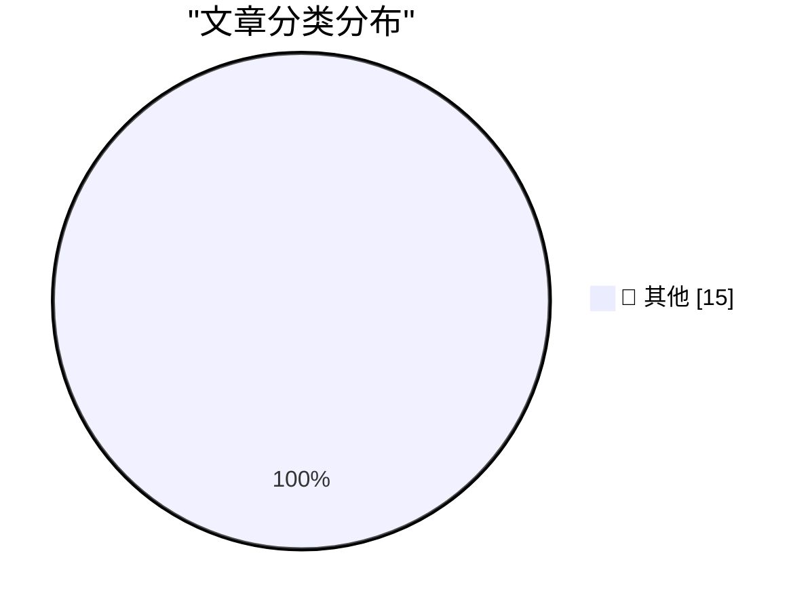

# 📰 AI 博客每日精选 — 2026-07-27

> 来自 Karpathy 推荐的 92 个顶级技术博客，AI 精选 Top 15

## 🏆 今日必读

🥇 **An Inside Look at the Relay Market Powering Token Resellers and Fraud**

[An Inside Look at the Relay Market Powering Token Resellers and Fraud](https://simonwillison.net/2026/Jul/26/relay-market/#atom-everything) — simonwillison.net · 17 小时前 · 📝 其他

> An Inside Look at the Relay Market Powering Token Resellers and Fraud

🥈 **Ruff v0.16.0**

[Ruff v0.16.0](https://simonwillison.net/2026/Jul/25/ruff/#atom-everything) — simonwillison.net · 1 天前 · 📝 其他

> Ruff v0.16.0

🥉 **‘AI Mania Is Eviscerating Global Decision-Making’**

[‘AI Mania Is Eviscerating Global Decision-Making’](https://ludic.mataroa.blog/blog/ai-mania-is-eviscerating-global-decision-making/) — daringfireball.net · 1 天前 · 📝 其他

> ‘AI Mania Is Eviscerating Global Decision-Making’

---

## 📊 数据概览

| 扫描源 | 抓取文章 | 时间范围 | 精选 |
|:---:|:---:|:---:|:---:|
| 81/92 | 2472 篇 → 19 篇 | 48h | **15 篇** |

### 分类分布

```mermaid
pie showData
    title "文章分类分布"
    "📝 其他" : 15
```

---

## 📝 其他

### 1. An Inside Look at the Relay Market Powering Token Resellers and Fraud

[An Inside Look at the Relay Market Powering Token Resellers and Fraud](https://simonwillison.net/2026/Jul/26/relay-market/#atom-everything) — **simonwillison.net** · 17 小时前 · ⭐ 15/30

> An Inside Look at the Relay Market Powering Token Resellers and Fraud

---

### 2. Ruff v0.16.0

[Ruff v0.16.0](https://simonwillison.net/2026/Jul/25/ruff/#atom-everything) — **simonwillison.net** · 1 天前 · ⭐ 15/30

> Ruff v0.16.0

---

### 3. ‘AI Mania Is Eviscerating Global Decision-Making’

[‘AI Mania Is Eviscerating Global Decision-Making’](https://ludic.mataroa.blog/blog/ai-mania-is-eviscerating-global-decision-making/) — **daringfireball.net** · 1 天前 · ⭐ 15/30

> ‘AI Mania Is Eviscerating Global Decision-Making’

---

### 4. EU Fines Google $1 Billion for DMA Competition Violations, Including Making Search Results More Useful

[EU Fines Google $1 Billion for DMA Competition Violations, Including Making Search Results More Useful](https://digital-markets-act.ec.europa.eu/commission-fines-google-eur890-million-breaches-digital-markets-act-2026-07-23_en) — **daringfireball.net** · 1 天前 · ⭐ 15/30

> EU Fines Google $1 Billion for DMA Competition Violations, Including Making Search Results More Useful

---

### 5. Court Grants SerpApi’s Motion to Dismiss Google Lawsuit

[Court Grants SerpApi’s Motion to Dismiss Google Lawsuit](https://serpapi.com/blog/google-v-serpapi-the-court-granted-our-motion-to-dismiss/) — **daringfireball.net** · 1 天前 · ⭐ 15/30

> Court Grants SerpApi’s Motion to Dismiss Google Lawsuit

---

### 6. Apple Maps to Power Navigation Experience for Ford’s New EVs

[Apple Maps to Power Navigation Experience for Ford’s New EVs](https://www.apple.com/newsroom/2026/07/apple-maps-to-power-navigation-experience-for-ford-uev-platform/) — **daringfireball.net** · 1 天前 · ⭐ 15/30

> Apple Maps to Power Navigation Experience for Ford’s New EVs

---

### 7. Measles Cases Hit New Record in U.S., as Stupid-Americans Reject Vaccines

[Measles Cases Hit New Record in U.S., as Stupid-Americans Reject Vaccines](https://www.nytimes.com/2026/07/24/well/measles-record-united-states-numbers.html?unlocked_article_code=1.0VA.4jBf.vqAYN4Bwu807) — **daringfireball.net** · 1 天前 · ⭐ 15/30

> Measles Cases Hit New Record in U.S., as Stupid-Americans Reject Vaccines

---

### 8. bIRC — A New Native IRC Client for Mac

[bIRC — A New Native IRC Client for Mac](https://birc.app/) — **daringfireball.net** · 1 天前 · ⭐ 15/30

> bIRC — A New Native IRC Client for Mac

---

### 9. Why $550 Million Medical Debt only Cost $5.5 Million

[Why $550 Million Medical Debt only Cost $5.5 Million](https://idiallo.com/byte-size/550-million-only-cost-5-million) — **idiallo.com** · 17 小时前 · ⭐ 15/30

> Why $550 Million Medical Debt only Cost $5.5 Million

---

### 10. Pluralistic: How the EU can punish Google (despite Trump) (27 Jul 2026)

[Pluralistic: How the EU can punish Google (despite Trump) (27 Jul 2026)](https://pluralistic.net/2026/07/27/eucd-6/) — **pluralistic.net** · 1 小时前 · ⭐ 15/30

> Pluralistic: How the EU can punish Google (despite Trump) (27 Jul 2026)

---

### 11. Book Review: Dungeon Crawler Carl by Matt Dinniman ★★⯪☆☆

[Book Review: Dungeon Crawler Carl by Matt Dinniman ★★⯪☆☆](https://shkspr.mobi/blog/2026/07/book-review-dungeon-crawler-carl-by-matt-dinniman/) — **shkspr.mobi** · 1 天前 · ⭐ 15/30

> Book Review: Dungeon Crawler Carl by Matt Dinniman ★★⯪☆☆

---

### 12. Permutation roots

[Permutation roots](https://www.johndcook.com/blog/2026/07/26/permutation-roots/) — **johndcook.com** · 16 小时前 · ⭐ 15/30

> Permutation roots

---

### 13. exp_q

[exp_q](https://www.johndcook.com/blog/2026/07/26/exp-q/) — **johndcook.com** · 18 小时前 · ⭐ 15/30

> exp_q

---

### 14. Excel column numbering

[Excel column numbering](https://www.johndcook.com/blog/2026/07/25/excel-column-numbering/) — **johndcook.com** · 1 天前 · ⭐ 15/30

> Excel column numbering

---

### 15. Reading List 07/25/26

[Reading List 07/25/26](https://www.construction-physics.com/p/reading-list-072526) — **construction-physics.com** · 1 天前 · ⭐ 15/30

> Reading List 07/25/26

---

*生成于 2026-07-27 12:48 | 扫描 81 源 → 获取 2472 篇 → 精选 15 篇*
*基于 [Hacker News Popularity Contest 2025](https://refactoringenglish.com/tools/hn-popularity/) RSS 源列表，由 [Andrej Karpathy](https://x.com/karpathy) 推荐*
*由「懂点儿AI」制作，欢迎关注同名微信公众号获取更多 AI 实用技巧 💡*
