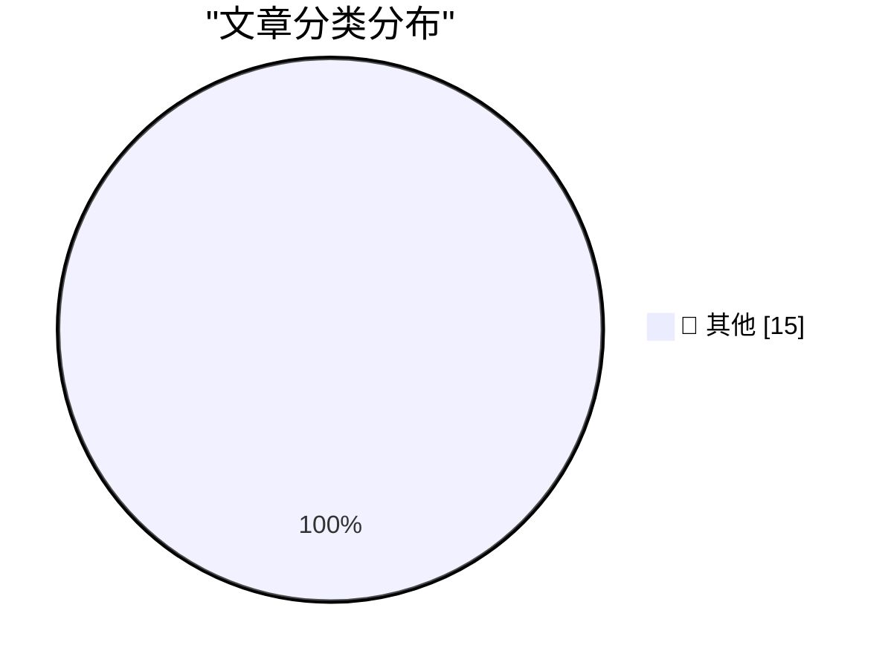

# 📰 AI 博客每日精选 — 2026-08-28

> 来自 Karpathy 推荐的 92 个顶级技术博客，AI 精选 Top 15

## 🏆 今日必读

🥇 **Breaking Claude Code Opus 5 Auto Mode**

[Breaking Claude Code Opus 5 Auto Mode](https://simonwillison.net/2026/Aug/27/breaking-claude-code-opus-5-auto-mode/) — simonwillison.net · 22 小时前 · 📝 其他

> Breaking Claude Code Opus 5 Auto Mode

🥈 **Qwen3.8-Flash-Next**

[Qwen3.8-Flash-Next](https://simonwillison.net/2026/Aug/26/qwen38-flash-next/) — simonwillison.net · 1 天前 · 📝 其他

> Qwen3.8-Flash-Next

🥉 **Building a mini Homelab that fits in my carry-on**

[Building a mini Homelab that fits in my carry-on](https://www.jeffgeerling.com/blog/2026/mini-homelab-network-fits-in-carry-on/) — jeffgeerling.com · 6 小时前 · 📝 其他

> Building a mini Homelab that fits in my carry-on

---

## 📊 数据概览

| 扫描源 | 抓取文章 | 时间范围 | 精选 |
|:---:|:---:|:---:|:---:|
| 83/92 | 2527 篇 → 36 篇 | 48h | **15 篇** |

### 分类分布

```mermaid
pie showData
    title "文章分类分布"
    "📝 其他" : 15
```

---

## 📝 其他

### 1. Breaking Claude Code Opus 5 Auto Mode

[Breaking Claude Code Opus 5 Auto Mode](https://simonwillison.net/2026/Aug/27/breaking-claude-code-opus-5-auto-mode/) — **simonwillison.net** · 22 小时前 · ⭐ 15/30

> Breaking Claude Code Opus 5 Auto Mode

---

### 2. Qwen3.8-Flash-Next

[Qwen3.8-Flash-Next](https://simonwillison.net/2026/Aug/26/qwen38-flash-next/) — **simonwillison.net** · 1 天前 · ⭐ 15/30

> Qwen3.8-Flash-Next

---

### 3. Building a mini Homelab that fits in my carry-on

[Building a mini Homelab that fits in my carry-on](https://www.jeffgeerling.com/blog/2026/mini-homelab-network-fits-in-carry-on/) — **jeffgeerling.com** · 6 小时前 · ⭐ 15/30

> Building a mini Homelab that fits in my carry-on

---

### 4. Selling out

[Selling out](https://seangoedecke.com/selling-out/) — **seangoedecke.com** · 21 小时前 · ⭐ 15/30

> Selling out

---

### 5. Two Alleged ‘TeamPCP’ Hackers Arrested in Australia

[Two Alleged ‘TeamPCP’ Hackers Arrested in Australia](https://krebsonsecurity.com/2026/08/two-alleged-teampcp-hackers-arrested-in-australia/) — **krebsonsecurity.com** · 1 天前 · ⭐ 15/30

> Two Alleged ‘TeamPCP’ Hackers Arrested in Australia

---

### 6. We Certainly Have Made a Hames Out of This

[We Certainly Have Made a Hames Out of This](https://daringfireball.net/linked/2026/08/28/trump-lake-ontario) — **daringfireball.net** · 1 小时前 · ⭐ 15/30

> We Certainly Have Made a Hames Out of This

---

### 7. ‘Not Sure How You Own Canada by Deleting Your Own History’

[‘Not Sure How You Own Canada by Deleting Your Own History’](https://x.com/MattWalshBlog/status/2093060290371870948) — **daringfireball.net** · 4 小时前 · ⭐ 15/30

> ‘Not Sure How You Own Canada by Deleting Your Own History’

---

### 8. From the DF Archive: ‘Golfo Del Gringo Loco’

[From the DF Archive: ‘Golfo Del Gringo Loco’](https://daringfireball.net/2025/02/golfo_del_gringo_loco) — **daringfireball.net** · 6 小时前 · ⭐ 15/30

> From the DF Archive: ‘Golfo Del Gringo Loco’

---

### 9. Trump Declares That Lake Ontario Is Now ‘Lake America’

[Trump Declares That Lake Ontario Is Now ‘Lake America’](https://www.notus.org/trump-white-house/lake-america-ontario-canada-trade-war-trump-executive-order-rename) — **daringfireball.net** · 6 小时前 · ⭐ 15/30

> Trump Declares That Lake Ontario Is Now ‘Lake America’

---

### 10. U.S. Judge Blocks Trump Defense Department’s Anthropic Blacklisting

[U.S. Judge Blocks Trump Defense Department’s Anthropic Blacklisting](https://www.reuters.com/legal/government/us-judge-blocks-pentagons-anthropic-blacklisting-2026-08-28/) — **daringfireball.net** · 18 小时前 · ⭐ 15/30

> U.S. Judge Blocks Trump Defense Department’s Anthropic Blacklisting

---

### 11. Afterglow — Classic After Dark Screen Savers on Today’s MacOS

[Afterglow — Classic After Dark Screen Savers on Today’s MacOS](https://morphing.cloud/afterglow/) — **daringfireball.net** · 23 小时前 · ⭐ 15/30

> Afterglow — Classic After Dark Screen Savers on Today’s MacOS

---

### 12. The Load-Bearing Vocabulary of Claude

[The Load-Bearing Vocabulary of Claude](https://louisabraham.github.io/load-bearing/) — **daringfireball.net** · 23 小时前 · ⭐ 15/30

> The Load-Bearing Vocabulary of Claude

---

### 13. Elizabeth Warren’s Incoherent Outrage Regarding Apple’s Tariff Refund

[Elizabeth Warren’s Incoherent Outrage Regarding Apple’s Tariff Refund](https://www.warren.senate.gov/newsroom/press-releases/warren-pushes-giant-corporations-to-give-billions-in-tariff-refunds-back-to-consumers/) — **daringfireball.net** · 1 天前 · ⭐ 15/30

> Elizabeth Warren’s Incoherent Outrage Regarding Apple’s Tariff Refund

---

### 14. Panic Is Refunding Tariff Fees to Playdate Buyers

[Panic Is Refunding Tariff Fees to Playdate Buyers](https://www.gamedeveloper.com/business/playdate-maker-is-refunding-tariff-fees-to-customers) — **daringfireball.net** · 1 天前 · ⭐ 15/30

> Panic Is Refunding Tariff Fees to Playdate Buyers

---

### 15. Ads in Apple Maps Have Now Launched

[Ads in Apple Maps Have Now Launched](https://9to5mac.com/2026/08/25/apple-maps-launches-ads-on-iphone-heres-whats-new/) — **daringfireball.net** · 1 天前 · ⭐ 15/30

> Ads in Apple Maps Have Now Launched

---

*生成于 2026-08-28 21:01 | 扫描 83 源 → 获取 2527 篇 → 精选 15 篇*
*基于 [Hacker News Popularity Contest 2025](https://refactoringenglish.com/tools/hn-popularity/) RSS 源列表，由 [Andrej Karpathy](https://x.com/karpathy) 推荐*
*由「懂点儿AI」制作，欢迎关注同名微信公众号获取更多 AI 实用技巧 💡*
