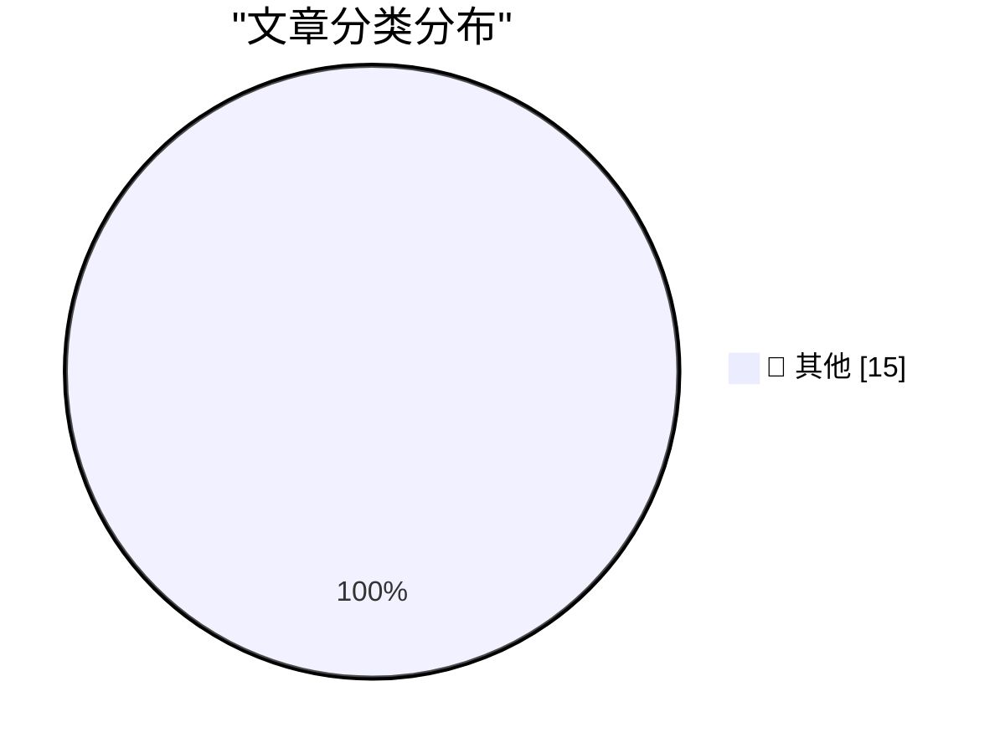

# 📰 AI 博客每日精选 — 2026-08-08

> 来自 Karpathy 推荐的 92 个顶级技术博客，AI 精选 Top 15

## 🏆 今日必读

🥇 **Quoting John Gruber**

[Quoting John Gruber](https://simonwillison.net/2026/Aug/8/john-gruber/#atom-everything) — simonwillison.net · 10 小时前 · 📝 其他

> Quoting John Gruber

🥈 **Now we have a timeline of the OpenAI accidental attack against Hugging Face**

[Now we have a timeline of the OpenAI accidental attack against Hugging Face](https://simonwillison.net/2026/Aug/7/openai-timeline/#atom-everything) — simonwillison.net · 10 小时前 · 📝 其他

> Now we have a timeline of the OpenAI accidental attack against Hugging Face

🥉 **Moonlight & Mayhem (Raccoon Heist by Codex + GPT-5.6 Sol Ultra)**

[Moonlight & Mayhem (Raccoon Heist by Codex + GPT-5.6 Sol Ultra)](https://simonwillison.net/2026/Aug/7/moonlight-mayhem/#atom-everything) — simonwillison.net · 15 小时前 · 📝 其他

> Moonlight & Mayhem (Raccoon Heist by Codex + GPT-5.6 Sol Ultra)

---

## 📊 数据概览

| 扫描源 | 抓取文章 | 时间范围 | 精选 |
|:---:|:---:|:---:|:---:|
| 81/92 | 2485 篇 → 46 篇 | 48h | **15 篇** |

### 分类分布

```mermaid
pie showData
    title "文章分类分布"
    "📝 其他" : 15
```

---

## 📝 其他

### 1. Quoting John Gruber

[Quoting John Gruber](https://simonwillison.net/2026/Aug/8/john-gruber/#atom-everything) — **simonwillison.net** · 10 小时前 · ⭐ 15/30

> Quoting John Gruber

---

### 2. Now we have a timeline of the OpenAI accidental attack against Hugging Face

[Now we have a timeline of the OpenAI accidental attack against Hugging Face](https://simonwillison.net/2026/Aug/7/openai-timeline/#atom-everything) — **simonwillison.net** · 10 小时前 · ⭐ 15/30

> Now we have a timeline of the OpenAI accidental attack against Hugging Face

---

### 3. Moonlight & Mayhem (Raccoon Heist by Codex + GPT-5.6 Sol Ultra)

[Moonlight & Mayhem (Raccoon Heist by Codex + GPT-5.6 Sol Ultra)](https://simonwillison.net/2026/Aug/7/moonlight-mayhem/#atom-everything) — **simonwillison.net** · 15 小时前 · ⭐ 15/30

> Moonlight & Mayhem (Raccoon Heist by Codex + GPT-5.6 Sol Ultra)

---

### 4. The Tokenpocalypse Is Here: Companies Are Scrambling To Stop Spending So Much on AI

[The Tokenpocalypse Is Here: Companies Are Scrambling To Stop Spending So Much on AI](https://simonwillison.net/2026/Aug/7/pdfs-are-terrible/#atom-everything) — **simonwillison.net** · 18 小时前 · ⭐ 15/30

> The Tokenpocalypse Is Here: Companies Are Scrambling To Stop Spending So Much on AI

---

### 5. datasette 1.0a38

[datasette 1.0a38](https://simonwillison.net/2026/Aug/6/datasette/#atom-everything) — **simonwillison.net** · 1 天前 · ⭐ 15/30

> datasette 1.0a38

---

### 6. datasette 0.65.3

[datasette 0.65.3](https://simonwillison.net/2026/Aug/6/datasette-2/#atom-everything) — **simonwillison.net** · 1 天前 · ⭐ 15/30

> datasette 0.65.3

---

### 7. Simon Willison on Technical Blogging

[Simon Willison on Technical Blogging](https://simonwillison.net/2026/Aug/6/simon-willison-on-technical-blogging/#atom-everything) — **simonwillison.net** · 1 天前 · ⭐ 15/30

> Simon Willison on Technical Blogging

---

### 8. I'm excited for Intel after testing the XPS 13

[I'm excited for Intel after testing the XPS 13](https://www.jeffgeerling.com/blog/2026/excited-for-intel-efficiency/) — **jeffgeerling.com** · 20 小时前 · ⭐ 15/30

> I'm excited for Intel after testing the XPS 13

---

### 9. Canadian Man Pleads Guilty in Snowflake Extortions

[Canadian Man Pleads Guilty in Snowflake Extortions](https://krebsonsecurity.com/2026/08/canadian-man-pleads-guilty-in-snowflake-extortions/) — **krebsonsecurity.com** · 1 天前 · ⭐ 15/30

> Canadian Man Pleads Guilty in Snowflake Extortions

---

### 10. Simon Willison on Blogging

[Simon Willison on Blogging](https://writethatblog.substack.com/p/simon-willison-on-technical-blogging) — **daringfireball.net** · 13 小时前 · ⭐ 15/30

> Simon Willison on Blogging

---

### 11. Google Earth Retracts AI Tool for Making Fake Satellite Images After It Was Immediately Abused Upon Release

[Google Earth Retracts AI Tool for Making Fake Satellite Images After It Was Immediately Abused Upon Release](https://arstechnica.com/ai/2026/07/google-earth-releases-swiftly-retracts-ai-feature-to-make-fake-satellite-images/) — **daringfireball.net** · 14 小时前 · ⭐ 15/30

> Google Earth Retracts AI Tool for Making Fake Satellite Images After It Was Immediately Abused Upon Release

---

### 12. Some New Data Centers Are Necessary

[Some New Data Centers Are Necessary](https://www.newyorker.com/cartoon/a62045) — **daringfireball.net** · 14 小时前 · ⭐ 15/30

> Some New Data Centers Are Necessary

---

### 13. An AI Model From Meta Also Hacked Another Company During Testing

[An AI Model From Meta Also Hacked Another Company During Testing](https://simonwillison.net/2026/Aug/6/an-ai-model-from-meta/) — **daringfireball.net** · 16 小时前 · ⭐ 15/30

> An AI Model From Meta Also Hacked Another Company During Testing

---

### 14. Meta: Introducing Muse Code and Muse Spark 1.2

[Meta: Introducing Muse Code and Muse Spark 1.2](https://research.meta.ai/blog/introducing-muse-code-and-muse-spark-1-2) — **daringfireball.net** · 16 小时前 · ⭐ 15/30

> Meta: Introducing Muse Code and Muse Spark 1.2

---

### 15. App Store Review Times Are Failing to Meet the AI-Driven Influx of Submissions

[App Store Review Times Are Failing to Meet the AI-Driven Influx of Submissions](https://macaw.social/@mergesort/117055390966724799) — **daringfireball.net** · 16 小时前 · ⭐ 15/30

> App Store Review Times Are Failing to Meet the AI-Driven Influx of Submissions

---

*生成于 2026-08-08 10:19 | 扫描 81 源 → 获取 2485 篇 → 精选 15 篇*
*基于 [Hacker News Popularity Contest 2025](https://refactoringenglish.com/tools/hn-popularity/) RSS 源列表，由 [Andrej Karpathy](https://x.com/karpathy) 推荐*
*由「懂点儿AI」制作，欢迎关注同名微信公众号获取更多 AI 实用技巧 💡*
