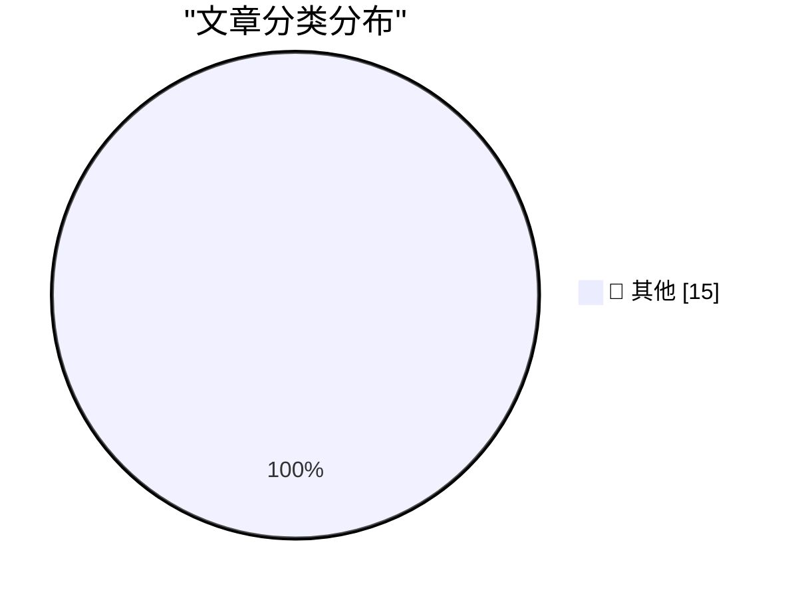

# 📰 AI 博客每日精选 — 2026-07-23

> 来自 Karpathy 推荐的 92 个顶级技术博客，AI 精选 Top 15

## 🏆 今日必读

🥇 **Quoting Seth Larson**

[Quoting Seth Larson](https://simonwillison.net/2026/Jul/23/seth-larson/#atom-everything) — simonwillison.net · 6 小时前 · 📝 其他

> Quoting Seth Larson

🥈 **Quoting Thomas Ptacek**

[Quoting Thomas Ptacek](https://simonwillison.net/2026/Jul/22/thomas-ptacek/#atom-everything) — simonwillison.net · 11 小时前 · 📝 其他

> Quoting Thomas Ptacek

🥉 **OpenAI’s accidental cyberattack against Hugging Face is science fiction that happened**

[OpenAI’s accidental cyberattack against Hugging Face is science fiction that happened](https://simonwillison.net/2026/Jul/22/openai-cyberattack/#atom-everything) — simonwillison.net · 11 小时前 · 📝 其他

> OpenAI’s accidental cyberattack against Hugging Face is science fiction that happened

---

## 📊 数据概览

| 扫描源 | 抓取文章 | 时间范围 | 精选 |
|:---:|:---:|:---:|:---:|
| 82/92 | 2507 篇 → 34 篇 | 48h | **15 篇** |

### 分类分布

```mermaid
pie showData
    title "文章分类分布"
    "📝 其他" : 15
```

---

## 📝 其他

### 1. Quoting Seth Larson

[Quoting Seth Larson](https://simonwillison.net/2026/Jul/23/seth-larson/#atom-everything) — **simonwillison.net** · 6 小时前 · ⭐ 15/30

> Quoting Seth Larson

---

### 2. Quoting Thomas Ptacek

[Quoting Thomas Ptacek](https://simonwillison.net/2026/Jul/22/thomas-ptacek/#atom-everything) — **simonwillison.net** · 11 小时前 · ⭐ 15/30

> Quoting Thomas Ptacek

---

### 3. OpenAI’s accidental cyberattack against Hugging Face is science fiction that happened

[OpenAI’s accidental cyberattack against Hugging Face is science fiction that happened](https://simonwillison.net/2026/Jul/22/openai-cyberattack/#atom-everything) — **simonwillison.net** · 11 小时前 · ⭐ 15/30

> OpenAI’s accidental cyberattack against Hugging Face is science fiction that happened

---

### 4. Are AI labs pelicanmaxxing?

[Are AI labs pelicanmaxxing?](https://simonwillison.net/2026/Jul/22/are-ai-labs-pelicanmaxxing/#atom-everything) — **simonwillison.net** · 12 小时前 · ⭐ 15/30

> Are AI labs pelicanmaxxing?

---

### 5. Orchestrions

[Orchestrions](https://simonwillison.net/2026/Jul/22/all-the-orchestrions/#atom-everything) — **simonwillison.net** · 20 小时前 · ⭐ 15/30

> Orchestrions

---

### 6. California Sea Lion

[California Sea Lion](https://simonwillison.net/2026/Jul/21/sighting-383713864/#atom-everything) — **simonwillison.net** · 1 天前 · ⭐ 15/30

> California Sea Lion

---

### 7. Nativ: Run AI models locally on your Mac

[Nativ: Run AI models locally on your Mac](https://simonwillison.net/2026/Jul/21/nativ/#atom-everything) — **simonwillison.net** · 1 天前 · ⭐ 15/30

> Nativ: Run AI models locally on your Mac

---

### 8. A Fireside Chat with Cat and Thariq from the Claude Code team

[A Fireside Chat with Cat and Thariq from the Claude Code team](https://simonwillison.net/2026/Jul/21/cat-and-thariq/#atom-everything) — **simonwillison.net** · 1 天前 · ⭐ 15/30

> A Fireside Chat with Cat and Thariq from the Claude Code team

---

### 9. Open Sauce and GPS time were my summer AI Antiseptics

[Open Sauce and GPS time were my summer AI Antiseptics](https://www.jeffgeerling.com/blog/2026/open-sauce-gps-time-badge/) — **jeffgeerling.com** · 21 小时前 · ⭐ 15/30

> Open Sauce and GPS time were my summer AI Antiseptics

---

### 10. Powerful AIs might escape containment by releasing themselves as open-weight models

[Powerful AIs might escape containment by releasing themselves as open-weight models](https://seangoedecke.com/powerful-ais-might-escape-by-releasing-open-weight-models/) — **seangoedecke.com** · 11 小时前 · ⭐ 15/30

> Powerful AIs might escape containment by releasing themselves as open-weight models

---

### 11. LG to Ban Residential Proxies from Smart TV Apps

[LG to Ban Residential Proxies from Smart TV Apps](https://krebsonsecurity.com/2026/07/lg-to-ban-residential-proxies-from-smart-tv-apps/) — **krebsonsecurity.com** · 1 天前 · ⭐ 15/30

> LG to Ban Residential Proxies from Smart TV Apps

---

### 12. ★ European Commission: ‘Guidance to Google for AI Interoperability on Android & Sharing of Google Search’

[★ European Commission: ‘Guidance to Google for AI Interoperability on Android & Sharing of Google Search’](https://daringfireball.net/2026/07/ec_google_guidance_android_ai_and_search_sharing) — **daringfireball.net** · 1 天前 · ⭐ 15/30

> ★ European Commission: ‘Guidance to Google for AI Interoperability on Android & Sharing of Google Search’

---

### 13. Not just development, distribution of software may change as well

[Not just development, distribution of software may change as well](http://antirez.com/news/170) — **antirez.com** · 20 小时前 · ⭐ 15/30

> Not just development, distribution of software may change as well

---

### 14. Pluralistic: California's privacy obstacle course (23 Jul 2026)

[Pluralistic: California's privacy obstacle course (23 Jul 2026)](https://pluralistic.net/2026/07/23/drop-a-dime/) — **pluralistic.net** · 1 小时前 · ⭐ 15/30

> Pluralistic: California's privacy obstacle course (23 Jul 2026)

---

### 15. Pluralistic: Trump's America can't even win a rigged game (22 Jul 2026)

[Pluralistic: Trump's America can't even win a rigged game (22 Jul 2026)](https://pluralistic.net/2026/07/22/table-flipper/) — **pluralistic.net** · 1 天前 · ⭐ 15/30

> Pluralistic: Trump's America can't even win a rigged game (22 Jul 2026)

---

*生成于 2026-07-23 11:44 | 扫描 82 源 → 获取 2507 篇 → 精选 15 篇*
*基于 [Hacker News Popularity Contest 2025](https://refactoringenglish.com/tools/hn-popularity/) RSS 源列表，由 [Andrej Karpathy](https://x.com/karpathy) 推荐*
*由「懂点儿AI」制作，欢迎关注同名微信公众号获取更多 AI 实用技巧 💡*
