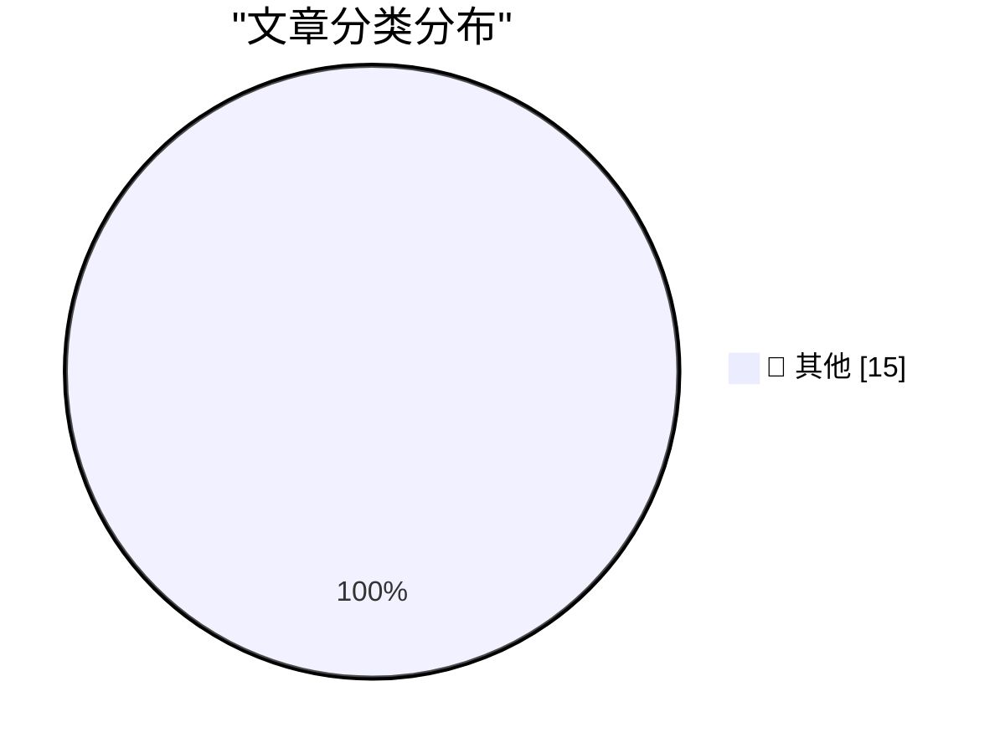

# 📰 AI 博客每日精选 — 2026-07-26

> 来自 Karpathy 推荐的 92 个顶级技术博客，AI 精选 Top 15

## 🏆 今日必读

🥇 **Ruff v0.16.0**

[Ruff v0.16.0](https://simonwillison.net/2026/Jul/25/ruff/#atom-everything) — simonwillison.net · 12 小时前 · 📝 其他

> Ruff v0.16.0

🥈 **Quoting Boris Cherny**

[Quoting Boris Cherny](https://simonwillison.net/2026/Jul/25/boris-cherny/#atom-everything) — simonwillison.net · 1 天前 · 📝 其他

> Quoting Boris Cherny

🥉 **Introducing Claude Opus 5**

[Introducing Claude Opus 5](https://simonwillison.net/2026/Jul/24/introducing-claude-opus-5/#atom-everything) — simonwillison.net · 1 天前 · 📝 其他

> Introducing Claude Opus 5

---

## 📊 数据概览

| 扫描源 | 抓取文章 | 时间范围 | 精选 |
|:---:|:---:|:---:|:---:|
| 82/92 | 2493 篇 → 26 篇 | 48h | **15 篇** |

### 分类分布

```mermaid
pie showData
    title "文章分类分布"
    "📝 其他" : 15
```

---

## 📝 其他

### 1. Ruff v0.16.0

[Ruff v0.16.0](https://simonwillison.net/2026/Jul/25/ruff/#atom-everything) — **simonwillison.net** · 12 小时前 · ⭐ 15/30

> Ruff v0.16.0

---

### 2. Quoting Boris Cherny

[Quoting Boris Cherny](https://simonwillison.net/2026/Jul/25/boris-cherny/#atom-everything) — **simonwillison.net** · 1 天前 · ⭐ 15/30

> Quoting Boris Cherny

---

### 3. Introducing Claude Opus 5

[Introducing Claude Opus 5](https://simonwillison.net/2026/Jul/24/introducing-claude-opus-5/#atom-everything) — **simonwillison.net** · 1 天前 · ⭐ 15/30

> Introducing Claude Opus 5

---

### 4. ‘AI Mania Is Eviscerating Global Decision-Making’

[‘AI Mania Is Eviscerating Global Decision-Making’](https://ludic.mataroa.blog/blog/ai-mania-is-eviscerating-global-decision-making/) — **daringfireball.net** · 16 小时前 · ⭐ 15/30

> ‘AI Mania Is Eviscerating Global Decision-Making’

---

### 5. EU Fines Google $1 Billion for DMA Competition Violations, Including Making Search Results More Useful

[EU Fines Google $1 Billion for DMA Competition Violations, Including Making Search Results More Useful](https://digital-markets-act.ec.europa.eu/commission-fines-google-eur890-million-breaches-digital-markets-act-2026-07-23_en) — **daringfireball.net** · 17 小时前 · ⭐ 15/30

> EU Fines Google $1 Billion for DMA Competition Violations, Including Making Search Results More Useful

---

### 6. Court Grants SerpApi’s Motion to Dismiss Google Lawsuit

[Court Grants SerpApi’s Motion to Dismiss Google Lawsuit](https://serpapi.com/blog/google-v-serpapi-the-court-granted-our-motion-to-dismiss/) — **daringfireball.net** · 17 小时前 · ⭐ 15/30

> Court Grants SerpApi’s Motion to Dismiss Google Lawsuit

---

### 7. Apple Maps to Power Navigation Experience for Ford’s New EVs

[Apple Maps to Power Navigation Experience for Ford’s New EVs](https://www.apple.com/newsroom/2026/07/apple-maps-to-power-navigation-experience-for-ford-uev-platform/) — **daringfireball.net** · 18 小时前 · ⭐ 15/30

> Apple Maps to Power Navigation Experience for Ford’s New EVs

---

### 8. Measles Cases Hit New Record in U.S., as Stupid-Americans Reject Vaccines

[Measles Cases Hit New Record in U.S., as Stupid-Americans Reject Vaccines](https://www.nytimes.com/2026/07/24/well/measles-record-united-states-numbers.html?unlocked_article_code=1.0VA.4jBf.vqAYN4Bwu807) — **daringfireball.net** · 19 小时前 · ⭐ 15/30

> Measles Cases Hit New Record in U.S., as Stupid-Americans Reject Vaccines

---

### 9. bIRC — A New Native IRC Client for Mac

[bIRC — A New Native IRC Client for Mac](https://birc.app/) — **daringfireball.net** · 19 小时前 · ⭐ 15/30

> bIRC — A New Native IRC Client for Mac

---

### 10. ★ Regarding Ad Blockers and Daring Fireball

[★ Regarding Ad Blockers and Daring Fireball](https://daringfireball.net/2026/07/regarding_ad_blockers_and_daring_fireball) — **daringfireball.net** · 1 天前 · ⭐ 15/30

> ★ Regarding Ad Blockers and Daring Fireball

---

### 11. Coiner of ‘Enshittification’ Endorses ‘Dickover’

[Coiner of ‘Enshittification’ Endorses ‘Dickover’](https://pluralistic.net/2026/07/21/dickovers/) — **daringfireball.net** · 1 天前 · ⭐ 15/30

> Coiner of ‘Enshittification’ Endorses ‘Dickover’

---

### 12. Dickover of the Week: Tomtoc

[Dickover of the Week: Tomtoc](https://daringfireball.net/2026/05/what_is_a_dickover) — **daringfireball.net** · 1 天前 · ⭐ 15/30

> Dickover of the Week: Tomtoc

---

### 13. Sixers Sign LeBron James

[Sixers Sign LeBron James](https://www.inquirer.com/sixers/live/lebron-james-signs-philadelphia-76ers-contract-salary-roster-updates-reaction-20260724.html) — **daringfireball.net** · 1 天前 · ⭐ 15/30

> Sixers Sign LeBron James

---

### 14. The Talk Show: ‘A Scam Held Together With Patriotism and Golden Paint’

[The Talk Show: ‘A Scam Held Together With Patriotism and Golden Paint’](https://daringfireball.net/thetalkshow/2026/07/23/ep-452) — **daringfireball.net** · 1 天前 · ⭐ 15/30

> The Talk Show: ‘A Scam Held Together With Patriotism and Golden Paint’

---

### 15. Being Linux Torvalds

[Being Linux Torvalds](http://antirez.com/news/171) — **antirez.com** · 23 小时前 · ⭐ 15/30

> Being Linux Torvalds

---

*生成于 2026-07-26 11:12 | 扫描 82 源 → 获取 2493 篇 → 精选 15 篇*
*基于 [Hacker News Popularity Contest 2025](https://refactoringenglish.com/tools/hn-popularity/) RSS 源列表，由 [Andrej Karpathy](https://x.com/karpathy) 推荐*
*由「懂点儿AI」制作，欢迎关注同名微信公众号获取更多 AI 实用技巧 💡*
