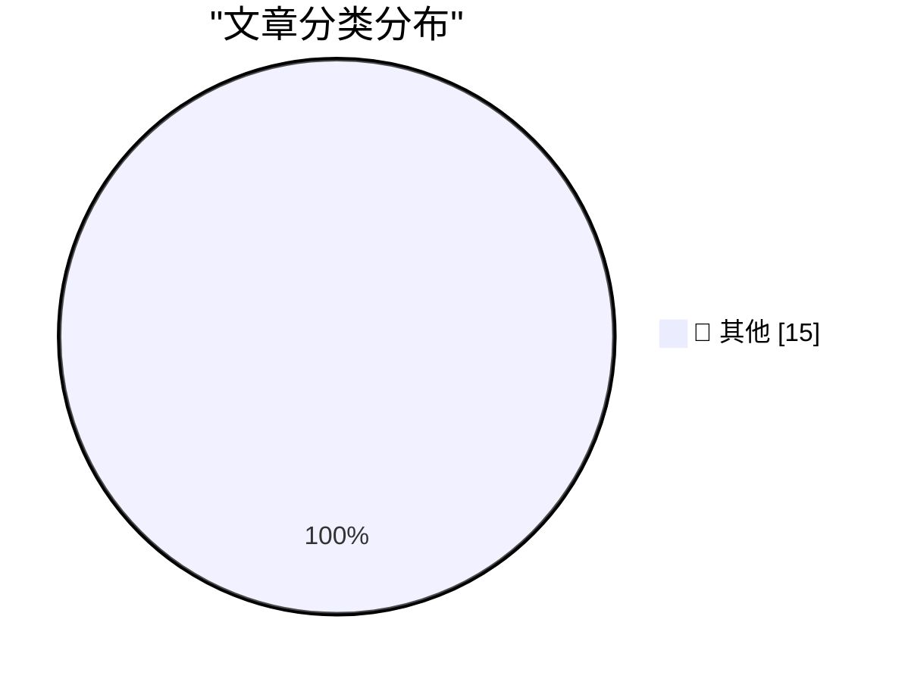

# 📰 AI 博客每日精选 — 2026-07-19

> 来自 Karpathy 推荐的 92 个顶级技术博客，AI 精选 Top 15

## 🏆 今日必读

🥇 **AI Mania Is Eviscerating Global Decision-Making**

[AI Mania Is Eviscerating Global Decision-Making](https://simonwillison.net/2026/Jul/19/ai-mania/#atom-everything) — simonwillison.net · 5 小时前 · 📝 其他

> AI Mania Is Eviscerating Global Decision-Making

🥈 **Claude Code uses Bun written in Rust now**

[Claude Code uses Bun written in Rust now](https://simonwillison.net/2026/Jul/19/claude-code-in-bun-in-rust/#atom-everything) — simonwillison.net · 7 小时前 · 📝 其他

> Claude Code uses Bun written in Rust now

🥉 **SQLite Query Explainer**

[SQLite Query Explainer](https://simonwillison.net/2026/Jul/18/sqlite-query-explainer/#atom-everything) — simonwillison.net · 17 小时前 · 📝 其他

> SQLite Query Explainer

---

## 📊 数据概览

| 扫描源 | 抓取文章 | 时间范围 | 精选 |
|:---:|:---:|:---:|:---:|
| 81/92 | 2472 篇 → 33 篇 | 48h | **15 篇** |

### 分类分布

```mermaid
pie showData
    title "文章分类分布"
    "📝 其他" : 15
```

---

## 📝 其他

### 1. AI Mania Is Eviscerating Global Decision-Making

[AI Mania Is Eviscerating Global Decision-Making](https://simonwillison.net/2026/Jul/19/ai-mania/#atom-everything) — **simonwillison.net** · 5 小时前 · ⭐ 15/30

> AI Mania Is Eviscerating Global Decision-Making

---

### 2. Claude Code uses Bun written in Rust now

[Claude Code uses Bun written in Rust now](https://simonwillison.net/2026/Jul/19/claude-code-in-bun-in-rust/#atom-everything) — **simonwillison.net** · 7 小时前 · ⭐ 15/30

> Claude Code uses Bun written in Rust now

---

### 3. SQLite Query Explainer

[SQLite Query Explainer](https://simonwillison.net/2026/Jul/18/sqlite-query-explainer/#atom-everything) — **simonwillison.net** · 17 小时前 · ⭐ 15/30

> SQLite Query Explainer

---

### 4. Claude make Fable 5 permanent

[Claude make Fable 5 permanent](https://simonwillison.net/2026/Jul/18/claude-make-fable-5-permanent/#atom-everything) — **simonwillison.net** · 1 天前 · ⭐ 15/30

> Claude make Fable 5 permanent

---

### 5. nascheme/quixote

[nascheme/quixote](https://simonwillison.net/2026/Jul/18/quixote/#atom-everything) — **simonwillison.net** · 1 天前 · ⭐ 15/30

> nascheme/quixote

---

### 6. Quoting Kimi K3

[Quoting Kimi K3](https://simonwillison.net/2026/Jul/17/kimi-k3/#atom-everything) — **simonwillison.net** · 1 天前 · ⭐ 15/30

> Quoting Kimi K3

---

### 7. LLM cliché highlighter

[LLM cliché highlighter](https://simonwillison.net/2026/Jul/17/llm-cliche-highlighter/#atom-everything) — **simonwillison.net** · 1 天前 · ⭐ 15/30

> LLM cliché highlighter

---

### 8. Impro is a handbook for running a cult

[Impro is a handbook for running a cult](https://seangoedecke.com/impro/) — **seangoedecke.com** · 11 小时前 · ⭐ 15/30

> Impro is a handbook for running a cult

---

### 9. Overtraining as the path to human-like AI

[Overtraining as the path to human-like AI](https://seangoedecke.com/overtraining-as-the-path-to-human-like-ai/) — **seangoedecke.com** · 1 天前 · ⭐ 15/30

> Overtraining as the path to human-like AI

---

### 10. ★ Mornings in Cupertino Have the Aroma of Napalm Once Again

[★ Mornings in Cupertino Have the Aroma of Napalm Once Again](https://daringfireball.net/2026/07/mornings_in_cupertino_have_the_aroma_of_napalm_once_again) — **daringfireball.net** · 10 小时前 · ⭐ 15/30

> ★ Mornings in Cupertino Have the Aroma of Napalm Once Again

---

### 11. Apple Sends Letters to Dozens of Former Employees Now at OpenAI

[Apple Sends Letters to Dozens of Former Employees Now at OpenAI](https://www.ft.com/content/1b8c9d52-88a9-426b-ba47-f1811f859166?syn-25a6b1a6=1) — **daringfireball.net** · 12 小时前 · ⭐ 15/30

> Apple Sends Letters to Dozens of Former Employees Now at OpenAI

---

### 12. Apple Books and Amazon Are Lousy With AI-Generated Books Ripping Off Legitimate Authors

[Apple Books and Amazon Are Lousy With AI-Generated Books Ripping Off Legitimate Authors](https://thenewthings.com/p/apple-big-ai-book-slop-problem) — **daringfireball.net** · 1 天前 · ⭐ 15/30

> Apple Books and Amazon Are Lousy With AI-Generated Books Ripping Off Legitimate Authors

---

### 13. Google Runs Out of Appeals, Must Pay Record $4.7 Billion EU Antitrust Fine

[Google Runs Out of Appeals, Must Pay Record $4.7 Billion EU Antitrust Fine](https://www.cnbc.com/2026/07/02/alphabet-google-android-eu-antitrust-fine-4-1-billion-euro-appeal.html) — **daringfireball.net** · 1 天前 · ⭐ 15/30

> Google Runs Out of Appeals, Must Pay Record $4.7 Billion EU Antitrust Fine

---

### 14. Roblox Set to Introduce AI Game-Building Feature, Including on iOS

[Roblox Set to Introduce AI Game-Building Feature, Including on iOS](https://about.roblox.com/newsroom/2026/07/build-without-limits-on-roblox) — **daringfireball.net** · 1 天前 · ⭐ 15/30

> Roblox Set to Introduce AI Game-Building Feature, Including on iOS

---

### 15. Apple Raises Prices for Apple Music and Apple One Subscriptions

[Apple Raises Prices for Apple Music and Apple One Subscriptions](https://9to5mac.com/2026/07/17/apple-raises-prices-for-apple-music-and-apple-one-subscriptions/) — **daringfireball.net** · 1 天前 · ⭐ 15/30

> Apple Raises Prices for Apple Music and Apple One Subscriptions

---

*生成于 2026-07-19 11:02 | 扫描 81 源 → 获取 2472 篇 → 精选 15 篇*
*基于 [Hacker News Popularity Contest 2025](https://refactoringenglish.com/tools/hn-popularity/) RSS 源列表，由 [Andrej Karpathy](https://x.com/karpathy) 推荐*
*由「懂点儿AI」制作，欢迎关注同名微信公众号获取更多 AI 实用技巧 💡*
