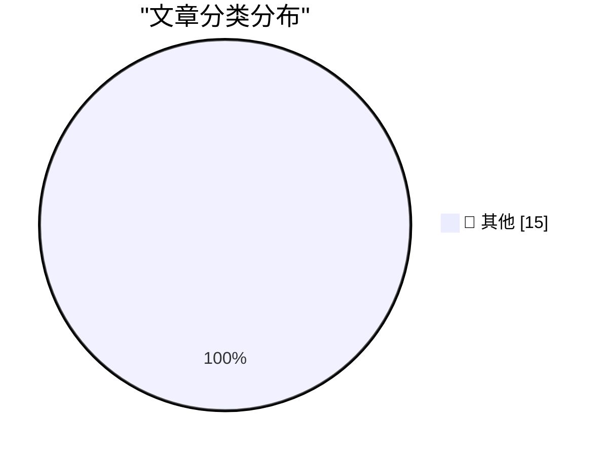

# 📰 AI 博客每日精选 — 2026-07-28

> 来自 Karpathy 推荐的 92 个顶级技术博客，AI 精选 Top 15

## 🏆 今日必读

🥇 **moonshotai/Kimi-K3**

[moonshotai/Kimi-K3](https://simonwillison.net/2026/Jul/27/kimi-k3/#atom-everything) — simonwillison.net · 12 小时前 · 📝 其他

> moonshotai/Kimi-K3

🥈 **An opinionated guide to which AI to use to do stuff**

[An opinionated guide to which AI to use to do stuff](https://simonwillison.net/2026/Jul/27/an-opinionated-guide-to-which-ai-to-use-to-do-stuff/#atom-everything) — simonwillison.net · 13 小时前 · 📝 其他

> An opinionated guide to which AI to use to do stuff

🥉 **An Inside Look at the Relay Market Powering Token Resellers and Fraud**

[An Inside Look at the Relay Market Powering Token Resellers and Fraud](https://simonwillison.net/2026/Jul/26/relay-market/#atom-everything) — simonwillison.net · 1 天前 · 📝 其他

> An Inside Look at the Relay Market Powering Token Resellers and Fraud

---

## 📊 数据概览

| 扫描源 | 抓取文章 | 时间范围 | 精选 |
|:---:|:---:|:---:|:---:|
| 82/92 | 2503 篇 → 24 篇 | 48h | **15 篇** |

### 分类分布

```mermaid
pie showData
    title "文章分类分布"
    "📝 其他" : 15
```

---

## 📝 其他

### 1. moonshotai/Kimi-K3

[moonshotai/Kimi-K3](https://simonwillison.net/2026/Jul/27/kimi-k3/#atom-everything) — **simonwillison.net** · 12 小时前 · ⭐ 15/30

> moonshotai/Kimi-K3

---

### 2. An opinionated guide to which AI to use to do stuff

[An opinionated guide to which AI to use to do stuff](https://simonwillison.net/2026/Jul/27/an-opinionated-guide-to-which-ai-to-use-to-do-stuff/#atom-everything) — **simonwillison.net** · 13 小时前 · ⭐ 15/30

> An opinionated guide to which AI to use to do stuff

---

### 3. An Inside Look at the Relay Market Powering Token Resellers and Fraud

[An Inside Look at the Relay Market Powering Token Resellers and Fraud](https://simonwillison.net/2026/Jul/26/relay-market/#atom-everything) — **simonwillison.net** · 1 天前 · ⭐ 15/30

> An Inside Look at the Relay Market Powering Token Resellers and Fraud

---

### 4. [Sponsor] Introducing Agent Fone

[[Sponsor] Introducing Agent Fone](https://fail.xyz/phone/) — **daringfireball.net** · 10 小时前 · ⭐ 15/30

> [Sponsor] Introducing Agent Fone

---

### 5. ‘Always Choose the Good Soap’

[‘Always Choose the Good Soap’](https://sixcolors.com/post/2026/07/always-choose-the-good-soap/) — **daringfireball.net** · 10 小时前 · ⭐ 15/30

> ‘Always Choose the Good Soap’

---

### 6. ★ Ads in Software Are Like Stickers on Laptops

[★ Ads in Software Are Like Stickers on Laptops](https://daringfireball.net/2026/07/ads_in_software_are_like_stickers_on_laptops) — **daringfireball.net** · 19 小时前 · ⭐ 15/30

> ★ Ads in Software Are Like Stickers on Laptops

---

### 7. WorkOS MCP

[WorkOS MCP](https://workos.com/blog/management-mcp-server?utm_source=daringfireball&amp;utm_medium=newsletter&amp;utm_campaign=q32026) — **daringfireball.net** · 19 小时前 · ⭐ 15/30

> WorkOS MCP

---

### 8. The real AI risk is inside the labs

[The real AI risk is inside the labs](http://antirez.com/news/172) — **antirez.com** · 2 小时前 · ⭐ 15/30

> The real AI risk is inside the labs

---

### 9. Why $550 Million Medical Debt only Cost $5.5 Million

[Why $550 Million Medical Debt only Cost $5.5 Million](https://idiallo.com/byte-size/550-million-only-cost-5-million) — **idiallo.com** · 1 天前 · ⭐ 15/30

> Why $550 Million Medical Debt only Cost $5.5 Million

---

### 10. Pluralistic: Discernment (28 Jul 2026)

[Pluralistic: Discernment (28 Jul 2026)](https://pluralistic.net/2026/07/28/hitl-ers/) — **pluralistic.net** · 1 小时前 · ⭐ 15/30

> Pluralistic: Discernment (28 Jul 2026)

---

### 11. Pluralistic: How the EU can punish Google (despite Trump) (27 Jul 2026)

[Pluralistic: How the EU can punish Google (despite Trump) (27 Jul 2026)](https://pluralistic.net/2026/07/27/eucd-6/) — **pluralistic.net** · 1 天前 · ⭐ 15/30

> Pluralistic: How the EU can punish Google (despite Trump) (27 Jul 2026)

---

### 12. Google Calendar "Unable to launch event" - caused by missing DTSTAMP

[Google Calendar "Unable to launch event" - caused by missing DTSTAMP](https://shkspr.mobi/blog/2026/07/google-calendar-unable-to-launch-event-caused-by-missing-dtstamp/) — **shkspr.mobi** · 15 分钟前 · ⭐ 15/30

> Google Calendar "Unable to launch event" - caused by missing DTSTAMP

---

### 13. Making an agile version of a Windows Runtime delegate in C++/WinRT, part 6

[Making an agile version of a Windows Runtime delegate in C++/WinRT, part 6](https://devblogs.microsoft.com/oldnewthing/20260727-00/?p=112566) — **devblogs.microsoft.com/oldnewthing** · 21 小时前 · ⭐ 15/30

> Making an agile version of a Windows Runtime delegate in C++/WinRT, part 6

---

### 14. Hiding data in permutations

[Hiding data in permutations](https://www.johndcook.com/blog/2026/07/27/hiding-data-in-permutations/) — **johndcook.com** · 12 小时前 · ⭐ 15/30

> Hiding data in permutations

---

### 15. Counting permutations with roots

[Counting permutations with roots](https://www.johndcook.com/blog/2026/07/27/counting-permutations-with-roots/) — **johndcook.com** · 19 小时前 · ⭐ 15/30

> Counting permutations with roots

---

*生成于 2026-07-28 11:49 | 扫描 82 源 → 获取 2503 篇 → 精选 15 篇*
*基于 [Hacker News Popularity Contest 2025](https://refactoringenglish.com/tools/hn-popularity/) RSS 源列表，由 [Andrej Karpathy](https://x.com/karpathy) 推荐*
*由「懂点儿AI」制作，欢迎关注同名微信公众号获取更多 AI 实用技巧 💡*
