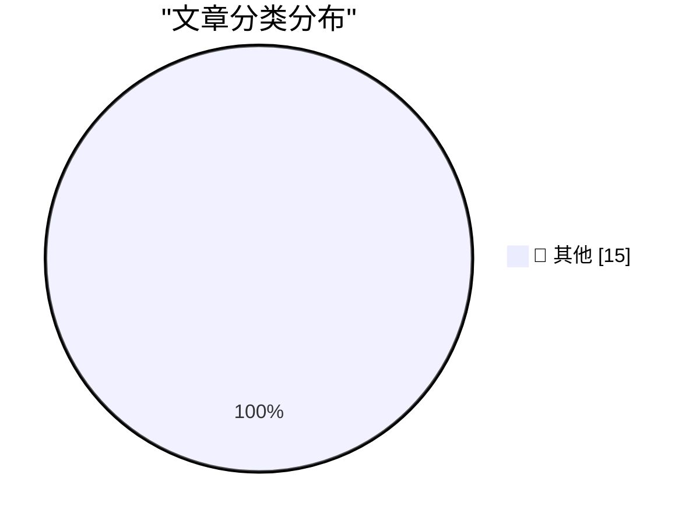

# 📰 AI 博客每日精选 — 2026-07-08

> 来自 Karpathy 推荐的 92 个顶级技术博客，AI 精选 Top 15

## 🏆 今日必读

🥇 **sqlite-utils 4.0, now with database schema migrations**

[sqlite-utils 4.0, now with database schema migrations](https://simonwillison.net/2026/Jul/7/sqlite-utils-4/#atom-everything) — simonwillison.net · 16 小时前 · 📝 其他

> sqlite-utils 4.0, now with database schema migrations

🥈 **sqlite-migrate 0.2**

[sqlite-migrate 0.2](https://simonwillison.net/2026/Jul/7/sqlite-migrate/#atom-everything) — simonwillison.net · 19 小时前 · 📝 其他

> sqlite-migrate 0.2

🥉 **github-code Web Component**

[github-code Web Component](https://simonwillison.net/2026/Jul/7/github-code-component/#atom-everything) — simonwillison.net · 19 小时前 · 📝 其他

> github-code Web Component

---

## 📊 数据概览

| 扫描源 | 抓取文章 | 时间范围 | 精选 |
|:---:|:---:|:---:|:---:|
| 82/92 | 2486 篇 → 29 篇 | 48h | **15 篇** |

### 分类分布

```mermaid
pie showData
    title "文章分类分布"
    "📝 其他" : 15
```

---

## 📝 其他

### 1. sqlite-utils 4.0, now with database schema migrations

[sqlite-utils 4.0, now with database schema migrations](https://simonwillison.net/2026/Jul/7/sqlite-utils-4/#atom-everything) — **simonwillison.net** · 16 小时前 · ⭐ 15/30

> sqlite-utils 4.0, now with database schema migrations

---

### 2. sqlite-migrate 0.2

[sqlite-migrate 0.2](https://simonwillison.net/2026/Jul/7/sqlite-migrate/#atom-everything) — **simonwillison.net** · 19 小时前 · ⭐ 15/30

> sqlite-migrate 0.2

---

### 3. github-code Web Component

[github-code Web Component](https://simonwillison.net/2026/Jul/7/github-code-component/#atom-everything) — **simonwillison.net** · 19 小时前 · ⭐ 15/30

> github-code Web Component

---

### 4. sqlite-utils 4.0

[sqlite-utils 4.0](https://simonwillison.net/2026/Jul/7/sqlite-utils/#atom-everything) — **simonwillison.net** · 19 小时前 · ⭐ 15/30

> sqlite-utils 4.0

---

### 5. sqlite-utils 4.0rc4

[sqlite-utils 4.0rc4](https://simonwillison.net/2026/Jul/7/sqlite-utils-2/#atom-everything) — **simonwillison.net** · 1 天前 · ⭐ 15/30

> sqlite-utils 4.0rc4

---

### 6. tencent/Hy3

[tencent/Hy3](https://simonwillison.net/2026/Jul/6/hy3/#atom-everything) — **simonwillison.net** · 1 天前 · ⭐ 15/30

> tencent/Hy3

---

### 7. Blog about things you don't understand yet

[Blog about things you don't understand yet](https://seangoedecke.com/blog-about-things-you-dont-understand-yet/) — **seangoedecke.com** · 1 天前 · ⭐ 15/30

> Blog about things you don't understand yet

---

### 8. OS 27 Developer Beta 3 Enables New ‘Pace’ and ‘Expressivity’ Sliders for Siri’s New Voices

[OS 27 Developer Beta 3 Enables New ‘Pace’ and ‘Expressivity’ Sliders for Siri’s New Voices](https://techcrunch.com/2026/07/06/you-can-now-customize-siris-pace-and-expressivity-in-the-latest-ios-27-beta/) — **daringfireball.net** · 20 小时前 · ⭐ 15/30

> OS 27 Developer Beta 3 Enables New ‘Pace’ and ‘Expressivity’ Sliders for Siri’s New Voices

---

### 9. ★ Apple Should Eliminate the App Icon ‘Squircle Jail’

[★ Apple Should Eliminate the App Icon ‘Squircle Jail’](https://daringfireball.net/2026/07/eliminate_app_icon_squircle_jail) — **daringfireball.net** · 1 天前 · ⭐ 15/30

> ★ Apple Should Eliminate the App Icon ‘Squircle Jail’

---

### 10. Markdown Now Has a Uniform Type Identifer (UTI) in Apple’s Version 27 OSes

[Markdown Now Has a Uniform Type Identifer (UTI) in Apple’s Version 27 OSes](https://developer.apple.com/documentation/uniformtypeidentifiers/uttype-swift.struct/markdown) — **daringfireball.net** · 1 天前 · ⭐ 15/30

> Markdown Now Has a Uniform Type Identifer (UTI) in Apple’s Version 27 OSes

---

### 11. Backblaze Versus Dropbox

[Backblaze Versus Dropbox](https://mjtsai.com/blog/2025/12/19/backblaze-no-longer-backs-up-dropbox/) — **daringfireball.net** · 1 天前 · ⭐ 15/30

> Backblaze Versus Dropbox

---

### 12. Allen Pike, Back in November: ‘Why Is ChatGPT for Mac So Good?’

[Allen Pike, Back in November: ‘Why Is ChatGPT for Mac So Good?’](https://allenpike.com/2025/why-is-chatgpt-so-good-claude/) — **daringfireball.net** · 1 天前 · ⭐ 15/30

> Allen Pike, Back in November: ‘Why Is ChatGPT for Mac So Good?’

---

### 13. ATP Member Special: Mac-Assed Mac Apps

[ATP Member Special: Mac-Assed Mac Apps](https://atp.fm/atp-dev-mac-assed-mac-apps) — **daringfireball.net** · 1 天前 · ⭐ 15/30

> ATP Member Special: Mac-Assed Mac Apps

---

### 14. Maestral, the Open Source Splendidly Simple Mac Dropbox Client, Has Been Retired

[Maestral, the Open Source Splendidly Simple Mac Dropbox Client, Has Been Retired](https://maestral.app/) — **daringfireball.net** · 1 天前 · ⭐ 15/30

> Maestral, the Open Source Splendidly Simple Mac Dropbox Client, Has Been Retired

---

### 15. Jason Snell Ends His Column, and 28-Year Run, at Macworld

[Jason Snell Ends His Column, and 28-Year Run, at Macworld](https://www.macworld.com/article/3175482) — **daringfireball.net** · 1 天前 · ⭐ 15/30

> Jason Snell Ends His Column, and 28-Year Run, at Macworld

---

*生成于 2026-07-08 11:40 | 扫描 82 源 → 获取 2486 篇 → 精选 15 篇*
*基于 [Hacker News Popularity Contest 2025](https://refactoringenglish.com/tools/hn-popularity/) RSS 源列表，由 [Andrej Karpathy](https://x.com/karpathy) 推荐*
*由「懂点儿AI」制作，欢迎关注同名微信公众号获取更多 AI 实用技巧 💡*
