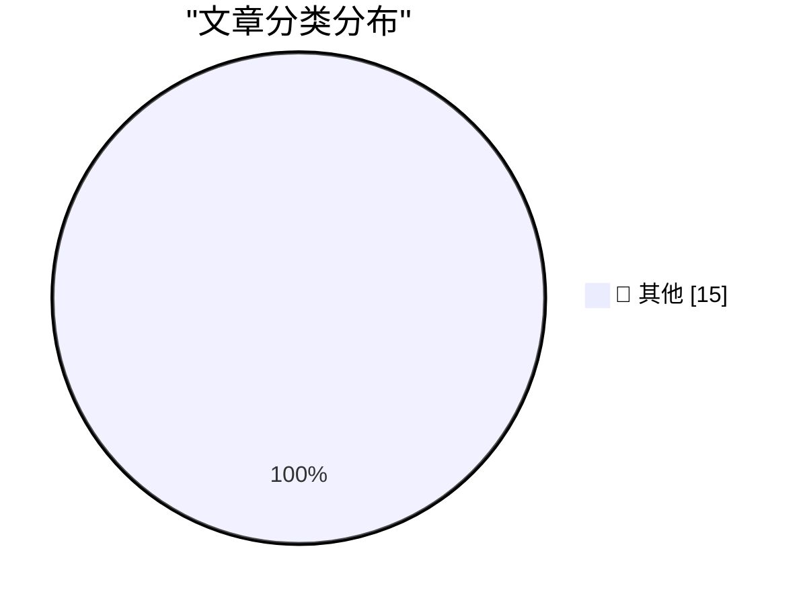

# 📰 AI 博客每日精选 — 2026-08-17

> 来自 Karpathy 推荐的 92 个顶级技术博客，AI 精选 Top 15

## 🏆 今日必读

🥇 **Markdown SVG upgrades**

[Markdown SVG upgrades](https://simonwillison.net/2026/Aug/16/markdown-svg-upgrades/) — simonwillison.net · 10 小时前 · 📝 其他

> Markdown SVG upgrades

🥈 **Qwen 3.8 27B is excellent, but it defaults to wildly overthinking things**

[Qwen 3.8 27B is excellent, but it defaults to wildly overthinking things](https://simonwillison.net/2026/Aug/16/qwen-38-27b/) — simonwillison.net · 12 小时前 · 📝 其他

> Qwen 3.8 27B is excellent, but it defaults to wildly overthinking things

🥉 **Quoting Dario Amodei**

[Quoting Dario Amodei](https://simonwillison.net/2026/Aug/16/dario-amodei/) — simonwillison.net · 19 小时前 · 📝 其他

> Quoting Dario Amodei

---

## 📊 数据概览

| 扫描源 | 抓取文章 | 时间范围 | 精选 |
|:---:|:---:|:---:|:---:|
| 79/92 | 2426 篇 → 21 篇 | 48h | **15 篇** |

### 分类分布

```mermaid
pie showData
    title "文章分类分布"
    "📝 其他" : 15
```

---

## 📝 其他

### 1. Markdown SVG upgrades

[Markdown SVG upgrades](https://simonwillison.net/2026/Aug/16/markdown-svg-upgrades/) — **simonwillison.net** · 10 小时前 · ⭐ 15/30

> Markdown SVG upgrades

---

### 2. Qwen 3.8 27B is excellent, but it defaults to wildly overthinking things

[Qwen 3.8 27B is excellent, but it defaults to wildly overthinking things](https://simonwillison.net/2026/Aug/16/qwen-38-27b/) — **simonwillison.net** · 12 小时前 · ⭐ 15/30

> Qwen 3.8 27B is excellent, but it defaults to wildly overthinking things

---

### 3. Quoting Dario Amodei

[Quoting Dario Amodei](https://simonwillison.net/2026/Aug/16/dario-amodei/) — **simonwillison.net** · 19 小时前 · ⭐ 15/30

> Quoting Dario Amodei

---

### 4. CORS Chat

[CORS Chat](https://simonwillison.net/2026/Aug/15/cors-chat/) — **simonwillison.net** · 1 天前 · ⭐ 15/30

> CORS Chat

---

### 5. The Information Profiles Cami Clark — Dario Amodei’s Wife, Ivanka Trump’s Friend, One-Time Would-Be Pornographer, and Anthropic’s ‘First Lady’

[The Information Profiles Cami Clark — Dario Amodei’s Wife, Ivanka Trump’s Friend, One-Time Would-Be Pornographer, and Anthropic’s ‘First Lady’](https://www.theinformation.com/articles/anthropics-first-lady-took-winding-road-top?rc=jfy0lk) — **daringfireball.net** · 14 小时前 · ⭐ 15/30

> The Information Profiles Cami Clark — Dario Amodei’s Wife, Ivanka Trump’s Friend, One-Time Would-Be Pornographer, and Anthropic’s ‘First Lady’

---

### 6. ★ Anthropic’s ‘Watermark’ Text Adulteration in Claude Is a Perversion of Writing

[★ Anthropic’s ‘Watermark’ Text Adulteration in Claude Is a Perversion of Writing](https://daringfireball.net/2026/08/anthropics_watermark_text_adulteration_in_claude_is_a_perversion_of_writing) — **daringfireball.net** · 14 小时前 · ⭐ 15/30

> ★ Anthropic’s ‘Watermark’ Text Adulteration in Claude Is a Perversion of Writing

---

### 7. ‘Anthropic’s Weak Watermarks Appease a Weak Law’

[‘Anthropic’s Weak Watermarks Appease a Weak Law’](https://blog.j11y.io/2026-08-12_Anthropics-weak-watermarks-appease-a-weak-law/) — **daringfireball.net** · 16 小时前 · ⭐ 15/30

> ‘Anthropic’s Weak Watermarks Appease a Weak Law’

---

### 8. Trump Administration ‘Not in Favor’ of Apple Using Chinese RAM

[Trump Administration ‘Not in Favor’ of Apple Using Chinese RAM](https://www.wsj.com/tech/apple-china-memory-chip-plan-57773a83?st=vfe1SA) — **daringfireball.net** · 17 小时前 · ⭐ 15/30

> Trump Administration ‘Not in Favor’ of Apple Using Chinese RAM

---

### 9. XCancel — An Unofficial Twitter/X Mirror

[XCancel — An Unofficial Twitter/X Mirror](https://xcancel.com/about) — **daringfireball.net** · 19 小时前 · ⭐ 15/30

> XCancel — An Unofficial Twitter/X Mirror

---

### 10. Drata

[Drata](https://drata.com/daring) — **daringfireball.net** · 1 天前 · ⭐ 15/30

> Drata

---

### 11. Pluralistic: Jennifer Jenkins' 'Music Copyright, Creativity, and Culture' (17 Aug 2026)

[Pluralistic: Jennifer Jenkins' 'Music Copyright, Creativity, and Culture' (17 Aug 2026)](https://pluralistic.net/2026/08/17/great-sousas-ghost/) — **pluralistic.net** · 3 小时前 · ⭐ 15/30

> Pluralistic: Jennifer Jenkins' 'Music Copyright, Creativity, and Culture' (17 Aug 2026)

---

### 12. Thoughts on visiting the Edinburgh Fringe as a newbie

[Thoughts on visiting the Edinburgh Fringe as a newbie](https://shkspr.mobi/blog/2026/08/thoughts-on-the-edinburgh-fringe-as-a-newbie/) — **shkspr.mobi** · 22 小时前 · ⭐ 15/30

> Thoughts on visiting the Edinburgh Fringe as a newbie

---

### 13. Book Review: Slags by Emma Jane Unsworth ★★★⯪☆

[Book Review: Slags by Emma Jane Unsworth ★★★⯪☆](https://shkspr.mobi/blog/2026/08/book-review-slags-by-emma-jane-unsworth/) — **shkspr.mobi** · 1 天前 · ⭐ 15/30

> Book Review: Slags by Emma Jane Unsworth ★★★⯪☆

---

### 14. Proportion of 1s in a Hadamard matrix

[Proportion of 1s in a Hadamard matrix](https://www.johndcook.com/blog/2026/08/16/proportion-of-1s-in-a-hadamard-matrix/) — **johndcook.com** · 9 小时前 · ⭐ 15/30

> Proportion of 1s in a Hadamard matrix

---

### 15. Probability of correcting errors

[Probability of correcting errors](https://www.johndcook.com/blog/2026/08/15/probability-of-correcting-errors/) — **johndcook.com** · 1 天前 · ⭐ 15/30

> Probability of correcting errors

---

*生成于 2026-08-17 10:20 | 扫描 79 源 → 获取 2426 篇 → 精选 15 篇*
*基于 [Hacker News Popularity Contest 2025](https://refactoringenglish.com/tools/hn-popularity/) RSS 源列表，由 [Andrej Karpathy](https://x.com/karpathy) 推荐*
*由「懂点儿AI」制作，欢迎关注同名微信公众号获取更多 AI 实用技巧 💡*
