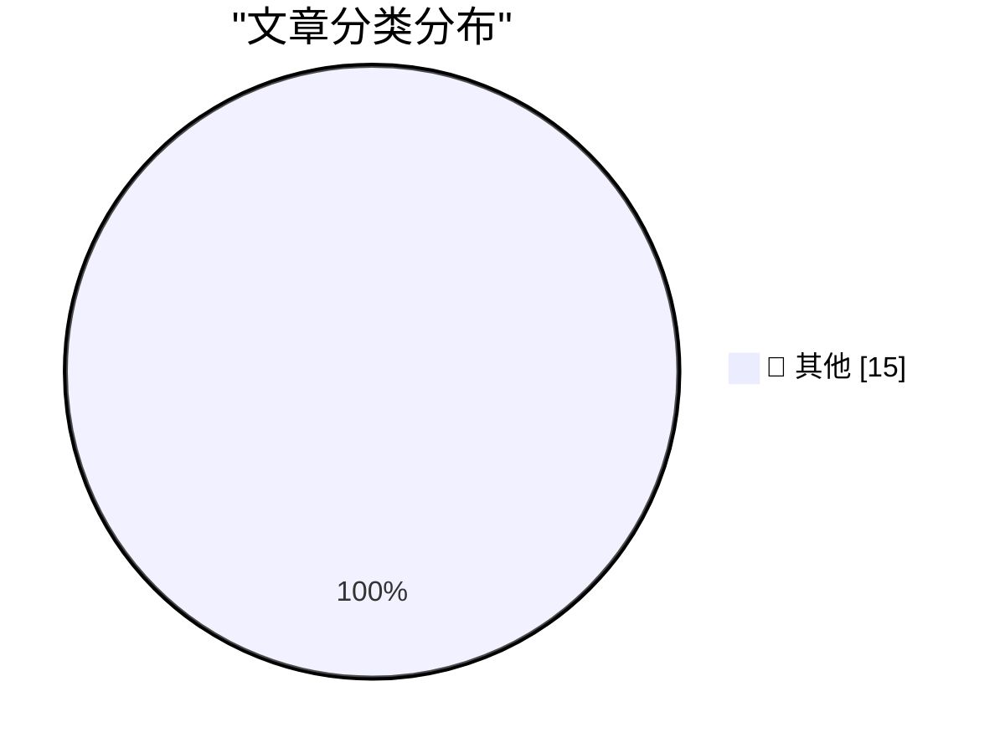

# 📰 AI 博客每日精选 — 2026-08-20

> 来自 Karpathy 推荐的 92 个顶级技术博客，AI 精选 Top 15

## 🏆 今日必读

🥇 **smolmachines / smolvm as a sandbox for untrusted Python & JavaScript**

[smolmachines / smolvm as a sandbox for untrusted Python & JavaScript](https://simonwillison.net/2026/Aug/19/smolmachines-untrusted-sandbox/) — simonwillison.net · 11 小时前 · 📝 其他

> smolmachines / smolvm as a sandbox for untrusted Python & JavaScript

🥈 **Quoting Jeremy Morrell**

[Quoting Jeremy Morrell](https://simonwillison.net/2026/Aug/19/jeremy-morrell/) — simonwillison.net · 11 小时前 · 📝 其他

> Quoting Jeremy Morrell

🥉 **Conceptual integrity and counting lines of code**

[Conceptual integrity and counting lines of code](https://simonwillison.net/2026/Aug/19/conceptual-integrity-and-counting-lines-of-code/) — simonwillison.net · 11 小时前 · 📝 其他

> Conceptual integrity and counting lines of code

---

## 📊 数据概览

| 扫描源 | 抓取文章 | 时间范围 | 精选 |
|:---:|:---:|:---:|:---:|
| 83/92 | 2523 篇 → 28 篇 | 48h | **15 篇** |

### 分类分布

```mermaid
pie showData
    title "文章分类分布"
    "📝 其他" : 15
```

---

## 📝 其他

### 1. smolmachines / smolvm as a sandbox for untrusted Python & JavaScript

[smolmachines / smolvm as a sandbox for untrusted Python & JavaScript](https://simonwillison.net/2026/Aug/19/smolmachines-untrusted-sandbox/) — **simonwillison.net** · 11 小时前 · ⭐ 15/30

> smolmachines / smolvm as a sandbox for untrusted Python & JavaScript

---

### 2. Quoting Jeremy Morrell

[Quoting Jeremy Morrell](https://simonwillison.net/2026/Aug/19/jeremy-morrell/) — **simonwillison.net** · 11 小时前 · ⭐ 15/30

> Quoting Jeremy Morrell

---

### 3. Conceptual integrity and counting lines of code

[Conceptual integrity and counting lines of code](https://simonwillison.net/2026/Aug/19/conceptual-integrity-and-counting-lines-of-code/) — **simonwillison.net** · 11 小时前 · ⭐ 15/30

> Conceptual integrity and counting lines of code

---

### 4. Mojo🔥 is now open source

[Mojo🔥 is now open source](https://simonwillison.net/2026/Aug/18/mojo-is-now-open-source/) — **simonwillison.net** · 1 天前 · ⭐ 15/30

> Mojo🔥 is now open source

---

### 5. Hands-on with Raspberry Pi's CM5 Programming Jig

[Hands-on with Raspberry Pi's CM5 Programming Jig](https://www.jeffgeerling.com/blog/2026/cm5-programming-jig/) — **jeffgeerling.com** · 1 天前 · ⭐ 15/30

> Hands-on with Raspberry Pi's CM5 Programming Jig

---

### 6. Disney’s ABC Sues Trump’s FCC Over Challenge to Its Broadcast License

[Disney’s ABC Sues Trump’s FCC Over Challenge to Its Broadcast License](https://www.wsj.com/business/media/disneys-abc-sues-fcc-over-challenge-to-its-broadcast-licenses-64e8f794?st=XTL4tA) — **daringfireball.net** · 1 天前 · ⭐ 15/30

> Disney’s ABC Sues Trump’s FCC Over Challenge to Its Broadcast License

---

### 7. Apple Gives Legal Middle Finger to DOJ Challenge on Apple’s July Discovery Win

[Apple Gives Legal Middle Finger to DOJ Challenge on Apple’s July Discovery Win](https://9to5mac.com/2026/08/17/apple-dojs-latest-challenge-in-antitrust-case-fails-at-every-level/) — **daringfireball.net** · 1 天前 · ⭐ 15/30

> Apple Gives Legal Middle Finger to DOJ Challenge on Apple’s July Discovery Win

---

### 8. Organized Thieves Are Targeting AI Server Chips With Violent Highway Hijackings

[Organized Thieves Are Targeting AI Server Chips With Violent Highway Hijackings](https://www.wired.com/story/the-worst-ive-ever-seen-cargo-thieves-are-turning-violent-in-pursuit-of-ai-hardware/) — **daringfireball.net** · 1 天前 · ⭐ 15/30

> Organized Thieves Are Targeting AI Server Chips With Violent Highway Hijackings

---

### 9. ‘Dickover’ Makes It Into The Guardian

[‘Dickover’ Makes It Into The Guardian](https://www.theguardian.com/technology/2026/aug/18/dickovers-baggravation-botiquette-18-new-words-tech-hellscape) — **daringfireball.net** · 1 天前 · ⭐ 15/30

> ‘Dickover’ Makes It Into The Guardian

---

### 10. OpenAI Pot Complains That Google Kettle Is Black

[OpenAI Pot Complains That Google Kettle Is Black](https://x.com/thsottiaux/status/2083373529081291076?s=12) — **daringfireball.net** · 1 天前 · ⭐ 15/30

> OpenAI Pot Complains That Google Kettle Is Black

---

### 11. Nature Is Healing: MacOS 27 Golden Gate Beta 6 Adds Redesigned Traffic Light Window Controls

[Nature Is Healing: MacOS 27 Golden Gate Beta 6 Adds Redesigned Traffic Light Window Controls](https://9to5mac.com/2026/08/17/macos-27-golden-gate-beta-6-features-redesigned-traffic-light-window-controls/) — **daringfireball.net** · 1 天前 · ⭐ 15/30

> Nature Is Healing: MacOS 27 Golden Gate Beta 6 Adds Redesigned Traffic Light Window Controls

---

### 12. Pluralistic: The ordinariness of evil (19 Aug 2026)

[Pluralistic: The ordinariness of evil (19 Aug 2026)](https://pluralistic.net/2026/08/19/banaility/) — **pluralistic.net** · 1 天前 · ⭐ 15/30

> Pluralistic: The ordinariness of evil (19 Aug 2026)

---

### 13. Pluralistic: IP can't save you from AI (18 Aug 2026)

[Pluralistic: IP can't save you from AI (18 Aug 2026)](https://pluralistic.net/2026/08/18/enron-corpus/) — **pluralistic.net** · 1 天前 · ⭐ 15/30

> Pluralistic: IP can't save you from AI (18 Aug 2026)

---

### 14. Asymmetric Agents

[Asymmetric Agents](https://shkspr.mobi/blog/2026/08/asymmetric-agents/) — **shkspr.mobi** · 22 小时前 · ⭐ 15/30

> Asymmetric Agents

---

### 15. Anubis continues to expose new ways people configure webservers

[Anubis continues to expose new ways people configure webservers](https://xeiaso.net/notes/2026/anubis-csp-worker-hell/) — **xeiaso.net** · 1 天前 · ⭐ 15/30

> Anubis continues to expose new ways people configure webservers

---

*生成于 2026-08-20 10:17 | 扫描 83 源 → 获取 2523 篇 → 精选 15 篇*
*基于 [Hacker News Popularity Contest 2025](https://refactoringenglish.com/tools/hn-popularity/) RSS 源列表，由 [Andrej Karpathy](https://x.com/karpathy) 推荐*
*由「懂点儿AI」制作，欢迎关注同名微信公众号获取更多 AI 实用技巧 💡*
