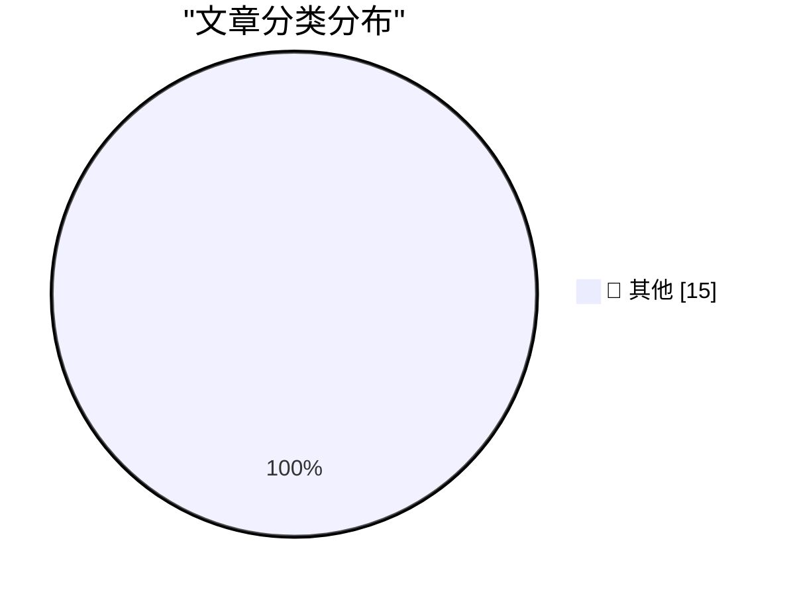

# 📰 AI 博客每日精选 — 2026-08-22

> 来自 Karpathy 推荐的 92 个顶级技术博客，AI 精选 Top 15

## 🏆 今日必读

🥇 **llm 0.32.1**

[llm 0.32.1](https://simonwillison.net/2026/Aug/21/llm/) — simonwillison.net · 16 小时前 · 📝 其他

> llm 0.32.1

🥈 **llm-openrouter 0.7**

[llm-openrouter 0.7](https://simonwillison.net/2026/Aug/21/llm-openrouter/) — simonwillison.net · 17 小时前 · 📝 其他

> llm-openrouter 0.7

🥉 **Stop Making TUIs**

[Stop Making TUIs](https://simonwillison.net/2026/Aug/21/stop-making-tuis/) — simonwillison.net · 18 小时前 · 📝 其他

> Stop Making TUIs

---

## 📊 数据概览

| 扫描源 | 抓取文章 | 时间范围 | 精选 |
|:---:|:---:|:---:|:---:|
| 82/92 | 2494 篇 → 29 篇 | 48h | **15 篇** |

### 分类分布

```mermaid
pie showData
    title "文章分类分布"
    "📝 其他" : 15
```

---

## 📝 其他

### 1. llm 0.32.1

[llm 0.32.1](https://simonwillison.net/2026/Aug/21/llm/) — **simonwillison.net** · 16 小时前 · ⭐ 15/30

> llm 0.32.1

---

### 2. llm-openrouter 0.7

[llm-openrouter 0.7](https://simonwillison.net/2026/Aug/21/llm-openrouter/) — **simonwillison.net** · 17 小时前 · ⭐ 15/30

> llm-openrouter 0.7

---

### 3. Stop Making TUIs

[Stop Making TUIs](https://simonwillison.net/2026/Aug/21/stop-making-tuis/) — **simonwillison.net** · 18 小时前 · ⭐ 15/30

> Stop Making TUIs

---

### 4. Quoting Matt Webb

[Quoting Matt Webb](https://simonwillison.net/2026/Aug/21/matt-webb/) — **simonwillison.net** · 19 小时前 · ⭐ 15/30

> Quoting Matt Webb

---

### 5. ChatGPT search now uses the site:operator at scale

[ChatGPT search now uses the site:operator at scale](https://simonwillison.net/2026/Aug/20/chatgpt-search-now-uses-the-siteoperator-at-scale/) — **simonwillison.net** · 1 天前 · ⭐ 15/30

> ChatGPT search now uses the site:operator at scale

---

### 6. A shot-scraper-style JSON API on Bun 1.4's new Bun.WebView

[A shot-scraper-style JSON API on Bun 1.4's new Bun.WebView](https://simonwillison.net/2026/Aug/20/bun-webview-json-api/) — **simonwillison.net** · 1 天前 · ⭐ 15/30

> A shot-scraper-style JSON API on Bun 1.4's new Bun.WebView

---

### 7. Getting the Steam Deck LCD working on a Raspberry Pi

[Getting the Steam Deck LCD working on a Raspberry Pi](https://www.jeffgeerling.com/blog/2026/steam-deck-lcd-pi-hat/) — **jeffgeerling.com** · 1 天前 · ⭐ 15/30

> Getting the Steam Deck LCD working on a Raspberry Pi

---

### 8. The Fourth Horseman of the File-Format-Hegemony Apocalypse

[The Fourth Horseman of the File-Format-Hegemony Apocalypse](https://techcommunity.microsoft.com/blog/onedriveblog/introducing-markdown-support-in-sharepoint-and-onedrive/4512174) — **daringfireball.net** · 10 小时前 · ⭐ 15/30

> The Fourth Horseman of the File-Format-Hegemony Apocalypse

---

### 9. Walmart Finally Caves, Will Soon Support Apple Pay

[Walmart Finally Caves, Will Soon Support Apple Pay](https://corporate.walmart.com/news/2026/08/21/more-ways-to-pay-tap-to-pay-is-coming-to-walmart-and-sams-club) — **daringfireball.net** · 14 小时前 · ⭐ 15/30

> Walmart Finally Caves, Will Soon Support Apple Pay

---

### 10. ★ When New DF Posts Drop in a Forest and No One Is There to Read Them

[★ When New DF Posts Drop in a Forest and No One Is There to Read Them](https://daringfireball.net/2026/08/df_posts_drop_in_a_forest) — **daringfireball.net** · 18 小时前 · ⭐ 15/30

> ★ When New DF Posts Drop in a Forest and No One Is There to Read Them

---

### 11. Bluesky’s Active User Base Is Shrinking, and Remains Tiny Compared to Threads and Twitter/X

[Bluesky’s Active User Base Is Shrinking, and Remains Tiny Compared to Threads and Twitter/X](https://techcrunch.com/2026/08/11/blueskys-active-user-base-is-shrinking-as-its-focus-expands-beyond-the-app/) — **daringfireball.net** · 20 小时前 · ⭐ 15/30

> Bluesky’s Active User Base Is Shrinking, and Remains Tiny Compared to Threads and Twitter/X

---

### 12. Bluesky Is Full of Anti-AI Zealots

[Bluesky Is Full of Anti-AI Zealots](https://bsky.app/profile/masnick.com/post/3mtk7cuvbok2x) — **daringfireball.net** · 21 小时前 · ⭐ 15/30

> Bluesky Is Full of Anti-AI Zealots

---

### 13. How Bluesky and Threads Sneak Their Logos Into iOS Screenshots

[How Bluesky and Threads Sneak Their Logos Into iOS Screenshots](https://timmarinin.net/2026/bluesky-screenshots/) — **daringfireball.net** · 1 天前 · ⭐ 15/30

> How Bluesky and Threads Sneak Their Logos Into iOS Screenshots

---

### 14. ★ Apple and European Commission Reach Agreement on App Payment Terms Under DMA, With Apple Conceding Very Little

[★ Apple and European Commission Reach Agreement on App Payment Terms Under DMA, With Apple Conceding Very Little](https://daringfireball.net/2026/08/apple_eu_business_terms_conceding_little) — **daringfireball.net** · 1 天前 · ⭐ 15/30

> ★ Apple and European Commission Reach Agreement on App Payment Terms Under DMA, With Apple Conceding Very Little

---

### 15. Pluralistic: Born on technology's third base (21 Aug 2026)

[Pluralistic: Born on technology's third base (21 Aug 2026)](https://pluralistic.net/2026/08/21/world-historic-forces/) — **pluralistic.net** · 8 小时前 · ⭐ 15/30

> Pluralistic: Born on technology's third base (21 Aug 2026)

---

*生成于 2026-08-22 10:10 | 扫描 82 源 → 获取 2494 篇 → 精选 15 篇*
*基于 [Hacker News Popularity Contest 2025](https://refactoringenglish.com/tools/hn-popularity/) RSS 源列表，由 [Andrej Karpathy](https://x.com/karpathy) 推荐*
*由「懂点儿AI」制作，欢迎关注同名微信公众号获取更多 AI 实用技巧 💡*
