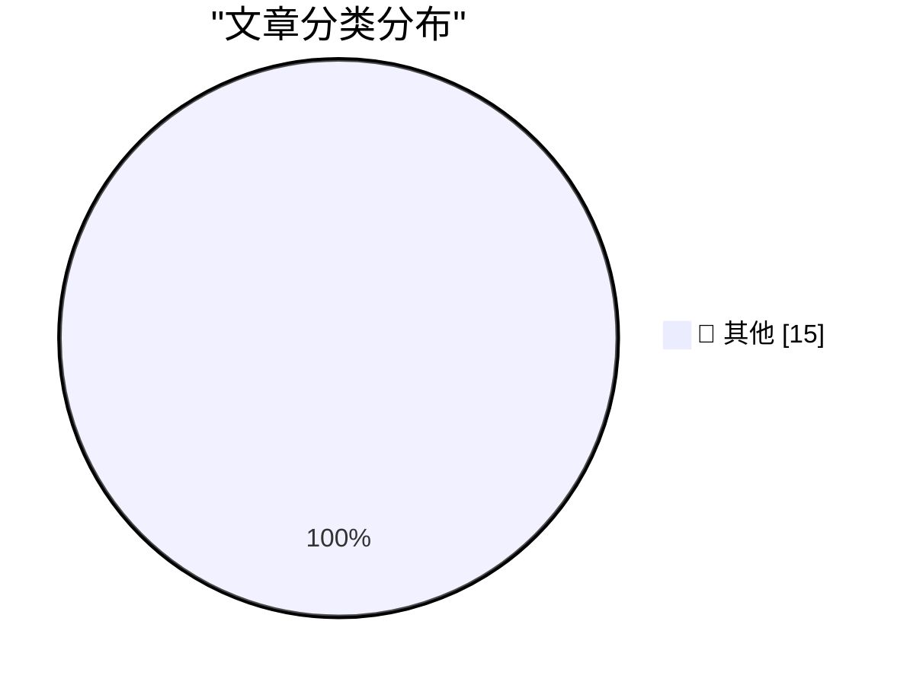

# 📰 AI 博客每日精选 — 2026-08-05

> 来自 Karpathy 推荐的 92 个顶级技术博客，AI 精选 Top 15

## 🏆 今日必读

🥇 **New release of LLM adds support for reasoning traces, OpenAI Responses, server-side tools, and smarter logging**

[New release of LLM adds support for reasoning traces, OpenAI Responses, server-side tools, and smarter logging](https://simonwillison.net/2026/Aug/4/new-release-of-llm/#atom-everything) — simonwillison.net · 11 小时前 · 📝 其他

> New release of LLM adds support for reasoning traces, OpenAI Responses, server-side tools, and smarter logging

🥈 **llm-anthropic 0.26**

[llm-anthropic 0.26](https://simonwillison.net/2026/Aug/4/llm-anthropic/#atom-everything) — simonwillison.net · 13 小时前 · 📝 其他

> llm-anthropic 0.26

🥉 **PipeNetwork/minimax-h3-mlx**

[PipeNetwork/minimax-h3-mlx](https://simonwillison.net/2026/Aug/4/minimax-h3-mlx/#atom-everything) — simonwillison.net · 16 小时前 · 📝 其他

> PipeNetwork/minimax-h3-mlx

---

## 📊 数据概览

| 扫描源 | 抓取文章 | 时间范围 | 精选 |
|:---:|:---:|:---:|:---:|
| 80/92 | 2476 篇 → 34 篇 | 48h | **15 篇** |

### 分类分布

```mermaid
pie showData
    title "文章分类分布"
    "📝 其他" : 15
```

---

## 📝 其他

### 1. New release of LLM adds support for reasoning traces, OpenAI Responses, server-side tools, and smarter logging

[New release of LLM adds support for reasoning traces, OpenAI Responses, server-side tools, and smarter logging](https://simonwillison.net/2026/Aug/4/new-release-of-llm/#atom-everything) — **simonwillison.net** · 11 小时前 · ⭐ 15/30

> New release of LLM adds support for reasoning traces, OpenAI Responses, server-side tools, and smarter logging

---

### 2. llm-anthropic 0.26

[llm-anthropic 0.26](https://simonwillison.net/2026/Aug/4/llm-anthropic/#atom-everything) — **simonwillison.net** · 13 小时前 · ⭐ 15/30

> llm-anthropic 0.26

---

### 3. PipeNetwork/minimax-h3-mlx

[PipeNetwork/minimax-h3-mlx](https://simonwillison.net/2026/Aug/4/minimax-h3-mlx/#atom-everything) — **simonwillison.net** · 16 小时前 · ⭐ 15/30

> PipeNetwork/minimax-h3-mlx

---

### 4. llm 0.32

[llm 0.32](https://simonwillison.net/2026/Aug/4/llm/#atom-everything) — **simonwillison.net** · 18 小时前 · ⭐ 15/30

> llm 0.32

---

### 5. Quoting Steve Yegge

[Quoting Steve Yegge](https://simonwillison.net/2026/Aug/4/steve-yegge/#atom-everything) — **simonwillison.net** · 1 天前 · ⭐ 15/30

> Quoting Steve Yegge

---

### 6. Don't be a meat proxy

[Don't be a meat proxy](https://simonwillison.net/2026/Aug/3/dont-be-a-meat-proxy/#atom-everything) — **simonwillison.net** · 1 天前 · ⭐ 15/30

> Don't be a meat proxy

---

### 7. Quoting David Crawshaw's prompt

[Quoting David Crawshaw's prompt](https://simonwillison.net/2026/Aug/3/david-crawshaw/#atom-everything) — **simonwillison.net** · 1 天前 · ⭐ 15/30

> Quoting David Crawshaw's prompt

---

### 8. Devtools must be open source (exe.dev)

[Devtools must be open source (exe.dev)](https://simonwillison.net/2026/Aug/3/devtools-must-be-open-source-exedev/#atom-everything) — **simonwillison.net** · 1 天前 · ⭐ 15/30

> Devtools must be open source (exe.dev)

---

### 9. ★ OpenAI Responds to Apple’s Lawsuit and Motion for Preliminary Injunction: ‘Apple Is Getting This Wrong’

[★ OpenAI Responds to Apple’s Lawsuit and Motion for Preliminary Injunction: ‘Apple Is Getting This Wrong’](https://daringfireball.net/2026/08/openai_apple_is_getting_this_wrong) — **daringfireball.net** · 12 小时前 · ⭐ 15/30

> ★ OpenAI Responds to Apple’s Lawsuit and Motion for Preliminary Injunction: ‘Apple Is Getting This Wrong’

---

### 10. Yours Truly on TBPN Yesterday

[Yours Truly on TBPN Yesterday](https://www.youtube.com/live/ruL8Q-TsbbI?t=4085) — **daringfireball.net** · 17 小时前 · ⭐ 15/30

> Yours Truly on TBPN Yesterday

---

### 11. Apple Seeks Preliminary Injunction Against OpenAI in Trade Secrets Case

[Apple Seeks Preliminary Injunction Against OpenAI in Trade Secrets Case](https://www.reuters.com/legal/litigation/apple-seeks-preliminary-injunction-against-openai-trade-secrets-case-2026-08-04/) — **daringfireball.net** · 19 小时前 · ⭐ 15/30

> Apple Seeks Preliminary Injunction Against OpenAI in Trade Secrets Case

---

### 12. Bending Spoons to Buy Airtable for $1.3 Billion

[Bending Spoons to Buy Airtable for $1.3 Billion](https://techcrunch.com/2026/08/04/bending-spoons-to-buy-airtable-for-1-28b/) — **daringfireball.net** · 20 小时前 · ⭐ 15/30

> Bending Spoons to Buy Airtable for $1.3 Billion

---

### 13. TerminalWidget 1.0

[TerminalWidget 1.0](https://terminalwidget.app/) — **daringfireball.net** · 1 天前 · ⭐ 15/30

> TerminalWidget 1.0

---

### 14. [Sponsor] MCP vs. REST: The Right Way to Connect Agents to Your API

[[Sponsor] MCP vs. REST: The Right Way to Connect Agents to Your API](https://workos.com/blog/mcp-vs-rest?utm_source=daringfireball&amp;utm_medium=newsletter&amp;utm_campaign=q32026) — **daringfireball.net** · 1 天前 · ⭐ 15/30

> [Sponsor] MCP vs. REST: The Right Way to Connect Agents to Your API

---

### 15. John Ternus Has Rehired Former Hardware VP Laura Legros

[John Ternus Has Rehired Former Hardware VP Laura Legros](https://www.macrumors.com/2026/08/03/apple-john-ternus-hiring-retired-vp/) — **daringfireball.net** · 1 天前 · ⭐ 15/30

> John Ternus Has Rehired Former Hardware VP Laura Legros

---

*生成于 2026-08-05 11:49 | 扫描 80 源 → 获取 2476 篇 → 精选 15 篇*
*基于 [Hacker News Popularity Contest 2025](https://refactoringenglish.com/tools/hn-popularity/) RSS 源列表，由 [Andrej Karpathy](https://x.com/karpathy) 推荐*
*由「懂点儿AI」制作，欢迎关注同名微信公众号获取更多 AI 实用技巧 💡*
