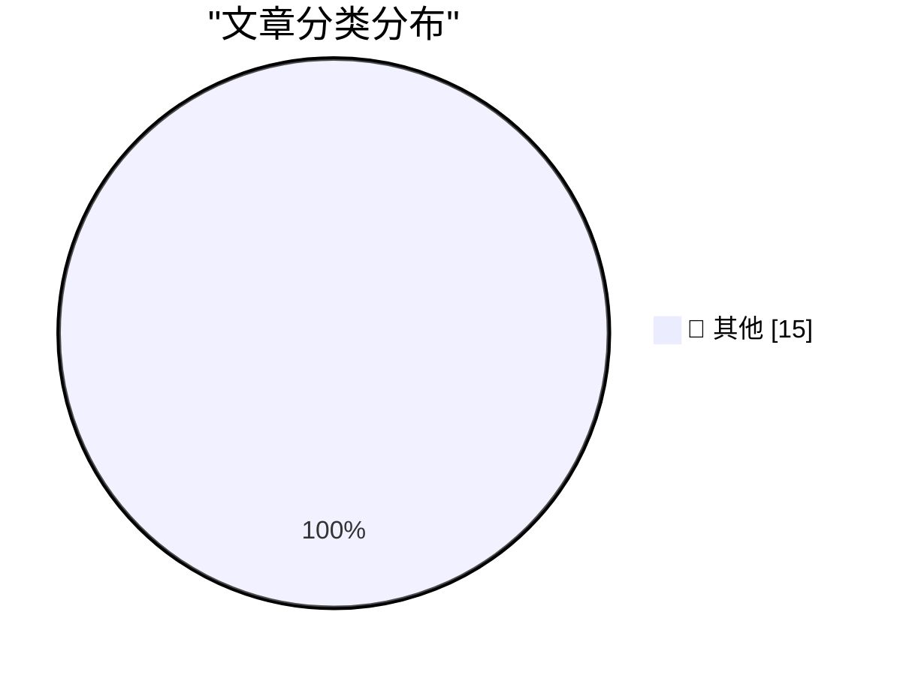

# 📰 AI 博客每日精选 — 2026-07-12

> 来自 Karpathy 推荐的 92 个顶级技术博客，AI 精选 Top 15

## 🏆 今日必读

🥇 **sqlite-utils 4.1**

[sqlite-utils 4.1](https://simonwillison.net/2026/Jul/11/sqlite-utils/#atom-everything) — simonwillison.net · 11 小时前 · 📝 其他

> sqlite-utils 4.1

🥈 **Quoting Nilay Patel**

[Quoting Nilay Patel](https://simonwillison.net/2026/Jul/10/nilay-patel/#atom-everything) — simonwillison.net · 1 天前 · 📝 其他

> Quoting Nilay Patel

🥉 **QuadRF can spot drones and see WiFi through my wall**

[QuadRF can spot drones and see WiFi through my wall](https://www.jeffgeerling.com/blog/2026/quadrf-can-spot-drones-and-see-wifi-through-my-wall/) — jeffgeerling.com · 1 天前 · 📝 其他

> QuadRF can spot drones and see WiFi through my wall

---

## 📊 数据概览

| 扫描源 | 抓取文章 | 时间范围 | 精选 |
|:---:|:---:|:---:|:---:|
| 83/92 | 2500 篇 → 32 篇 | 48h | **15 篇** |

### 分类分布

```mermaid
pie showData
    title "文章分类分布"
    "📝 其他" : 15
```

---

## 📝 其他

### 1. sqlite-utils 4.1

[sqlite-utils 4.1](https://simonwillison.net/2026/Jul/11/sqlite-utils/#atom-everything) — **simonwillison.net** · 11 小时前 · ⭐ 15/30

> sqlite-utils 4.1

---

### 2. Quoting Nilay Patel

[Quoting Nilay Patel](https://simonwillison.net/2026/Jul/10/nilay-patel/#atom-everything) — **simonwillison.net** · 1 天前 · ⭐ 15/30

> Quoting Nilay Patel

---

### 3. QuadRF can spot drones and see WiFi through my wall

[QuadRF can spot drones and see WiFi through my wall](https://www.jeffgeerling.com/blog/2026/quadrf-can-spot-drones-and-see-wifi-through-my-wall/) — **jeffgeerling.com** · 1 天前 · ⭐ 15/30

> QuadRF can spot drones and see WiFi through my wall

---

### 4. In defense of not understanding your codebase

[In defense of not understanding your codebase](https://seangoedecke.com/in-defense-of-not-understanding-your-codebase/) — **seangoedecke.com** · 1 天前 · ⭐ 15/30

> In defense of not understanding your codebase

---

### 5. Can Someone Explain to Me How to Get ‘ChatGPT Classic’?

[Can Someone Explain to Me How to Get ‘ChatGPT Classic’?](https://help.openai.com/en/articles/20001276-moving-to-the-new-chatgpt-desktop-app) — **daringfireball.net** · 12 小时前 · ⭐ 15/30

> Can Someone Explain to Me How to Get ‘ChatGPT Classic’?

---

### 6. OpenAI Help Center Describes What Is Wrong With the New ChatGPT

[OpenAI Help Center Describes What Is Wrong With the New ChatGPT](https://help.openai.com/en/articles/20001275-chatgpt-work-and-codex) — **daringfireball.net** · 12 小时前 · ⭐ 15/30

> OpenAI Help Center Describes What Is Wrong With the New ChatGPT

---

### 7. Benedict Evans on the New ‘Super App’ ChatGPT

[Benedict Evans on the New ‘Super App’ ChatGPT](https://www.threads.com/@benedictevans/post/Dano_uvDr8F) — **daringfireball.net** · 12 小时前 · ⭐ 15/30

> Benedict Evans on the New ‘Super App’ ChatGPT

---

### 8. ★ Exactly Like Om Malik

[★ Exactly Like Om Malik](https://daringfireball.net/2026/07/exactly_like_om_malik) — **daringfireball.net** · 15 小时前 · ⭐ 15/30

> ★ Exactly Like Om Malik

---

### 9. Gurman on Tang Tan and Paul Meade

[Gurman on Tang Tan and Paul Meade](https://www.bloomberg.com/news/articles/2026-07-11/openai-engineer-s-lol-moment-set-stage-for-legal-fight-with-apple) — **daringfireball.net** · 17 小时前 · ⭐ 15/30

> Gurman on Tang Tan and Paul Meade

---

### 10. John Ternus Calls Sam Altman

[John Ternus Calls Sam Altman](https://www.youtube.com/watch?v=ClASuxd8jQY) — **daringfireball.net** · 1 天前 · ⭐ 15/30

> John Ternus Calls Sam Altman

---

### 11. ‘No Interest’

[‘No Interest’](https://x.com/drewpusateri/status/2075708238650089981) — **daringfireball.net** · 1 天前 · ⭐ 15/30

> ‘No Interest’

---

### 12. Ice Cold

[Ice Cold](https://www.threads.com/@alexheath/post/DaoI2jaEioX) — **daringfireball.net** · 1 天前 · ⭐ 15/30

> Ice Cold

---

### 13. Ryanair Literally Sucks

[Ryanair Literally Sucks](https://apnews.com/article/greece-germany-ryanair-passenger-457c424f541152af1becdb387c90cfdd) — **daringfireball.net** · 1 天前 · ⭐ 15/30

> Ryanair Literally Sucks

---

### 14. Newly Renamed Trump Airport in Palm Beach Has an AI Slop Logo

[Newly Renamed Trump Airport in Palm Beach Has an AI Slop Logo](https://futurism.com/artificial-intelligence/trump-airport-logo-ai) — **daringfireball.net** · 1 天前 · ⭐ 15/30

> Newly Renamed Trump Airport in Palm Beach Has an AI Slop Logo

---

### 15. Mac OS 9’s Finder Had a ‘View as Buttons’ Mode

[Mac OS 9’s Finder Had a ‘View as Buttons’ Mode](https://www.cryan.com/blog/20240502.jsp) — **daringfireball.net** · 1 天前 · ⭐ 15/30

> Mac OS 9’s Finder Had a ‘View as Buttons’ Mode

---

*生成于 2026-07-12 11:04 | 扫描 83 源 → 获取 2500 篇 → 精选 15 篇*
*基于 [Hacker News Popularity Contest 2025](https://refactoringenglish.com/tools/hn-popularity/) RSS 源列表，由 [Andrej Karpathy](https://x.com/karpathy) 推荐*
*由「懂点儿AI」制作，欢迎关注同名微信公众号获取更多 AI 实用技巧 💡*
