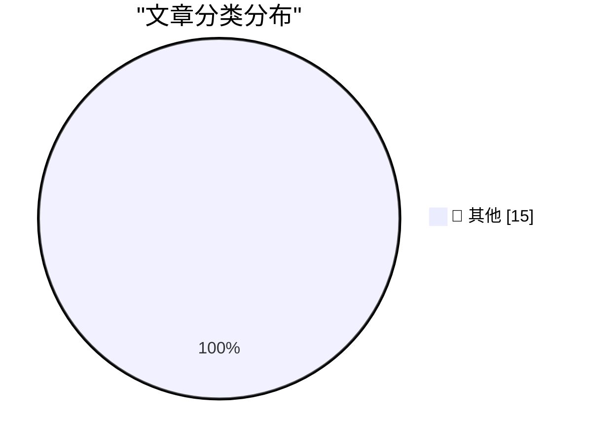

# 📰 AI 博客每日精选 — 2026-08-09

> 来自 Karpathy 推荐的 92 个顶级技术博客，AI 精选 Top 15

## 🏆 今日必读

🥇 **Auto mode is now the default in Claude Code for Pro, Max, and Team plans**

[Auto mode is now the default in Claude Code for Pro, Max, and Team plans](https://simonwillison.net/2026/Aug/8/auto-mode/#atom-everything) — simonwillison.net · 11 小时前 · 📝 其他

> Auto mode is now the default in Claude Code for Pro, Max, and Team plans

🥈 **Now we have a timeline of the OpenAI accidental attack against Hugging Face**

[Now we have a timeline of the OpenAI accidental attack against Hugging Face](https://simonwillison.net/2026/Aug/8/now-we-have-a-timeline-of-the-openai-accidental-attack-against-h/#atom-everything) — simonwillison.net · 20 小时前 · 📝 其他

> Now we have a timeline of the OpenAI accidental attack against Hugging Face

🥉 **Quoting John Gruber**

[Quoting John Gruber](https://simonwillison.net/2026/Aug/8/john-gruber/#atom-everything) — simonwillison.net · 1 天前 · 📝 其他

> Quoting John Gruber

---

## 📊 数据概览

| 扫描源 | 抓取文章 | 时间范围 | 精选 |
|:---:|:---:|:---:|:---:|
| 80/92 | 2449 篇 → 35 篇 | 48h | **15 篇** |

### 分类分布

```mermaid
pie showData
    title "文章分类分布"
    "📝 其他" : 15
```

---

## 📝 其他

### 1. Auto mode is now the default in Claude Code for Pro, Max, and Team plans

[Auto mode is now the default in Claude Code for Pro, Max, and Team plans](https://simonwillison.net/2026/Aug/8/auto-mode/#atom-everything) — **simonwillison.net** · 11 小时前 · ⭐ 15/30

> Auto mode is now the default in Claude Code for Pro, Max, and Team plans

---

### 2. Now we have a timeline of the OpenAI accidental attack against Hugging Face

[Now we have a timeline of the OpenAI accidental attack against Hugging Face](https://simonwillison.net/2026/Aug/8/now-we-have-a-timeline-of-the-openai-accidental-attack-against-h/#atom-everything) — **simonwillison.net** · 20 小时前 · ⭐ 15/30

> Now we have a timeline of the OpenAI accidental attack against Hugging Face

---

### 3. Quoting John Gruber

[Quoting John Gruber](https://simonwillison.net/2026/Aug/8/john-gruber/#atom-everything) — **simonwillison.net** · 1 天前 · ⭐ 15/30

> Quoting John Gruber

---

### 4. Now we have a timeline of the OpenAI accidental attack against Hugging Face

[Now we have a timeline of the OpenAI accidental attack against Hugging Face](https://simonwillison.net/2026/Aug/7/openai-timeline/#atom-everything) — **simonwillison.net** · 1 天前 · ⭐ 15/30

> Now we have a timeline of the OpenAI accidental attack against Hugging Face

---

### 5. Moonlight & Mayhem (Raccoon Heist by Codex + GPT-5.6 Sol Ultra)

[Moonlight & Mayhem (Raccoon Heist by Codex + GPT-5.6 Sol Ultra)](https://simonwillison.net/2026/Aug/7/moonlight-mayhem/#atom-everything) — **simonwillison.net** · 1 天前 · ⭐ 15/30

> Moonlight & Mayhem (Raccoon Heist by Codex + GPT-5.6 Sol Ultra)

---

### 6. The Tokenpocalypse Is Here: Companies Are Scrambling To Stop Spending So Much on AI

[The Tokenpocalypse Is Here: Companies Are Scrambling To Stop Spending So Much on AI](https://simonwillison.net/2026/Aug/7/pdfs-are-terrible/#atom-everything) — **simonwillison.net** · 1 天前 · ⭐ 15/30

> The Tokenpocalypse Is Here: Companies Are Scrambling To Stop Spending So Much on AI

---

### 7. I'm excited for Intel after testing the XPS 13

[I'm excited for Intel after testing the XPS 13](https://www.jeffgeerling.com/blog/2026/excited-for-intel-efficiency/) — **jeffgeerling.com** · 1 天前 · ⭐ 15/30

> I'm excited for Intel after testing the XPS 13

---

### 8. ★ Retraction: The App Store Rejection of the Week That Was, in Fact, a Correct Rejection

[★ Retraction: The App Store Rejection of the Week That Was, in Fact, a Correct Rejection](https://daringfireball.net/2026/08/retraction_app_store_rejection_of_the_week) — **daringfireball.net** · 7 小时前 · ⭐ 15/30

> ★ Retraction: The App Store Rejection of the Week That Was, in Fact, a Correct Rejection

---

### 9. Corrupt Minds Think Alike

[Corrupt Minds Think Alike](https://www.nytimes.com/2026/08/06/business/fifa-world-cup-privatization.html?unlocked_article_code=1.3VA.4zqH.Pul7X9bQ2kv0&amp;smid=bs-share) — **daringfireball.net** · 13 小时前 · ⭐ 15/30

> Corrupt Minds Think Alike

---

### 10. Maybe ‘Steal Underpants by Blowing a Fortune on AI Tokens’ Is, in Fact, Not a Good Business Plan

[Maybe ‘Steal Underpants by Blowing a Fortune on AI Tokens’ Is, in Fact, Not a Good Business Plan](https://www.404media.co/the-tokenpocalypse-is-here-companies-are-scrambling-to-stop-spending-so-much-on-ai/) — **daringfireball.net** · 14 小时前 · ⭐ 15/30

> Maybe ‘Steal Underpants by Blowing a Fortune on AI Tokens’ Is, in Fact, Not a Good Business Plan

---

### 11. Simon Willison on Blogging

[Simon Willison on Blogging](https://writethatblog.substack.com/p/simon-willison-on-technical-blogging) — **daringfireball.net** · 1 天前 · ⭐ 15/30

> Simon Willison on Blogging

---

### 12. Google Earth Retracts AI Tool for Making Fake Satellite Images After It Was Immediately Abused Upon Release

[Google Earth Retracts AI Tool for Making Fake Satellite Images After It Was Immediately Abused Upon Release](https://arstechnica.com/ai/2026/07/google-earth-releases-swiftly-retracts-ai-feature-to-make-fake-satellite-images/) — **daringfireball.net** · 1 天前 · ⭐ 15/30

> Google Earth Retracts AI Tool for Making Fake Satellite Images After It Was Immediately Abused Upon Release

---

### 13. Some New Data Centers Are Necessary

[Some New Data Centers Are Necessary](https://www.newyorker.com/cartoon/a62045) — **daringfireball.net** · 1 天前 · ⭐ 15/30

> Some New Data Centers Are Necessary

---

### 14. An AI Model From Meta Also Hacked Another Company During Testing

[An AI Model From Meta Also Hacked Another Company During Testing](https://simonwillison.net/2026/Aug/6/an-ai-model-from-meta/) — **daringfireball.net** · 1 天前 · ⭐ 15/30

> An AI Model From Meta Also Hacked Another Company During Testing

---

### 15. Meta: Introducing Muse Code and Muse Spark 1.2

[Meta: Introducing Muse Code and Muse Spark 1.2](https://research.meta.ai/blog/introducing-muse-code-and-muse-spark-1-2) — **daringfireball.net** · 1 天前 · ⭐ 15/30

> Meta: Introducing Muse Code and Muse Spark 1.2

---

*生成于 2026-08-09 10:20 | 扫描 80 源 → 获取 2449 篇 → 精选 15 篇*
*基于 [Hacker News Popularity Contest 2025](https://refactoringenglish.com/tools/hn-popularity/) RSS 源列表，由 [Andrej Karpathy](https://x.com/karpathy) 推荐*
*由「懂点儿AI」制作，欢迎关注同名微信公众号获取更多 AI 实用技巧 💡*
