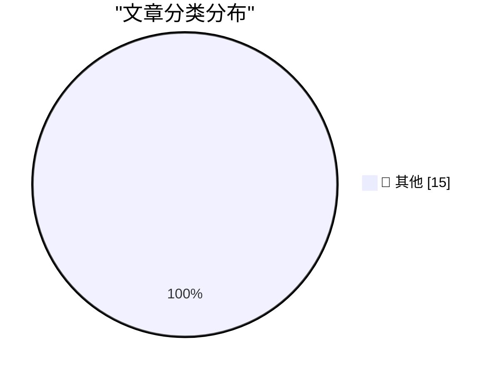

# 📰 AI 博客每日精选 — 2026-07-06

> 来自 Karpathy 推荐的 92 个顶级技术博客，AI 精选 Top 15

## 🏆 今日必读

🥇 **sqlite-utils 4.0rc3**

[sqlite-utils 4.0rc3](https://simonwillison.net/2026/Jul/6/sqlite-utils/#atom-everything) — simonwillison.net · 7 小时前 · 📝 其他

> sqlite-utils 4.0rc3

🥈 **sqlite-utils 4.0rc2, mostly written by Claude Fable (for about $149.25)**

[sqlite-utils 4.0rc2, mostly written by Claude Fable (for about $149.25)](https://simonwillison.net/2026/Jul/5/sqlite-utils-fable/#atom-everything) — simonwillison.net · 1 天前 · 📝 其他

> sqlite-utils 4.0rc2, mostly written by Claude Fable (for about $149.25)

🥉 **sqlite-utils 4.0rc2**

[sqlite-utils 4.0rc2](https://simonwillison.net/2026/Jul/5/sqlite-utils/#atom-everything) — simonwillison.net · 1 天前 · 📝 其他

> sqlite-utils 4.0rc2

---

## 📊 数据概览

| 扫描源 | 抓取文章 | 时间范围 | 精选 |
|:---:|:---:|:---:|:---:|
| 83/92 | 2484 篇 → 15 篇 | 48h | **15 篇** |

### 分类分布

```mermaid
pie showData
    title "文章分类分布"
    "📝 其他" : 15
```

---

## 📝 其他

### 1. sqlite-utils 4.0rc3

[sqlite-utils 4.0rc3](https://simonwillison.net/2026/Jul/6/sqlite-utils/#atom-everything) — **simonwillison.net** · 7 小时前 · ⭐ 15/30

> sqlite-utils 4.0rc3

---

### 2. sqlite-utils 4.0rc2, mostly written by Claude Fable (for about $149.25)

[sqlite-utils 4.0rc2, mostly written by Claude Fable (for about $149.25)](https://simonwillison.net/2026/Jul/5/sqlite-utils-fable/#atom-everything) — **simonwillison.net** · 1 天前 · ⭐ 15/30

> sqlite-utils 4.0rc2, mostly written by Claude Fable (for about $149.25)

---

### 3. sqlite-utils 4.0rc2

[sqlite-utils 4.0rc2](https://simonwillison.net/2026/Jul/5/sqlite-utils/#atom-everything) — **simonwillison.net** · 1 天前 · ⭐ 15/30

> sqlite-utils 4.0rc2

---

### 4. Building a World Map with only 500 bytes

[Building a World Map with only 500 bytes](https://simonwillison.net/2026/Jul/4/building-a-world-map-with-only-500-bytes/#atom-everything) — **simonwillison.net** · 1 天前 · ⭐ 15/30

> Building a World Map with only 500 bytes

---

### 5. Better Models: Worse Tools

[Better Models: Worse Tools](https://simonwillison.net/2026/Jul/4/better-models-worse-tools/#atom-everything) — **simonwillison.net** · 1 天前 · ⭐ 15/30

> Better Models: Worse Tools

---

### 6. Day One Journal

[Day One Journal](https://dayoneapp.com/blog/introducing-daily-chat/) — **daringfireball.net** · 1 天前 · ⭐ 15/30

> Day One Journal

---

### 7. From the DF Archive: ‘Electron and the Decline of Native Apps’

[From the DF Archive: ‘Electron and the Decline of Native Apps’](https://daringfireball.net/2018/12/electron_and_the_decline_of_native_apps) — **daringfireball.net** · 1 天前 · ⭐ 15/30

> From the DF Archive: ‘Electron and the Decline of Native Apps’

---

### 8. Fantastical 4.1.15 Adds Calendar Mirroring

[Fantastical 4.1.15 Adds Calendar Mirroring](https://flexibits.com/blog/2026/06/double-booked-never-heard-of-it-meet-calendar-mirroring-in-fantastical/) — **daringfireball.net** · 1 天前 · ⭐ 15/30

> Fantastical 4.1.15 Adds Calendar Mirroring

---

### 9. Amazon Basics, but for intellectual property.

[Amazon Basics, but for intellectual property.](https://idiallo.com/blog/amazon-basics-but-intellectual-property) — **idiallo.com** · 6 小时前 · ⭐ 15/30

> Amazon Basics, but for intellectual property.

---

### 10. I'm just so bored of AI

[I'm just so bored of AI](https://shkspr.mobi/blog/2026/07/im-just-so-bored-of-ai/) — **shkspr.mobi** · 2 小时前 · ⭐ 15/30

> I'm just so bored of AI

---

### 11. e approximation

[e approximation](https://www.johndcook.com/blog/2026/07/06/e-approximation/) — **johndcook.com** · 1 小时前 · ⭐ 15/30

> e approximation

---

### 12. Making a Shuffle Button

[Making a Shuffle Button](https://blog.jim-nielsen.com/2026/notes-shuffle/) — **blog.jim-nielsen.com** · 18 小时前 · ⭐ 15/30

> Making a Shuffle Button

---

### 13. Why IBM bought Lotus

[Why IBM bought Lotus](https://dfarq.homeip.net/why-ibm-bought-lotus/?utm_source=rss&#038;utm_medium=rss&#038;utm_campaign=why-ibm-bought-lotus) — **dfarq.homeip.net** · 2 小时前 · ⭐ 15/30

> Why IBM bought Lotus

---

### 14. Travel notes: PLDI Boulder

[Travel notes: PLDI Boulder](https://bernsteinbear.com/blog/travel-notes-pldi-boulder/?utm_source=rss) — **bernsteinbear.com** · 1 天前 · ⭐ 15/30

> Travel notes: PLDI Boulder

---

### 15. My blog has moved

[My blog has moved](https://mjg59.dreamwidth.org/74260.html) — **mjg59.dreamwidth.org** · 4 小时前 · ⭐ 15/30

> My blog has moved

---

*生成于 2026-07-06 13:36 | 扫描 83 源 → 获取 2484 篇 → 精选 15 篇*
*基于 [Hacker News Popularity Contest 2025](https://refactoringenglish.com/tools/hn-popularity/) RSS 源列表，由 [Andrej Karpathy](https://x.com/karpathy) 推荐*
*由「懂点儿AI」制作，欢迎关注同名微信公众号获取更多 AI 实用技巧 💡*
