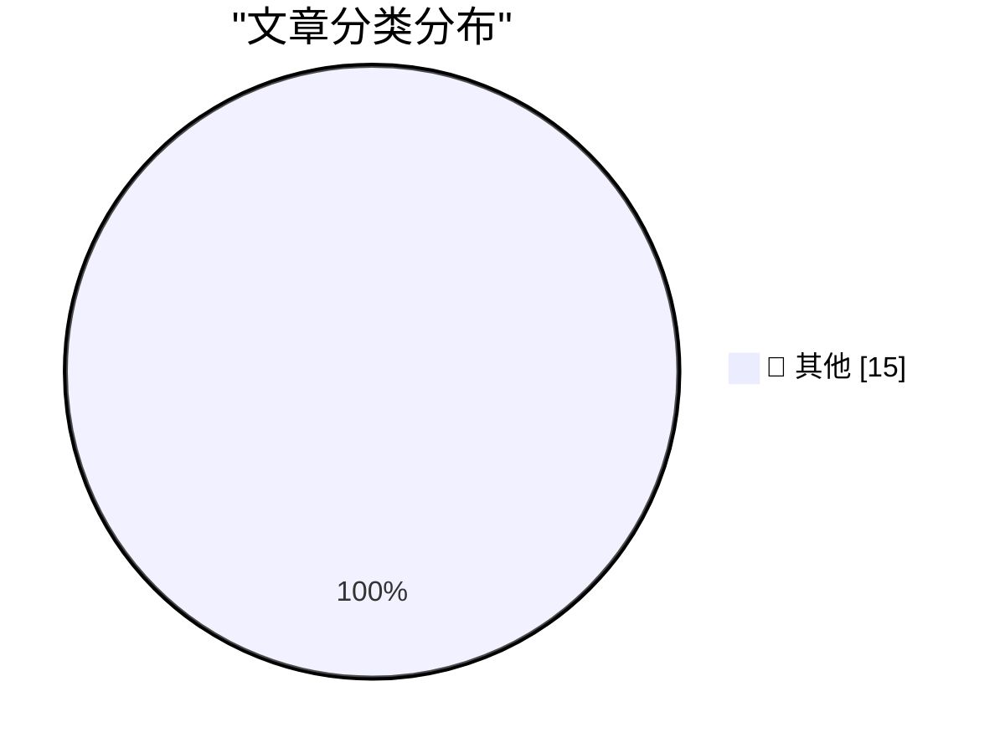

# 📰 AI 博客每日精选 — 2026-08-12

> 来自 Karpathy 推荐的 92 个顶级技术博客，AI 精选 Top 15

## 🏆 今日必读

🥇 **There are no lossless transformations of natural-language text**

[There are no lossless transformations of natural-language text](https://simonwillison.net/2026/Aug/11/there-are-no-lossless-transformations-of-natural-language-text/#atom-everything) — simonwillison.net · 11 小时前 · 📝 其他

> There are no lossless transformations of natural-language text

🥈 **Stealing Reasoning Traces from Proprietary LLM APIs**

[Stealing Reasoning Traces from Proprietary LLM APIs](https://simonwillison.net/2026/Aug/11/stealing-reasoning-traces/#atom-everything) — simonwillison.net · 12 小时前 · 📝 其他

> Stealing Reasoning Traces from Proprietary LLM APIs

🥉 **datasette-upload-dbs 0.5a0**

[datasette-upload-dbs 0.5a0](https://simonwillison.net/2026/Aug/11/datasette-upload-dbs/#atom-everything) — simonwillison.net · 14 小时前 · 📝 其他

> datasette-upload-dbs 0.5a0

---

## 📊 数据概览

| 扫描源 | 抓取文章 | 时间范围 | 精选 |
|:---:|:---:|:---:|:---:|
| 79/92 | 2456 篇 → 46 篇 | 48h | **15 篇** |

### 分类分布

```mermaid
pie showData
    title "文章分类分布"
    "📝 其他" : 15
```

---

## 📝 其他

### 1. There are no lossless transformations of natural-language text

[There are no lossless transformations of natural-language text](https://simonwillison.net/2026/Aug/11/there-are-no-lossless-transformations-of-natural-language-text/#atom-everything) — **simonwillison.net** · 11 小时前 · ⭐ 15/30

> There are no lossless transformations of natural-language text

---

### 2. Stealing Reasoning Traces from Proprietary LLM APIs

[Stealing Reasoning Traces from Proprietary LLM APIs](https://simonwillison.net/2026/Aug/11/stealing-reasoning-traces/#atom-everything) — **simonwillison.net** · 12 小时前 · ⭐ 15/30

> Stealing Reasoning Traces from Proprietary LLM APIs

---

### 3. datasette-upload-dbs 0.5a0

[datasette-upload-dbs 0.5a0](https://simonwillison.net/2026/Aug/11/datasette-upload-dbs/#atom-everything) — **simonwillison.net** · 14 小时前 · ⭐ 15/30

> datasette-upload-dbs 0.5a0

---

### 4. Introducing Muse Glimmer

[Introducing Muse Glimmer](https://simonwillison.net/2026/Aug/10/introducing-muse-glimmer/#atom-everything) — **simonwillison.net** · 1 天前 · ⭐ 15/30

> Introducing Muse Glimmer

---

### 5. Microsoft Plugs Nearly 400 Security Holes

[Microsoft Plugs Nearly 400 Security Holes](https://krebsonsecurity.com/2026/08/microsoft-plugs-nearly-400-security-holes/) — **krebsonsecurity.com** · 13 小时前 · ⭐ 15/30

> Microsoft Plugs Nearly 400 Security Holes

---

### 6. The Economist: ‘How to Spot AI Writing’

[The Economist: ‘How to Spot AI Writing’](https://www.economist.com/culture/2026/07/30/how-to-spot-ai-writing?giftId=NzBlNTc2OGItMDgxNS00N2EzLWE4NmUtZDgzZmE4Y2FkM2Mw) — **daringfireball.net** · 13 小时前 · ⭐ 15/30

> The Economist: ‘How to Spot AI Writing’

---

### 7. Alex Micek on BMW’s iDrive ‘Special Surprises’

[Alex Micek on BMW’s iDrive ‘Special Surprises’](https://tumbledry.org/2026/08/07/idrive_ads) — **daringfireball.net** · 14 小时前 · ⭐ 15/30

> Alex Micek on BMW’s iDrive ‘Special Surprises’

---

### 8. BMW Probably Paid Sony for the Spider-Man Dashboard Ads, Not the Other Way Around

[BMW Probably Paid Sony for the Spider-Man Dashboard Ads, Not the Other Way Around](https://www.press.bmwgroup.com/global/article/detail/T0459622EN/bmw-brings-modern-mobility-to-the-sony-pictures-film-%E2%80%9Cspider-man%E2%84%A2:-brand-new-day%E2%80%9D?language=en) — **daringfireball.net** · 15 小时前 · ⭐ 15/30

> BMW Probably Paid Sony for the Spider-Man Dashboard Ads, Not the Other Way Around

---

### 9. Mark Zuckerberg Posts 6,500-Word AI Essay

[Mark Zuckerberg Posts 6,500-Word AI Essay](https://www.meta.com/thefutureisforeveryone/) — **daringfireball.net** · 15 小时前 · ⭐ 15/30

> Mark Zuckerberg Posts 6,500-Word AI Essay

---

### 10. The Talk Show: ‘Getting the Snack Right’

[The Talk Show: ‘Getting the Snack Right’](https://daringfireball.net/thetalkshow/2026/08/10/ep-454) — **daringfireball.net** · 15 小时前 · ⭐ 15/30

> The Talk Show: ‘Getting the Snack Right’

---

### 11. Netflix Has Peaked

[Netflix Has Peaked](https://sharptext.net/2026/is-netflix-washed-now/) — **daringfireball.net** · 15 小时前 · ⭐ 15/30

> Netflix Has Peaked

---

### 12. Anthropic Posts ‘How Claude Marks AI-Generated Content’ Without Explaining How Claude Marks AI-Generated Content

[Anthropic Posts ‘How Claude Marks AI-Generated Content’ Without Explaining How Claude Marks AI-Generated Content](https://support.claude.com/en/articles/16266773-how-claude-marks-ai-generated-content) — **daringfireball.net** · 16 小时前 · ⭐ 15/30

> Anthropic Posts ‘How Claude Marks AI-Generated Content’ Without Explaining How Claude Marks AI-Generated Content

---

### 13. [Sponsor] Drata

[[Sponsor] Drata](https://drata.com/daring) — **daringfireball.net** · 1 天前 · ⭐ 15/30

> [Sponsor] Drata

---

### 14. What’s New in iOS 27 Beta 5

[What’s New in iOS 27 Beta 5](https://9to5mac.com/2026/08/10/heres-whats-new-with-ios-27-beta-5/) — **daringfireball.net** · 1 天前 · ⭐ 15/30

> What’s New in iOS 27 Beta 5

---

### 15. ‘Friday Night Baseball’ Will Start Broadcasting Games Live, in Apple Immersive, on Vision Pro

[‘Friday Night Baseball’ Will Start Broadcasting Games Live, in Apple Immersive, on Vision Pro](https://www.apple.com/newsroom/2026/08/apple-mlb-announce-september-friday-night-baseball-schedule/) — **daringfireball.net** · 1 天前 · ⭐ 15/30

> ‘Friday Night Baseball’ Will Start Broadcasting Games Live, in Apple Immersive, on Vision Pro

---

*生成于 2026-08-12 10:49 | 扫描 79 源 → 获取 2456 篇 → 精选 15 篇*
*基于 [Hacker News Popularity Contest 2025](https://refactoringenglish.com/tools/hn-popularity/) RSS 源列表，由 [Andrej Karpathy](https://x.com/karpathy) 推荐*
*由「懂点儿AI」制作，欢迎关注同名微信公众号获取更多 AI 实用技巧 💡*
