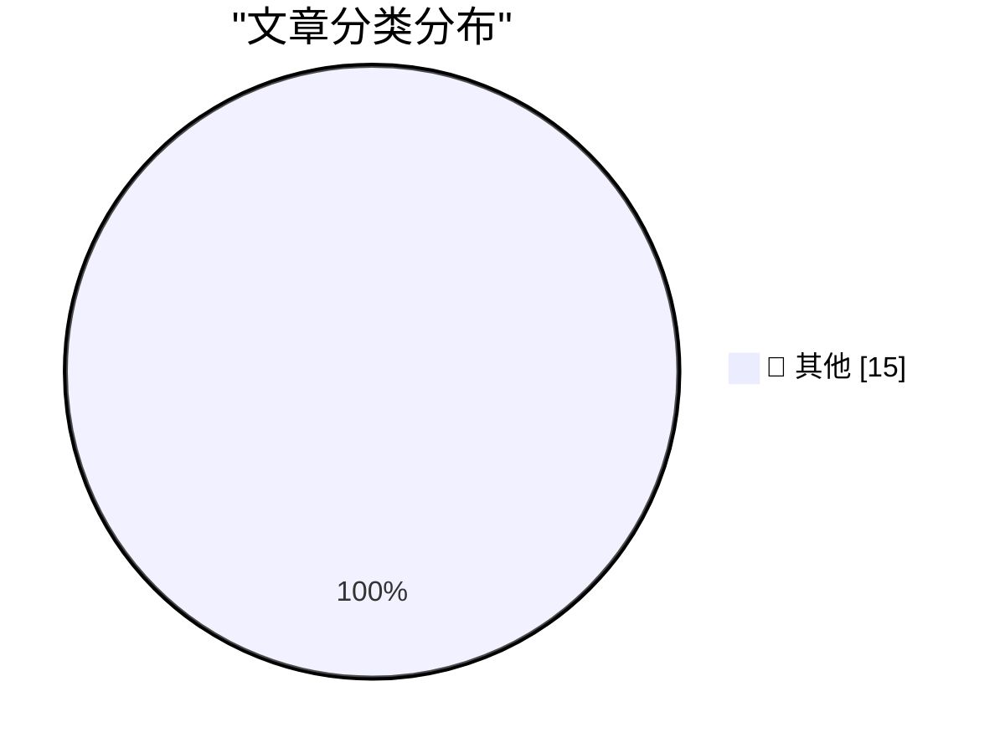

# 📰 AI 博客每日精选 — 2026-06-01

> 来自 Karpathy 推荐的 92 个顶级技术博客，AI 精选 Top 15

## 🏆 今日必读

🥇 **May 2026 newsletter**

[May 2026 newsletter](https://simonwillison.net/2026/Jun/1/may-newsletter/#atom-everything) — simonwillison.net · 11 小时前 · 📝 其他

> May 2026 newsletter

🥈 **datasette 1.0a32**

[datasette 1.0a32](https://simonwillison.net/2026/May/31/datasette/#atom-everything) — simonwillison.net · 16 小时前 · 📝 其他

> datasette 1.0a32

🥉 **The solution might be cancelling my AI subscription**

[The solution might be cancelling my AI subscription](https://simonwillison.net/2026/May/31/the-solution-might-be-cancelling-my-ai-subscription/#atom-everything) — simonwillison.net · 23 小时前 · 📝 其他

> The solution might be cancelling my AI subscription

---

## 📊 数据概览

| 扫描源 | 抓取文章 | 时间范围 | 精选 |
|:---:|:---:|:---:|:---:|
| 81/92 | 2433 篇 → 30 篇 | 48h | **15 篇** |

### 分类分布

```mermaid
pie showData
    title "文章分类分布"
    "📝 其他" : 15
```

---

## 📝 其他

### 1. May 2026 newsletter

[May 2026 newsletter](https://simonwillison.net/2026/Jun/1/may-newsletter/#atom-everything) — **simonwillison.net** · 11 小时前 · ⭐ 15/30

> May 2026 newsletter

---

### 2. datasette 1.0a32

[datasette 1.0a32](https://simonwillison.net/2026/May/31/datasette/#atom-everything) — **simonwillison.net** · 16 小时前 · ⭐ 15/30

> datasette 1.0a32

---

### 3. The solution might be cancelling my AI subscription

[The solution might be cancelling my AI subscription](https://simonwillison.net/2026/May/31/the-solution-might-be-cancelling-my-ai-subscription/#atom-everything) — **simonwillison.net** · 23 小时前 · ⭐ 15/30

> The solution might be cancelling my AI subscription

---

### 4. Quoting Karen Kwok for Reuters Breakingviews

[Quoting Karen Kwok for Reuters Breakingviews](https://simonwillison.net/2026/May/31/anthropic-run-rate/#atom-everything) — **simonwillison.net** · 1 天前 · ⭐ 15/30

> Quoting Karen Kwok for Reuters Breakingviews

---

### 5. How we contain Claude across products

[How we contain Claude across products](https://simonwillison.net/2026/May/30/how-we-contain-claude/#atom-everything) — **simonwillison.net** · 1 天前 · ⭐ 15/30

> How we contain Claude across products

---

### 6. Running Python ASGI apps in the browser via Pyodide + a service worker

[Running Python ASGI apps in the browser via Pyodide + a service worker](https://simonwillison.net/2026/May/30/pyodide-asgi-browser/#atom-everything) — **simonwillison.net** · 1 天前 · ⭐ 15/30

> Running Python ASGI apps in the browser via Pyodide + a service worker

---

### 7. I Am Retiring from Tech to Live Offline

[I Am Retiring from Tech to Live Offline](https://simonwillison.net/2026/May/30/retiring-from-tech-to-live-offline/#atom-everything) — **simonwillison.net** · 1 天前 · ⭐ 15/30

> I Am Retiring from Tech to Live Offline

---

### 8. Quoting Daniel Jalkut

[Quoting Daniel Jalkut](https://simonwillison.net/2026/May/30/daniel-jalkut/#atom-everything) — **simonwillison.net** · 1 天前 · ⭐ 15/30

> Quoting Daniel Jalkut

---

### 9. The Talk Show Live From WWDC 2026: Tuesday June 9

[The Talk Show Live From WWDC 2026: Tuesday June 9](https://ti.to/daringfireball/the-talk-show-live-from-wwdc-2026) — **daringfireball.net** · 13 小时前 · ⭐ 15/30

> The Talk Show Live From WWDC 2026: Tuesday June 9

---

### 10. exe.dev

[exe.dev](https://exe.dev/?df) — **daringfireball.net** · 13 小时前 · ⭐ 15/30

> exe.dev

---

### 11. Take Two

[Take Two](https://x.com/markgurman/status/2061236259843182813) — **daringfireball.net** · 15 小时前 · ⭐ 15/30

> Take Two

---

### 12. Please don't mess with links:

[Please don't mess with links:](https://maurycyz.com/misc/real_links/) — **maurycyz.com** · 1 天前 · ⭐ 15/30

> Please don't mess with links:

---

### 13. Pluralistic: Molly Crabapple's 'Here Where We Live Is Our Country' (01 Jun 2026)

[Pluralistic: Molly Crabapple's 'Here Where We Live Is Our Country' (01 Jun 2026)](https://pluralistic.net/2026/06/01/doikayt/) — **pluralistic.net** · 6 小时前 · ⭐ 15/30

> Pluralistic: Molly Crabapple's 'Here Where We Live Is Our Country' (01 Jun 2026)

---

### 14. Who are the actors in the UK's 2015 passport?

[Who are the actors in the UK's 2015 passport?](https://shkspr.mobi/blog/2026/05/who-are-the-actors-in-the-uks-2015-passport/) — **shkspr.mobi** · 1 天前 · ⭐ 15/30

> Who are the actors in the UK's 2015 passport?

---

### 15. Microcode inside the Intel 8087 floating-point chip: register exchange

[Microcode inside the Intel 8087 floating-point chip: register exchange](http://www.righto.com/feeds/5917097192784199241/comments/default) — **righto.com** · 1 天前 · ⭐ 15/30

> Microcode inside the Intel 8087 floating-point chip: register exchange

---

*生成于 2026-06-01 15:46 | 扫描 81 源 → 获取 2433 篇 → 精选 15 篇*
*基于 [Hacker News Popularity Contest 2025](https://refactoringenglish.com/tools/hn-popularity/) RSS 源列表，由 [Andrej Karpathy](https://x.com/karpathy) 推荐*
*由「懂点儿AI」制作，欢迎关注同名微信公众号获取更多 AI 实用技巧 💡*
