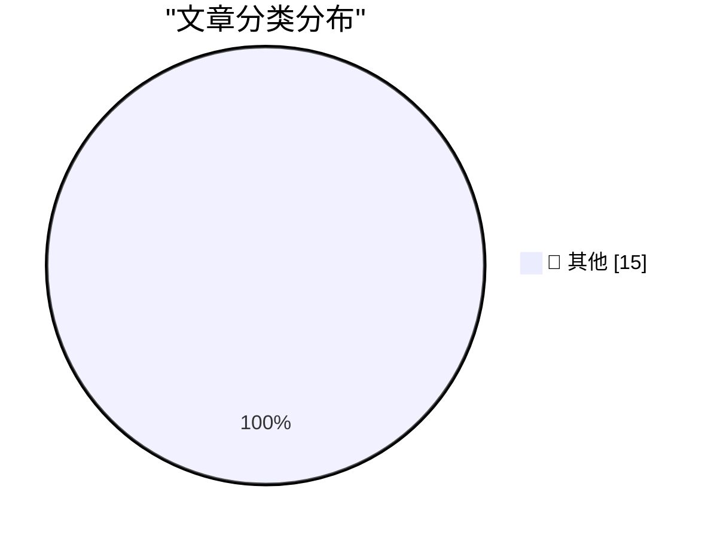

# 📰 AI 博客每日精选 — 2026-07-22

> 来自 Karpathy 推荐的 92 个顶级技术博客，AI 精选 Top 15

## 🏆 今日必读

🥇 **Nativ: Run AI models locally on your Mac**

[Nativ: Run AI models locally on your Mac](https://simonwillison.net/2026/Jul/21/nativ/#atom-everything) — simonwillison.net · 21 小时前 · 📝 其他

> Nativ: Run AI models locally on your Mac

🥈 **A Fireside Chat with Cat and Thariq from the Claude Code team**

[A Fireside Chat with Cat and Thariq from the Claude Code team](https://simonwillison.net/2026/Jul/21/cat-and-thariq/#atom-everything) — simonwillison.net · 22 小时前 · 📝 其他

> A Fireside Chat with Cat and Thariq from the Claude Code team

🥉 **Reverse-engineering is cheap now**

[Reverse-engineering is cheap now](https://simonwillison.net/2026/Jul/20/cheap-reverse-engineering/#atom-everything) — simonwillison.net · 1 天前 · 📝 其他

> Reverse-engineering is cheap now

---

## 📊 数据概览

| 扫描源 | 抓取文章 | 时间范围 | 精选 |
|:---:|:---:|:---:|:---:|
| 84/92 | 2526 篇 → 27 篇 | 48h | **15 篇** |

### 分类分布

```mermaid
pie showData
    title "文章分类分布"
    "📝 其他" : 15
```

---

## 📝 其他

### 1. Nativ: Run AI models locally on your Mac

[Nativ: Run AI models locally on your Mac](https://simonwillison.net/2026/Jul/21/nativ/#atom-everything) — **simonwillison.net** · 21 小时前 · ⭐ 15/30

> Nativ: Run AI models locally on your Mac

---

### 2. A Fireside Chat with Cat and Thariq from the Claude Code team

[A Fireside Chat with Cat and Thariq from the Claude Code team](https://simonwillison.net/2026/Jul/21/cat-and-thariq/#atom-everything) — **simonwillison.net** · 22 小时前 · ⭐ 15/30

> A Fireside Chat with Cat and Thariq from the Claude Code team

---

### 3. Reverse-engineering is cheap now

[Reverse-engineering is cheap now](https://simonwillison.net/2026/Jul/20/cheap-reverse-engineering/#atom-everything) — **simonwillison.net** · 1 天前 · ⭐ 15/30

> Reverse-engineering is cheap now

---

### 4. Who’s Afraid of Chinese Models?

[Who’s Afraid of Chinese Models?](https://simonwillison.net/2026/Jul/20/afraid-of-chinese-models/#atom-everything) — **simonwillison.net** · 1 天前 · ⭐ 15/30

> Who’s Afraid of Chinese Models?

---

### 5. LG to Ban Residential Proxies from Smart TV Apps

[LG to Ban Residential Proxies from Smart TV Apps](https://krebsonsecurity.com/2026/07/lg-to-ban-residential-proxies-from-smart-tv-apps/) — **krebsonsecurity.com** · 10 小时前 · ⭐ 15/30

> LG to Ban Residential Proxies from Smart TV Apps

---

### 6. ★ European Commission: ‘Guidance to Google for AI Interoperability on Android & Sharing of Google Search’

[★ European Commission: ‘Guidance to Google for AI Interoperability on Android & Sharing of Google Search’](https://daringfireball.net/2026/07/ec_google_guidance_android_ai_and_search_sharing) — **daringfireball.net** · 12 小时前 · ⭐ 15/30

> ★ European Commission: ‘Guidance to Google for AI Interoperability on Android & Sharing of Google Search’

---

### 7. [Sponsor] WorkOS MCP: Manage Your Auth Platform From Any AI Agent

[[Sponsor] WorkOS MCP: Manage Your Auth Platform From Any AI Agent](https://workos.com/blog/management-mcp-server?utm_source=daringfireball&amp;utm_medium=newsletter&amp;utm_campaign=q32026) — **daringfireball.net** · 1 天前 · ⭐ 15/30

> [Sponsor] WorkOS MCP: Manage Your Auth Platform From Any AI Agent

---

### 8. ‘Who’s Afraid of Chinese Models?’

[‘Who’s Afraid of Chinese Models?’](https://stratechery.com/2026/whos-afraid-of-chinese-models/) — **daringfireball.net** · 1 天前 · ⭐ 15/30

> ‘Who’s Afraid of Chinese Models?’

---

### 9. Expensive Is Just a Brand Now

[Expensive Is Just a Brand Now](https://idiallo.com/blog/expensive-is-just-branding) — **idiallo.com** · 1 天前 · ⭐ 15/30

> Expensive Is Just a Brand Now

---

### 10. Pluralistic: Trump's America can't even win a rigged game (22 Jul 2026)

[Pluralistic: Trump's America can't even win a rigged game (22 Jul 2026)](https://pluralistic.net/2026/07/22/table-flipper/) — **pluralistic.net** · 2 小时前 · ⭐ 15/30

> Pluralistic: Trump's America can't even win a rigged game (22 Jul 2026)

---

### 11. Pluralistic: Dealing with dickovers (21 Jul 2026) dickovers

[Pluralistic: Dealing with dickovers (21 Jul 2026) dickovers](https://pluralistic.net/2026/07/21/dickovers/) — **pluralistic.net** · 1 天前 · ⭐ 15/30

> Pluralistic: Dealing with dickovers (21 Jul 2026) dickovers

---

### 12. Scattered thoughts on social geolocation

[Scattered thoughts on social geolocation](https://shkspr.mobi/blog/2026/07/scattered-thoughts-on-social-geolocation/) — **shkspr.mobi** · 6 分钟前 · ⭐ 15/30

> Scattered thoughts on social geolocation

---

### 13. Making an agile version of a Windows Runtime delegate in C++/WinRT, part 2

[Making an agile version of a Windows Runtime delegate in C++/WinRT, part 2](https://devblogs.microsoft.com/oldnewthing/20260721-00/?p=112550) — **devblogs.microsoft.com/oldnewthing** · 21 小时前 · ⭐ 15/30

> Making an agile version of a Windows Runtime delegate in C++/WinRT, part 2

---

### 14. Making an agile version of a Windows Runtime delegate in C++/WinRT, part 1

[Making an agile version of a Windows Runtime delegate in C++/WinRT, part 1](https://devblogs.microsoft.com/oldnewthing/20260720-00/?p=112545) — **devblogs.microsoft.com/oldnewthing** · 1 天前 · ⭐ 15/30

> Making an agile version of a Windows Runtime delegate in C++/WinRT, part 1

---

### 15. Forensic accounting in Python

[Forensic accounting in Python](https://www.johndcook.com/blog/2026/07/21/forensic-accounting-in-python/) — **johndcook.com** · 20 小时前 · ⭐ 15/30

> Forensic accounting in Python

---

*生成于 2026-07-22 11:40 | 扫描 84 源 → 获取 2526 篇 → 精选 15 篇*
*基于 [Hacker News Popularity Contest 2025](https://refactoringenglish.com/tools/hn-popularity/) RSS 源列表，由 [Andrej Karpathy](https://x.com/karpathy) 推荐*
*由「懂点儿AI」制作，欢迎关注同名微信公众号获取更多 AI 实用技巧 💡*
