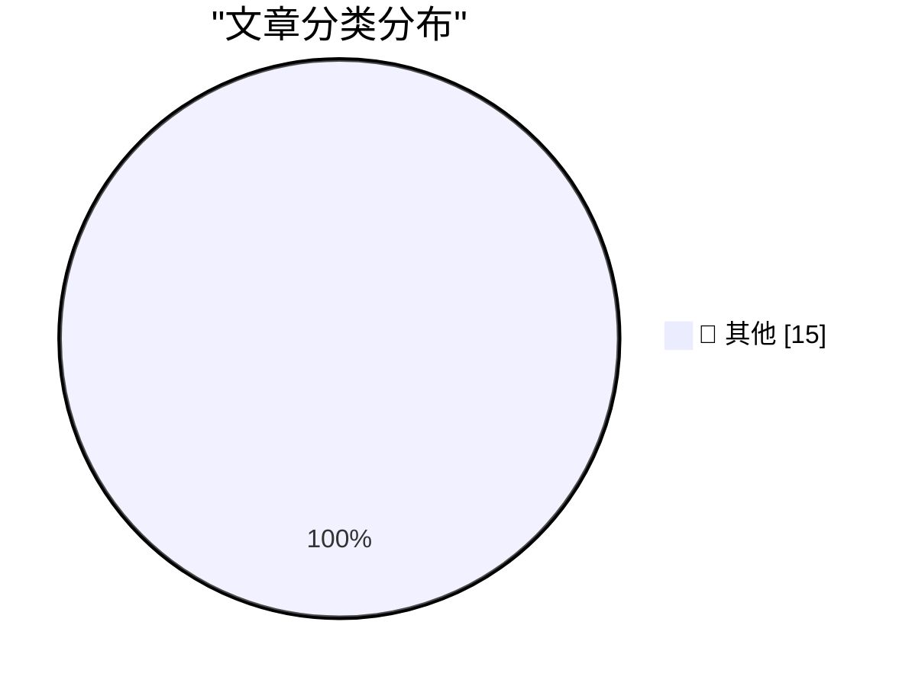

# 📰 AI 博客每日精选 — 2026-06-04

> 来自 Karpathy 推荐的 92 个顶级技术博客，AI 精选 Top 15

## 🏆 今日必读

🥇 **Uber Caps Usage of AI Tools Like Claude Code to Manage Costs**

[Uber Caps Usage of AI Tools Like Claude Code to Manage Costs](https://simonwillison.net/2026/Jun/3/uber-caps-usage/#atom-everything) — simonwillison.net · 1 天前 · 📝 其他

> Uber Caps Usage of AI Tools Like Claude Code to Manage Costs

🥈 **Microsoft's new MAI models**

[Microsoft's new MAI models](https://simonwillison.net/2026/Jun/2/microsofts-new-models/#atom-everything) — simonwillison.net · 1 天前 · 📝 其他

> Microsoft's new MAI models

🥉 **datasette-agent-micropython 0.1a0**

[datasette-agent-micropython 0.1a0](https://simonwillison.net/2026/Jun/2/datasette-agent-micropython/#atom-everything) — simonwillison.net · 1 天前 · 📝 其他

> datasette-agent-micropython 0.1a0

---

## 📊 数据概览

| 扫描源 | 抓取文章 | 时间范围 | 精选 |
|:---:|:---:|:---:|:---:|
| 83/92 | 2478 篇 → 37 篇 | 48h | **15 篇** |

### 分类分布

```mermaid
pie showData
    title "文章分类分布"
    "📝 其他" : 15
```

---

## 📝 其他

### 1. Uber Caps Usage of AI Tools Like Claude Code to Manage Costs

[Uber Caps Usage of AI Tools Like Claude Code to Manage Costs](https://simonwillison.net/2026/Jun/3/uber-caps-usage/#atom-everything) — **simonwillison.net** · 1 天前 · ⭐ 15/30

> Uber Caps Usage of AI Tools Like Claude Code to Manage Costs

---

### 2. Microsoft's new MAI models

[Microsoft's new MAI models](https://simonwillison.net/2026/Jun/2/microsofts-new-models/#atom-everything) — **simonwillison.net** · 1 天前 · ⭐ 15/30

> Microsoft's new MAI models

---

### 3. datasette-agent-micropython 0.1a0

[datasette-agent-micropython 0.1a0](https://simonwillison.net/2026/Jun/2/datasette-agent-micropython/#atom-everything) — **simonwillison.net** · 1 天前 · ⭐ 15/30

> datasette-agent-micropython 0.1a0

---

### 4. micropython-wasm 0.1a1

[micropython-wasm 0.1a1](https://simonwillison.net/2026/Jun/2/micropython-wasm/#atom-everything) — **simonwillison.net** · 1 天前 · ⭐ 15/30

> micropython-wasm 0.1a1

---

### 5. California Brown Pelican

[California Brown Pelican](https://simonwillison.net/2026/Jun/2/sighting-367841339/#atom-everything) — **simonwillison.net** · 1 天前 · ⭐ 15/30

> California Brown Pelican

---

### 6. Anti-AI nostalgia and the cult of the past

[Anti-AI nostalgia and the cult of the past](https://seangoedecke.com/anti-ai-nostalgia/) — **seangoedecke.com** · 12 小时前 · ⭐ 15/30

> Anti-AI nostalgia and the cult of the past

---

### 7. Another Gem From the Annals of Nick Bilton Jackassery

[Another Gem From the Annals of Nick Bilton Jackassery](https://daringfireball.net/linked/2015/03/20/bilton-pseudoscience) — **daringfireball.net** · 10 小时前 · ⭐ 15/30

> Another Gem From the Annals of Nick Bilton Jackassery

---

### 8. If There’s One Thing Nick Bilton Knows, It’s Television

[If There’s One Thing Nick Bilton Knows, It’s Television](https://daringfireball.net/linked/2011/10/27/bilton-itv) — **daringfireball.net** · 10 小时前 · ⭐ 15/30

> If There’s One Thing Nick Bilton Knows, It’s Television

---

### 9. Scott Pelley on Leaving ‘60 Minutes’: ‘Incompetence and Unprofessionalism in the New Management Have Wreaked Havoc’

[Scott Pelley on Leaving ‘60 Minutes’: ‘Incompetence and Unprofessionalism in the New Management Have Wreaked Havoc’](https://www.instagram.com/p/DZHlWAoG3_3/?img_index=1) — **daringfireball.net** · 13 小时前 · ⭐ 15/30

> Scott Pelley on Leaving ‘60 Minutes’: ‘Incompetence and Unprofessionalism in the New Management Have Wreaked Havoc’

---

### 10. The ‘60 Minutes’ Purge

[The ‘60 Minutes’ Purge](https://www.paramountpressexpress.com/cbs-news-and-stations/shows/60-minutes/talent/) — **daringfireball.net** · 15 小时前 · ⭐ 15/30

> The ‘60 Minutes’ Purge

---

### 11. CBS News Fires Scott Pelley of ‘60 Minutes’

[CBS News Fires Scott Pelley of ‘60 Minutes’](https://www.nytimes.com/2026/06/02/business/media/scott-pelley-cbs-bari-weiss.html) — **daringfireball.net** · 16 小时前 · ⭐ 15/30

> CBS News Fires Scott Pelley of ‘60 Minutes’

---

### 12. The Underworld Market to Remove the Recording Indicator Light on Meta Glasses

[The Underworld Market to Remove the Recording Indicator Light on Meta Glasses](https://www.youtube.com/watch?v=EaJSPeJmqis) — **daringfireball.net** · 16 小时前 · ⭐ 15/30

> The Underworld Market to Remove the Recording Indicator Light on Meta Glasses

---

### 13. Meta Reportedly Has a Slew of New Smart Glasses Planned for This Year

[Meta Reportedly Has a Slew of New Smart Glasses Planned for This Year](https://gizmodo.com/meta-has-a-ridiculous-amount-of-smart-glasses-planned-for-this-year-2000765741) — **daringfireball.net** · 1 天前 · ⭐ 15/30

> Meta Reportedly Has a Slew of New Smart Glasses Planned for This Year

---

### 14. Apple, the Anti-‘Metaverse’ VR Company

[Apple, the Anti-‘Metaverse’ VR Company](https://daringfireball.net/2025/12/meta_says_fuck_that_metaverse_shit) — **daringfireball.net** · 1 天前 · ⭐ 15/30

> Apple, the Anti-‘Metaverse’ VR Company

---

### 15. The Metaverse Was Snake Oil for Isolation

[The Metaverse Was Snake Oil for Isolation](https://daringfireball.net/linked/2026/06/01/the-metaverse-fever-dream) — **daringfireball.net** · 1 天前 · ⭐ 15/30

> The Metaverse Was Snake Oil for Isolation

---

*生成于 2026-06-04 12:36 | 扫描 83 源 → 获取 2478 篇 → 精选 15 篇*
*基于 [Hacker News Popularity Contest 2025](https://refactoringenglish.com/tools/hn-popularity/) RSS 源列表，由 [Andrej Karpathy](https://x.com/karpathy) 推荐*
*由「懂点儿AI」制作，欢迎关注同名微信公众号获取更多 AI 实用技巧 💡*
