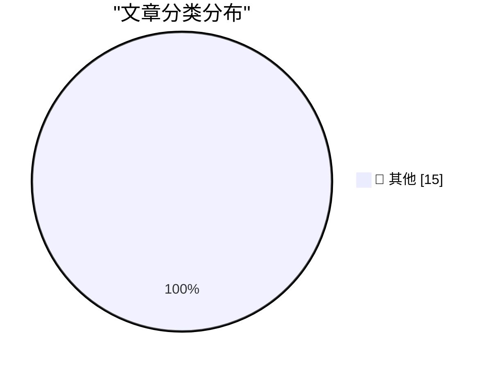

# 📰 AI 博客每日精选 — 2026-09-17

> 来自 Karpathy 推荐的 92 个顶级技术博客，AI 精选 Top 15

## 🏆 今日必读

🥇 **datasette 1.0a40**

[datasette 1.0a40](https://simonwillison.net/2026/Sep/16/datasette/) — simonwillison.net · 14 小时前 · 📝 其他

> datasette 1.0a40

🥈 **datasette 0.65.5**

[datasette 0.65.5](https://simonwillison.net/2026/Sep/16/datasette-2/) — simonwillison.net · 14 小时前 · 📝 其他

> datasette 0.65.5

🥉 **Claude Cowork and chat are now one Claude**

[Claude Cowork and chat are now one Claude](https://simonwillison.net/2026/Sep/16/one-claude/) — simonwillison.net · 20 小时前 · 📝 其他

> Claude Cowork and chat are now one Claude

---

## 📊 数据概览

| 扫描源 | 抓取文章 | 时间范围 | 精选 |
|:---:|:---:|:---:|:---:|
| 83/92 | 2530 篇 → 33 篇 | 48h | **15 篇** |

### 分类分布

```mermaid
pie showData
    title "文章分类分布"
    "📝 其他" : 15
```

---

## 📝 其他

### 1. datasette 1.0a40

[datasette 1.0a40](https://simonwillison.net/2026/Sep/16/datasette/) — **simonwillison.net** · 14 小时前 · ⭐ 15/30

> datasette 1.0a40

---

### 2. datasette 0.65.5

[datasette 0.65.5](https://simonwillison.net/2026/Sep/16/datasette-2/) — **simonwillison.net** · 14 小时前 · ⭐ 15/30

> datasette 0.65.5

---

### 3. Claude Cowork and chat are now one Claude

[Claude Cowork and chat are now one Claude](https://simonwillison.net/2026/Sep/16/one-claude/) — **simonwillison.net** · 20 小时前 · ⭐ 15/30

> Claude Cowork and chat are now one Claude

---

### 4. Quoting Mustafa Suleyman

[Quoting Mustafa Suleyman](https://simonwillison.net/2026/Sep/16/mustafa-suleyman/) — **simonwillison.net** · 22 小时前 · ⭐ 15/30

> Quoting Mustafa Suleyman

---

### 5. Gemini Live audio

[Gemini Live audio](https://simonwillison.net/2026/Sep/15/gemini-live/) — **simonwillison.net** · 1 天前 · ⭐ 15/30

> Gemini Live audio

---

### 6. Jev means structured output is interesting again

[Jev means structured output is interesting again](https://seangoedecke.com/jev-means-structured-output-is-interesting-again/) — **seangoedecke.com** · 1 天前 · ⭐ 15/30

> Jev means structured output is interesting again

---

### 7. Data Broker Radaris Loses Domains in Privacy Fight

[Data Broker Radaris Loses Domains in Privacy Fight](https://krebsonsecurity.com/2026/09/data-broker-radaris-loses-domains-in-privacy-fight/) — **krebsonsecurity.com** · 20 小时前 · ⭐ 15/30

> Data Broker Radaris Loses Domains in Privacy Fight

---

### 8. Xcode 27.2 Is Out, but 27.1 Is Not, Which Means Developers Still Can’t Get Started on Duo-Adapted Apps

[Xcode 27.2 Is Out, but 27.1 Is Not, Which Means Developers Still Can’t Get Started on Duo-Adapted Apps](https://developer.apple.com/documentation/xcode-release-notes/xcode-27_2-release-notes) — **daringfireball.net** · 15 小时前 · ⭐ 15/30

> Xcode 27.2 Is Out, but 27.1 Is Not, Which Means Developers Still Can’t Get Started on Duo-Adapted Apps

---

### 9. Is That a Duo in Ternus’s Pocket or Was He Just Happy That Apple TV Shows Won 28 Emmys?

[Is That a Duo in Ternus’s Pocket or Was He Just Happy That Apple TV Shows Won 28 Emmys?](https://x.com/DEADLINE/status/2099645816361332775) — **daringfireball.net** · 16 小时前 · ⭐ 15/30

> Is That a Duo in Ternus’s Pocket or Was He Just Happy That Apple TV Shows Won 28 Emmys?

---

### 10. Woz Launches Merch Store

[Woz Launches Merch Store](https://x.com/stevewoz/status/2100074363605397658) — **daringfireball.net** · 16 小时前 · ⭐ 15/30

> Woz Launches Merch Store

---

### 11. Apple OS 27.2 Betas Are Out; Version 27.1 Is the Duo-Exclusive iOS Fork

[Apple OS 27.2 Betas Are Out; Version 27.1 Is the Duo-Exclusive iOS Fork](https://www.macrumors.com/2026/09/16/heres-why-apple-released-ios-27-2-beta/) — **daringfireball.net** · 19 小时前 · ⭐ 15/30

> Apple OS 27.2 Betas Are Out; Version 27.1 Is the Duo-Exclusive iOS Fork

---

### 12. AirPods 5 With Wireless Charging Case Works With MagSafe, But Not Magnetically

[AirPods 5 With Wireless Charging Case Works With MagSafe, But Not Magnetically](https://www.apple.com/airpods-5/specs/) — **daringfireball.net** · 23 小时前 · ⭐ 15/30

> AirPods 5 With Wireless Charging Case Works With MagSafe, But Not Magnetically

---

### 13. ‘Apple Reference Image: A New Approach for Verified Photography’

[‘Apple Reference Image: A New Approach for Verified Photography’](https://security.apple.com/blog/apple-reference-image/) — **daringfireball.net** · 1 天前 · ⭐ 15/30

> ‘Apple Reference Image: A New Approach for Verified Photography’

---

### 14. FT: ‘Steve Bannon and Bernie Sanders Unite in AI Safety Call’

[FT: ‘Steve Bannon and Bernie Sanders Unite in AI Safety Call’](https://www.ft.com/content/bab5c4c5-5377-4dd0-8b46-d8c4ce9a36d5?syn-25a6b1a6=1) — **daringfireball.net** · 1 天前 · ⭐ 15/30

> FT: ‘Steve Bannon and Bernie Sanders Unite in AI Safety Call’

---

### 15. ★ Thoughts and Observations on Apple’s ‘Surprise and Shine’ Event; the Announcements of the iPhones 18 Pro, AirPods 5, Apple Watches Series 12 and Ultra 4, and the iPhone Duo; and the Dawn of the Ternus, John Ternus Era at Apple

[★ Thoughts and Observations on Apple’s ‘Surprise and Shine’ Event; the Announcements of the iPhones 18 Pro, AirPods 5, Apple Watches Series 12 and Ultra 4, and the iPhone Duo; and the Dawn of the Ternus, John Ternus Era at Apple](https://daringfireball.net/2026/09/thoughts_and_observations_on_apples_surprise_and_shine_event) — **daringfireball.net** · 1 天前 · ⭐ 15/30

> ★ Thoughts and Observations on Apple’s ‘Surprise and Shine’ Event; the Announcements of the iPhones 18 Pro, AirPods 5, Apple Watches Series 12 and Ultra 4, and the iPhone Duo; and the Dawn of the Ternus, John Ternus Era at Apple

---

*生成于 2026-09-17 14:30 | 扫描 83 源 → 获取 2530 篇 → 精选 15 篇*
*基于 [Hacker News Popularity Contest 2025](https://refactoringenglish.com/tools/hn-popularity/) RSS 源列表，由 [Andrej Karpathy](https://x.com/karpathy) 推荐*
*由「懂点儿AI」制作，欢迎关注同名微信公众号获取更多 AI 实用技巧 💡*
