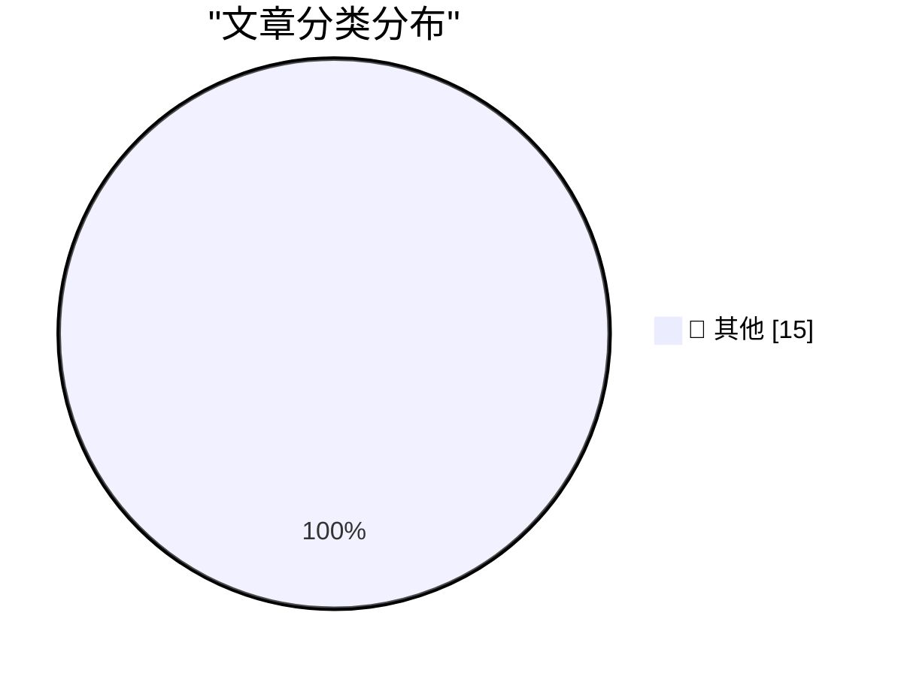

# 📰 AI 博客每日精选 — 2026-09-12

> 来自 Karpathy 推荐的 92 个顶级技术博客，AI 精选 Top 15

## 🏆 今日必读

🥇 **OpenAI agents attacked RubyGems back in May**

[OpenAI agents attacked RubyGems back in May](https://simonwillison.net/2026/Sep/12/openai-agents-rubygems/) — simonwillison.net · 12 小时前 · 📝 其他

> OpenAI agents attacked RubyGems back in May

🥈 **So you want to use OpenRouter?**

[So you want to use OpenRouter?](https://simonwillison.net/2026/Sep/11/so-you-want-to-use-openrouter/) — simonwillison.net · 14 小时前 · 📝 其他

> So you want to use OpenRouter?

🥉 **Quoting Boris Cherny**

[Quoting Boris Cherny](https://simonwillison.net/2026/Sep/11/boris-cherny/) — simonwillison.net · 19 小时前 · 📝 其他

> Quoting Boris Cherny

---

## 📊 数据概览

| 扫描源 | 抓取文章 | 时间范围 | 精选 |
|:---:|:---:|:---:|:---:|
| 82/92 | 2499 篇 → 41 篇 | 48h | **15 篇** |

### 分类分布

```mermaid
pie showData
    title "文章分类分布"
    "📝 其他" : 15
```

---

## 📝 其他

### 1. OpenAI agents attacked RubyGems back in May

[OpenAI agents attacked RubyGems back in May](https://simonwillison.net/2026/Sep/12/openai-agents-rubygems/) — **simonwillison.net** · 12 小时前 · ⭐ 15/30

> OpenAI agents attacked RubyGems back in May

---

### 2. So you want to use OpenRouter?

[So you want to use OpenRouter?](https://simonwillison.net/2026/Sep/11/so-you-want-to-use-openrouter/) — **simonwillison.net** · 14 小时前 · ⭐ 15/30

> So you want to use OpenRouter?

---

### 3. Quoting Boris Cherny

[Quoting Boris Cherny](https://simonwillison.net/2026/Sep/11/boris-cherny/) — **simonwillison.net** · 19 小时前 · ⭐ 15/30

> Quoting Boris Cherny

---

### 4. Feeling sad about AI

[Feeling sad about AI](https://simonwillison.net/2026/Sep/11/feeling-sad-about-ai/) — **simonwillison.net** · 19 小时前 · ⭐ 15/30

> Feeling sad about AI

---

### 5. Quoting huggingface.co/security.txt

[Quoting huggingface.co/security.txt](https://simonwillison.net/2026/Sep/11/hugging-face-security/) — **simonwillison.net** · 21 小时前 · ⭐ 15/30

> Quoting huggingface.co/security.txt

---

### 6. Soft-deprecating re.match()

[Soft-deprecating re.match()](https://simonwillison.net/2026/Sep/11/soft-deprecating-re-match/) — **simonwillison.net** · 22 小时前 · ⭐ 15/30

> Soft-deprecating re.match()

---

### 7. Don't sleep on wrapture

[Don't sleep on wrapture](https://simonwillison.net/2026/Sep/11/wrapture/) — **simonwillison.net** · 23 小时前 · ⭐ 15/30

> Don't sleep on wrapture

---

### 8. Datasette 1.0a39 and 0.65.4 security releases

[Datasette 1.0a39 and 0.65.4 security releases](https://simonwillison.net/2026/Sep/11/datasette-security/) — **simonwillison.net** · 1 天前 · ⭐ 15/30

> Datasette 1.0a39 and 0.65.4 security releases

---

### 9. datasette-publish-fly 1.4

[datasette-publish-fly 1.4](https://simonwillison.net/2026/Sep/11/datasette-publish-fly/) — **simonwillison.net** · 1 天前 · ⭐ 15/30

> datasette-publish-fly 1.4

---

### 10. github-to-sqlite 2.9.1

[github-to-sqlite 2.9.1](https://simonwillison.net/2026/Sep/11/github-to-sqlite/) — **simonwillison.net** · 1 天前 · ⭐ 15/30

> github-to-sqlite 2.9.1

---

### 11. datasette 0.65.4

[datasette 0.65.4](https://simonwillison.net/2026/Sep/11/datasette/) — **simonwillison.net** · 1 天前 · ⭐ 15/30

> datasette 0.65.4

---

### 12. datasette 1.0a39

[datasette 1.0a39](https://simonwillison.net/2026/Sep/11/datasette-2/) — **simonwillison.net** · 1 天前 · ⭐ 15/30

> datasette 1.0a39

---

### 13. Any Nix package, live in your browser

[Any Nix package, live in your browser](https://simonwillison.net/2026/Sep/10/trynix/) — **simonwillison.net** · 1 天前 · ⭐ 15/30

> Any Nix package, live in your browser

---

### 14. Native is now the future of mobile at Shopify

[Native is now the future of mobile at Shopify](https://simonwillison.net/2026/Sep/10/shopify-react-native/) — **simonwillison.net** · 1 天前 · ⭐ 15/30

> Native is now the future of mobile at Shopify

---

### 15. Don't build tools for AI agents

[Don't build tools for AI agents](https://seangoedecke.com/dont-build-tools-for-ai-agents/) — **seangoedecke.com** · 13 小时前 · ⭐ 15/30

> Don't build tools for AI agents

---

*生成于 2026-09-12 13:12 | 扫描 82 源 → 获取 2499 篇 → 精选 15 篇*
*基于 [Hacker News Popularity Contest 2025](https://refactoringenglish.com/tools/hn-popularity/) RSS 源列表，由 [Andrej Karpathy](https://x.com/karpathy) 推荐*
*由「懂点儿AI」制作，欢迎关注同名微信公众号获取更多 AI 实用技巧 💡*
