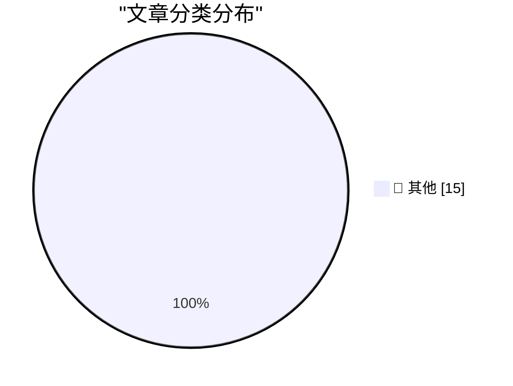

# 📰 AI 博客每日精选 — 2026-10-05

> 来自 Karpathy 推荐的 92 个顶级技术博客，AI 精选 Top 15

## 🏆 今日必读

🥇 **Qwen3.8 27B addition in words**

[Qwen3.8 27B addition in words](https://simonwillison.net/2026/Oct/4/qwen38-addition-in-words/) — simonwillison.net · 19 小时前 · 📝 其他

> Qwen3.8 27B addition in words

🥈 **We're going to need default hard budget caps on pretty much everything**

[We're going to need default hard budget caps on pretty much everything](https://simonwillison.net/2026/Oct/3/default-hard-budget-caps/) — simonwillison.net · 1 天前 · 📝 其他

> We're going to need default hard budget caps on pretty much everything

🥉 **September sponsors-only newsletter**

[September sponsors-only newsletter](https://simonwillison.net/2026/Oct/3/newsletter/) — simonwillison.net · 1 天前 · 📝 其他

> September sponsors-only newsletter

---

## 📊 数据概览

| 扫描源 | 抓取文章 | 时间范围 | 精选 |
|:---:|:---:|:---:|:---:|
| 82/92 | 2314 篇 → 20 篇 | 48h | **15 篇** |

### 分类分布

```mermaid
pie showData
    title "文章分类分布"
    "📝 其他" : 15
```

---

## 📝 其他

### 1. Qwen3.8 27B addition in words

[Qwen3.8 27B addition in words](https://simonwillison.net/2026/Oct/4/qwen38-addition-in-words/) — **simonwillison.net** · 19 小时前 · ⭐ 15/30

> Qwen3.8 27B addition in words

---

### 2. We're going to need default hard budget caps on pretty much everything

[We're going to need default hard budget caps on pretty much everything](https://simonwillison.net/2026/Oct/3/default-hard-budget-caps/) — **simonwillison.net** · 1 天前 · ⭐ 15/30

> We're going to need default hard budget caps on pretty much everything

---

### 3. September sponsors-only newsletter

[September sponsors-only newsletter](https://simonwillison.net/2026/Oct/3/newsletter/) — **simonwillison.net** · 1 天前 · ⭐ 15/30

> September sponsors-only newsletter

---

### 4. WorkOS

[WorkOS](https://workos.com/guide/the-developers-guide-to-sso?utm_source=daringfireball&amp;utm_medium=newsletter&amp;utm_campaign=q32026) — **daringfireball.net** · 1 天前 · ⭐ 15/30

> WorkOS

---

### 5. Why My Asus Laptop Kept Rebooting After Sleep and How to Fix it

[Why My Asus Laptop Kept Rebooting After Sleep and How to Fix it](https://idiallo.com/blog/asus-laptop-keeps-rebooting-after-sleep) — **idiallo.com** · 1 天前 · ⭐ 15/30

> Why My Asus Laptop Kept Rebooting After Sleep and How to Fix it

---

### 6. The indicators of a quality website (somewhat silly)

[The indicators of a quality website (somewhat silly)](https://maurycyz.com/misc/quality/indicators.html) — **maurycyz.com** · 1 天前 · ⭐ 15/30

> The indicators of a quality website (somewhat silly)

---

### 7. [RSS Club] Changes to the RSS and Atom feeds

[[RSS Club] Changes to the RSS and Atom feeds](https://shkspr.mobi/blog/2026/10/rss-club-changes-to-the-rss-and-atom-feeds/) — **shkspr.mobi** · 7 小时前 · ⭐ 15/30

> [RSS Club] Changes to the RSS and Atom feeds

---

### 8. My Pitch for the New Season of Doctor Who

[My Pitch for the New Season of Doctor Who](https://shkspr.mobi/blog/2026/10/my-pitch-for-the-new-season-of-doctor-who/) — **shkspr.mobi** · 1 天前 · ⭐ 15/30

> My Pitch for the New Season of Doctor Who

---

### 9. How to Solve: AAC Heavyweight M1 (Savage)

[How to Solve: AAC Heavyweight M1 (Savage)](https://xeiaso.net/blog/2026/m9s/) — **xeiaso.net** · 1 天前 · ⭐ 15/30

> How to Solve: AAC Heavyweight M1 (Savage)

---

### 10. Miquel’s pentagon theorem

[Miquel’s pentagon theorem](https://www.johndcook.com/blog/2026/10/04/miquels-pentagon-theorem/) — **johndcook.com** · 1 天前 · ⭐ 15/30

> Miquel’s pentagon theorem

---

### 11. Topological models of modal logic

[Topological models of modal logic](https://www.johndcook.com/blog/2026/10/04/topological-models-of-modal-logic/) — **johndcook.com** · 1 天前 · ⭐ 15/30

> Topological models of modal logic

---

### 12. Modal logic and topology

[Modal logic and topology](https://www.johndcook.com/blog/2026/10/04/modal-topology/) — **johndcook.com** · 1 天前 · ⭐ 15/30

> Modal logic and topology

---

### 13. Miquel’s pivot theorem

[Miquel’s pivot theorem](https://www.johndcook.com/blog/2026/10/03/miquels-pivot-theorem/) — **johndcook.com** · 1 天前 · ⭐ 15/30

> Miquel’s pivot theorem

---

### 14. Benchmark In Milliseconds

[Benchmark In Milliseconds](https://matklad.github.io/2026/10/05/benchmark-milliseconds.html) — **matklad.github.io** · 18 小时前 · ⭐ 15/30

> Benchmark In Milliseconds

---

### 15. “I’m Embarrassed on Behalf of the Tech Industry”

[“I’m Embarrassed on Behalf of the Tech Industry”](https://blog.jim-nielsen.com/2026/embarrassed-by-tech/) — **blog.jim-nielsen.com** · 23 小时前 · ⭐ 15/30

> “I’m Embarrassed on Behalf of the Tech Industry”

---

*生成于 2026-10-05 18:54 | 扫描 82 源 → 获取 2314 篇 → 精选 15 篇*
*基于 [Hacker News Popularity Contest 2025](https://refactoringenglish.com/tools/hn-popularity/) RSS 源列表，由 [Andrej Karpathy](https://x.com/karpathy) 推荐*
*由「懂点儿AI」制作，欢迎关注同名微信公众号获取更多 AI 实用技巧 💡*
