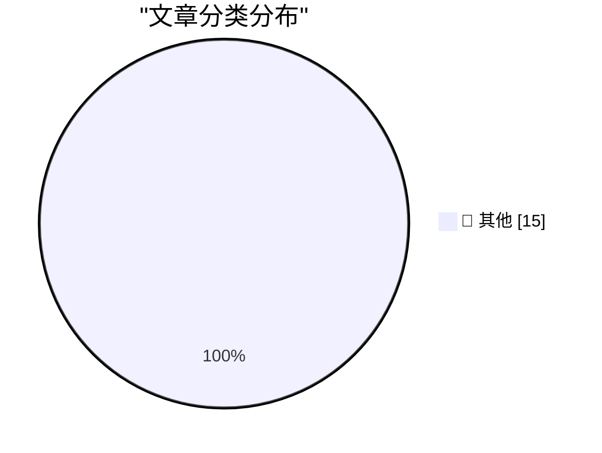

# 📰 AI 博客每日精选 — 2026-09-27

> 来自 Karpathy 推荐的 92 个顶级技术博客，AI 精选 Top 15

## 🏆 今日必读

🥇 **Kākāpō Party**

[Kākāpō Party](https://simonwillison.net/2026/Sep/26/kakapo-party/) — simonwillison.net · 15 小时前 · 📝 其他

> Kākāpō Party

🥈 **Quoting John Gruber**

[Quoting John Gruber](https://simonwillison.net/2026/Sep/25/john-gruber/) — simonwillison.net · 1 天前 · 📝 其他

> Quoting John Gruber

🥉 **I'm starting HomelabFest (in St. Louis, Sep 2027)**

[I'm starting HomelabFest (in St. Louis, Sep 2027)](https://www.jeffgeerling.com/blog/2026/homelabfest-announcement/) — jeffgeerling.com · 1 天前 · 📝 其他

> I'm starting HomelabFest (in St. Louis, Sep 2027)

---

## 📊 数据概览

| 扫描源 | 抓取文章 | 时间范围 | 精选 |
|:---:|:---:|:---:|:---:|
| 83/92 | 2529 篇 → 26 篇 | 48h | **15 篇** |

### 分类分布

```mermaid
pie showData
    title "文章分类分布"
    "📝 其他" : 15
```

---

## 📝 其他

### 1. Kākāpō Party

[Kākāpō Party](https://simonwillison.net/2026/Sep/26/kakapo-party/) — **simonwillison.net** · 15 小时前 · ⭐ 15/30

> Kākāpō Party

---

### 2. Quoting John Gruber

[Quoting John Gruber](https://simonwillison.net/2026/Sep/25/john-gruber/) — **simonwillison.net** · 1 天前 · ⭐ 15/30

> Quoting John Gruber

---

### 3. I'm starting HomelabFest (in St. Louis, Sep 2027)

[I'm starting HomelabFest (in St. Louis, Sep 2027)](https://www.jeffgeerling.com/blog/2026/homelabfest-announcement/) — **jeffgeerling.com** · 1 天前 · ⭐ 15/30

> I'm starting HomelabFest (in St. Louis, Sep 2027)

---

### 4. Human-AI partnerships are for alignment, not capability

[Human-AI partnerships are for alignment, not capability](https://seangoedecke.com/human-ai-partnerships-are-for-alignment-not-capability/) — **seangoedecke.com** · 14 小时前 · ⭐ 15/30

> Human-AI partnerships are for alignment, not capability

---

### 5. Advice to a beginning software engineer

[Advice to a beginning software engineer](https://seangoedecke.com/advice-to-a-beginning-software-engineer/) — **seangoedecke.com** · 1 天前 · ⭐ 15/30

> Advice to a beginning software engineer

---

### 6. U.S. Soldier Gets 70 Months in Prison for AT&T, Verizon Extortions

[U.S. Soldier Gets 70 Months in Prison for AT&T, Verizon Extortions](https://krebsonsecurity.com/2026/09/u-s-soldier-gets-70-months-in-prison-for-att-verizon-extortions/) — **krebsonsecurity.com** · 1 天前 · ⭐ 15/30

> U.S. Soldier Gets 70 Months in Prison for AT&T, Verizon Extortions

---

### 7. Reelizer Returns

[Reelizer Returns](https://www.reelizer.com/) — **daringfireball.net** · 17 小时前 · ⭐ 15/30

> Reelizer Returns

---

### 8. Alexandr Wang: ‘Why I’m Building Muse’

[Alexandr Wang: ‘Why I’m Building Muse’](https://x.com/alexandr_wang/status/2103551714536439951) — **daringfireball.net** · 18 小时前 · ⭐ 15/30

> Alexandr Wang: ‘Why I’m Building Muse’

---

### 9. Apple’s Other Recent ‘Duo’

[Apple’s Other Recent ‘Duo’](https://support.apple.com/en-us/111812) — **daringfireball.net** · 19 小时前 · ⭐ 15/30

> Apple’s Other Recent ‘Duo’

---

### 10. International Standard Paper Sizes

[International Standard Paper Sizes](https://www.cl.cam.ac.uk/~mgk25/iso-paper.html) — **daringfireball.net** · 20 小时前 · ⭐ 15/30

> International Standard Paper Sizes

---

### 11. Microsoft Took the ‘Copilot+ PC’ Brand Out Behind the Shed

[Microsoft Took the ‘Copilot+ PC’ Brand Out Behind the Shed](https://www.windowscentral.com/microsoft/windows-11/the-copilot-pc-brand-is-dead-microsoft-and-pc-makers-quietly-pull-back-on-tarnished-windows-11-ai-pc-branding) — **daringfireball.net** · 21 小时前 · ⭐ 15/30

> Microsoft Took the ‘Copilot+ PC’ Brand Out Behind the Shed

---

### 12. The Talk Show: ‘I’m Thinking X, Not X’

[The Talk Show: ‘I’m Thinking X, Not X’](https://daringfireball.net/thetalkshow/2026/09/25/ep-455) — **daringfireball.net** · 22 小时前 · ⭐ 15/30

> The Talk Show: ‘I’m Thinking X, Not X’

---

### 13. Mr. Choyka Is Apparently Doing Well

[Mr. Choyka Is Apparently Doing Well](https://www.usatoday.com/story/sports/golf/2020/02/02/golf-amateur-gary-choyka-sinks-two-holes-one-same-round/4639969002/) — **daringfireball.net** · 1 天前 · ⭐ 15/30

> Mr. Choyka Is Apparently Doing Well

---

### 14. Stock UI in MacOS 27 Eschews Clarity

[Stock UI in MacOS 27 Eschews Clarity](https://mastodon.design/@thibault/117320401426286497) — **daringfireball.net** · 1 天前 · ⭐ 15/30

> Stock UI in MacOS 27 Eschews Clarity

---

### 15. Brent Simmons on ‘Stock’ Mac UI

[Brent Simmons on ‘Stock’ Mac UI](https://inessential.com/2026/09/22/that-about-wraps-it-up-for.html) — **daringfireball.net** · 1 天前 · ⭐ 15/30

> Brent Simmons on ‘Stock’ Mac UI

---

*生成于 2026-09-27 14:52 | 扫描 83 源 → 获取 2529 篇 → 精选 15 篇*
*基于 [Hacker News Popularity Contest 2025](https://refactoringenglish.com/tools/hn-popularity/) RSS 源列表，由 [Andrej Karpathy](https://x.com/karpathy) 推荐*
*由「懂点儿AI」制作，欢迎关注同名微信公众号获取更多 AI 实用技巧 💡*
